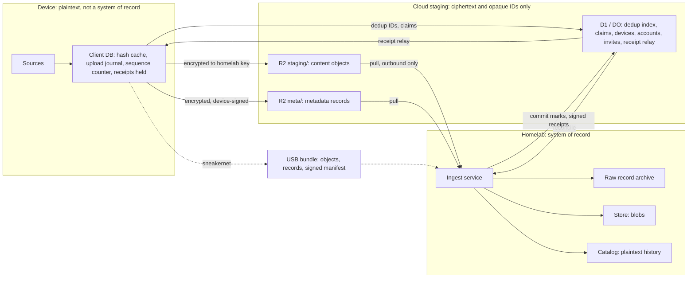
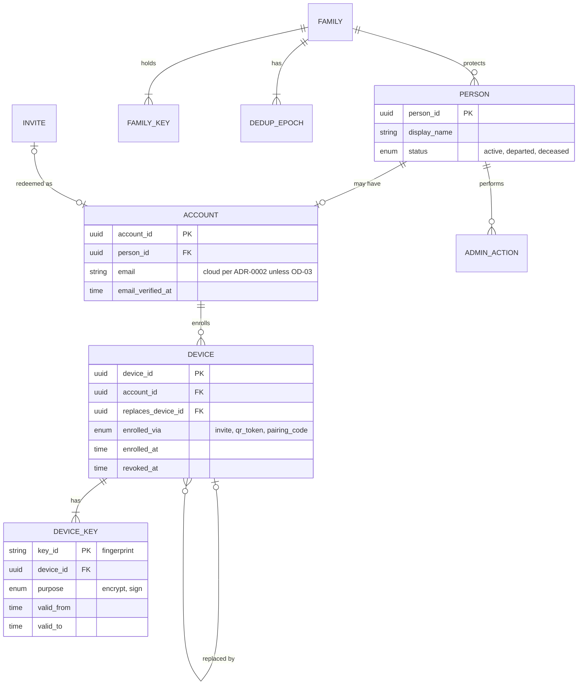
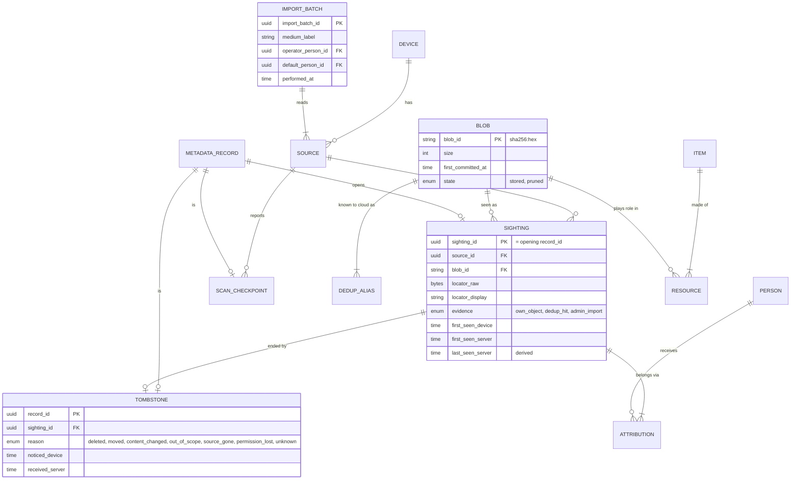
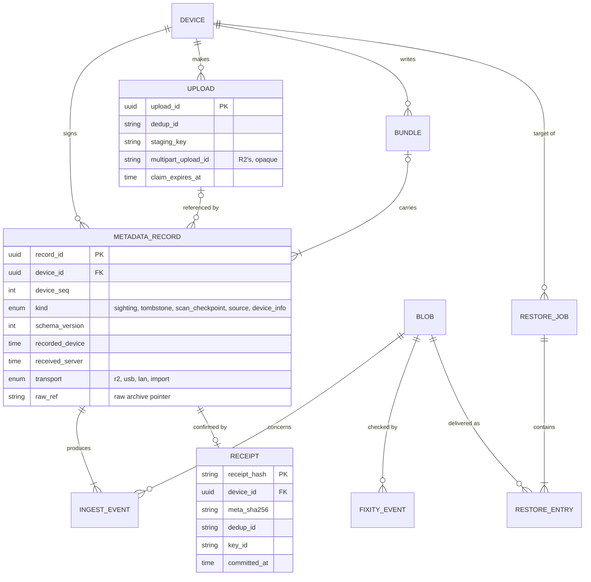

# Canonical data model (v0, provisional)

- **Owner:** H4 (glossary and canonical cross-component data model).
- **Status:** **v0, provisional.** Wave 0 start, 2026-09-29. H4 completes it in Wave 2. Nothing here is a decision; each part names the workstream whose ADR or spec will fix it.
- **Gate:** Gate A needs "H4 data model with v0 history fields" and "A9 provenance fields" (PLAN §4.2). The history fields are one-way door #6 in `docs/research/one-way-doors.md`: anything not recorded from the first real ingest is lost for good. §5 is the list the owner is asked to fix at Gate A.
- **Terms:** as defined in [glossary.md](glossary.md). Words in bold there are used here with the same meaning.
- **Inputs:** `CLAUDE.md`; ADR-0001; ADR-0002; `docs/research/PLAN.md` (A0–A9, B5, B6, C1, D2, D3, D6, E3, E7, H4, §3, §4); `docs/research/content-encryption-format.md` (a spike result, not yet accepted; cited as **CE spike**).
- **Traceability:** advances R-25 (locator, filename and mtime recorded; plaintext only at the homelab) and R-27 (deleting on a device never removes the backed-up copy).

## 1. Scope and how to read this

This is the **logical** model: the things every component must agree on, and the fields that cross from one component to another. It is not a database schema. The physical schemas belong to:

| Store | Physical schema owner |
|---|---|
| Client DB on each device | B6 (ADR-0021) |
| Cloud control plane (D1 / Durable Objects) and R2 key layout | C1 (ADR-0010) |
| Metadata record, receipt, manifest byte formats | A2 (ADR-0007), A3 (ADR-0009), A4 (ADR-0011) |
| Homelab catalog | A6 (ADR-0013) |

Each field below has an owner (who fixes its definition) and a basis:

| Basis | Meaning |
|---|---|
| **ADR** | Required by an Accepted ADR (0001 or 0002). |
| **PLAN** | Named as a requirement in PLAN.md. |
| **CE** | Present in the CE spike's prototype format. Not yet accepted. |
| **H4** | Proposed here. Needs the owning workstream to agree. |

## 2. Principles (v0)

1. **The homelab is the system of record.** Devices and the cloud hold working state only. A device's client DB can be lost; the cloud is untrusted and short-lived.
2. **Record events; derive state.** Sightings, tombstones, receipts, attributions and admin actions are appended, never edited or deleted. "Last seen", items and health are projections that can be recomputed.
3. **Keep every signed record raw, forever,** with its schema, envelope and dedup-epoch versions (A6: the catalog must be rebuildable from the store). New rules can then be re-run over old evidence.
4. **Nothing on a device deletes anything at home.** A tombstone ends a sighting. It never touches a blob (keep forever, R-26 and R-27).
5. **Only the admin removes bytes** (pruning). The blob row and all its history stay, marked pruned.
6. **One blob per content hash.** Many sightings per blob. Several content objects may arrive for one blob; the homelab keeps the first verified copy and logs the rest.
7. **The homelab keys blobs by content hash; the cloud by dedup ID.** Dedup IDs change when the dedup secret rotates; content hashes do not. The catalog keeps every dedup ID a blob has had.
8. **Two clocks on every event:** the device's claimed time and the server's time. Device clocks drift (PLAN §3); order within a device comes from its sequence number.
9. **Evidence matters.** A sighting records whether this device's own upload was verified, or it was a dedup hit, or an admin import. ADR-0001 §4 limits any future self-service restore to files the device actually uploaded and the homelab verified.
10. **Derived IDs stay at home.** Item and resource IDs are never signed and never sent off the homelab, because regrouping can change them.
11. **The plaintext boundary is part of the model.** §8 says, for each field, where it is plaintext. A field marked "absent" for the cloud must not appear in D1, R2 keys, Worker logs, email or telemetry.

## 3. Where data lives

## 4. Homelab catalog: entities and relationships

Three views of one model. Only key fields are drawn; §4.4 and §5 list the rest.

### 4.1 People, devices and trust

### 4.2 Content, history and provenance (the Gate A core)

A **source** belongs to exactly one device **or** one import batch, never both. A sighting from an import batch has no device of origin (A9).

### 4.3 Transfer, receipts, restore and integrity

Records made by the admin importer carry an import_batch_id instead of a device_id (transport `import`); A9 says the importer emits the same metadata records with `source = admin-import`.

### 4.4 Other entities (key fields only)

| Entity | Key fields (v0) | Basis | Owner |
|---|---|---|---|
| FAMILY | family_id, created_at, environment (production or sandbox) | H4 | H4 |
| PERSON | person_id, display_name, status, status_changed_at, is_placeholder (the "unknown person" bucket) | PLAN (A9, E7) | E7, A6 |
| ACCOUNT | account_id, person_id, name, email, email_verified_at, invite_id, created_at | ADR-0002 | D3; OD-03 |
| INVITE | invite_id, code_hmac (never the code), expires_at, state (unused, redeemed, expired), created_by | ADR-0002 | D3, E5 |
| DEVICE | device_id, account_id, platform, device_kind (phone, laptop…), enrolled_at, enrolled_via, enrolled_by_device_id, replaces_device_id, status (active, revoked, retired), revoked_at, first_client_version | ADR-0002, PLAN (D3, A8 "new phone day") | D3 |
| DEVICE_KEY | key_id, device_id, purpose, algorithm, public_key, valid_from, valid_to, how the homelab authenticated it | ADR-0001 §6, PLAN D3 | D3, D2 |
| FAMILY_KEY | key_id, purpose (ingest recipient, recovery recipient, receipt signing, restore-manifest signing), algorithm, public part, valid_from, retired_at. **Private parts are never in the catalog.** | PLAN D2 | D2 |
| DEDUP_EPOCH | epoch, created_at, retired_at, reason. The secret itself is never in the catalog. | PLAN A1 | A1, D2 |
| DEDUP_ALIAS | dedup_id, epoch, blob_id, first_seen_server | H4 | A1 |
| ITEM | item_id (derived), kind, capture_time, capture_offset, capture_time_source, grouping_key, rules_version | PLAN A5 | A5 |
| RESOURCE | item_id, blob_id, role | PLAN A5 | A5 |
| INGEST_EVENT | event_id, record_id, blob_id, upload_id or bundle_id, outcome (committed, duplicate dropped, awaiting commit, rejected), error_code, at_server, ingest_version | PLAN A3, A7 | A3, A6 |
| RECEIPT | hash of the receipt bytes, device_id, meta_sha256, dedup_id, size, committed_at, key_id, relayed_at | CE §10, PLAN A3 | A3 |
| BUNDLE | bundle_id, device_id, transport, first and last device_seq, prev_manifest_sha256, manifest_sha256, sealed_device, ingested_server, outcome | PLAN A4 | A4 |
| RESTORE_JOB | restore_job_id, requested_by, for_person_id, target_device_id, selection, delivery (R2, USB, handover), state, restore_manifest_sha256, expires_at | ADR-0001 §6, PLAN A8 | A8 |
| RESTORE_ENTRY | restore_job_id, blob_id, sighting_id used for its name and place, delivered_at | PLAN A8 | A8 |
| FIXITY_EVENT | event_id, blob_id, at, method (audit, sample, restore drill), outcome | PLAN A7 | A7 |
| ADMIN_ACTION | action_id, actor, action (invite, revoke, attribution change, person status change, prune, restore, key rotation), target, at, reason | PLAN C7, C8 | C8 |
| CONSENT | person_id, text_version, accepted_at, via_device_id. H4 proposal: when a person accepted which charter text cannot be reconstructed later either. | H4 | D6 |

## 5. History and provenance fields to fix at Gate A

These are the fields that "cannot be reconstructed later" (PLAN H4, §3; one-way door #6). **Must** rows are named in PLAN or required by the settled text (ADR-0001, R-25). **Recommended** rows are H4 additions for the same reason; the owner decides at Gate A whether they join the list.

| # | Field or record | Carried in | Why it cannot be rebuilt later | Level | Settled by |
|---|---|---|---|---|---|
| H-1 | **Sighting** per (device, source, locator, blob), including dedup hits | Sighting record | Once a device is gone, nobody can say what it held or where. A8 needs "everything device X had on date D". | Must (PLAN H4, A8) | A3 (event), A2 (format) |
| H-2 | **First seen**, in device time and server time | Sighting record; server stamp on receipt | The device may have found the file long before upload; the gap is lost once the client DB is gone. | Must | A3 |
| H-3 | **Last seen**, derived from complete scan checkpoints (H-14) | Checkpoint record | Without periodic confirmation, "still on the device" cannot be told from "never rescanned". | Must | A3, B5 |
| H-4 | **Deleted on device** (tombstone with reason and noticed time) | Tombstone record | Deletions leave no trace on the device. The reason separates "deleted" from "permission lost" or "source unplugged". | Must (PLAN H4, R-27) | A3 |
| H-5 | **Source plugin** name and version, and source ID, on every sighting | Sighting and source records | Needed to re-read old locators and hints when plugins change. | Must (PLAN H4) | B5 |
| H-6 | **Admin-import provenance**: import batch (medium label and identity, medium kind, operator, date, default person, tool and version, custody note) | Import batch; its source | "From drive X, by the admin, on date D, attributed to person P" (A9) exists only at import time. | Must (PLAN A9) | A9 |
| H-7 | **Items with no device of origin**: sightings whose source belongs to an import batch | Source (device XOR import batch) | The model must allow it from v0, or imports get fake devices. | Must (PLAN A9) | A9, A6 |
| H-8 | **Snapshot**: size, mtime, ctime, platform file ID at read time; plus birth time where the OS has it | Sighting record | Describes exactly the version uploaded; the file may change or vanish. | Must (ADR-0001 §3; CE §9) | B5, A5 |
| H-9 | **Source locator** as raw bytes plus display form, and filename | Sighting record | Lossless paths (NFD, invalid UTF-8, long paths) cannot be recovered from a normalised copy. | Must (R-25; PLAN B5) | B5 |
| H-10 | **Evidence** type: own object verified, dedup hit, or admin import | Sighting (from record: content object present or null) | ADR-0001 §4 limits future self-service restore to files the device uploaded and the homelab verified. | Recommended | A3, A8 |
| H-11 | **Attribution history**: person per sighting, who set it, when, what it replaced | Attribution rows (homelab only) | Admin corrections overwrite knowledge unless kept as history. Needed for per-person views and pruning with cross-user dedup (A6). | Recommended | A9, A6 |
| H-12 | **Device lineage**: enrolled_via, enrolled_by_device_id, replaces_device_id, revoked_at | Device row | "New phone day" restores and clone detection need to know which device replaced which. | Recommended | D3, A8 |
| H-13 | **Device sequence number** on every signed record and manifest, plus server receive time | Record, manifest | Gaps show missed uploads; repeats show clones (PLAN D3) or a restored client DB. | Recommended (PLAN A2, A4 raise it) | A3, A4 |
| H-14 | **Scan checkpoint** per source: started, completed, complete-pass flag, count present | Checkpoint record | Makes H-3 cheap: no per-file "still here" records. | Recommended (mechanism for H-3) | A3, B5 |
| H-15 | **Format versions** on every record: schema version, envelope version, dedup epoch, client version | Record | Needed to read and re-verify records decades later (A7 software durability). | Recommended | A2, A7 |
| H-16 | **Raw record archive**: every signed record and manifest kept as received | Homelab store | The catalog is a projection; the raw evidence is what lets it be rebuilt or reinterpreted (A6-S4). | Recommended (PLAN A6) | A6 |
| H-17 | **Source hints**: values the platform knows but the bytes do not (e.g. PhotoKit or MediaStore dates, Live Photo pairing IDs, favourites) | Sighting record | Lost when the device or cloud library is gone. Which hints, per platform, is A5's call. | Recommended | A5, B5 |
| H-18 | **Commit record**: which upload or bundle delivered the kept copy, when, and every rejection | Ingest event | The fixity chain (A7) and dedup-poisoning forensics (D4) need it. | Recommended | A3, A7 |
| H-19 | **Consent**: which charter text each person accepted, when | Consent row | Consent at the time cannot be proved afterwards. | Recommended | D6 |

## 6. Cross-hop artifacts (v0 field lists)

### 6.1 Metadata record

The CE spike (§9) defines a signed "file-meta" record. v0 proposes a small set of **record kinds** that share one envelope, so tombstones and checkpoints look like sightings to the cloud (the CE spike pads records to multiples of 512 bytes).

| Field | Kinds | Basis | Owner |
|---|---|---|---|
| `v`, `type` / kind | all | CE (kind: H4) | A2 |
| `record_id` (random, device-made) | all | H4 (A3's idempotency key is dedup ID + record ID) | A3 |
| `device_id`, `device_seq` | all | CE (seq: PLAN A2) | A3 |
| `recorded_at` (device time) | all | CE | A3 |
| `client_version`, `schema_version` | all | H4 | A2 |
| `source_id` | sighting, tombstone, checkpoint, source | H4 | B5 |
| `dedup_id`, `dedup_epoch`, `sha256`, `size` | sighting; last-known values on tombstone | CE (epoch: H4) | A1 |
| `content_object {key, header_mac}` or `null` for a dedup hit | sighting | CE | A2, A3 |
| `source_locator` (raw and display), `path`, `name` | sighting, tombstone | CE, ADR-0001 | B5 |
| `mtime_ns`, `ctime_ns`, `btime_ns` (if any), `file_id` | sighting | CE (btime: H4) | B5 |
| `first_seen_at` (device time the client first hashed this version) | sighting | H4 | A3 |
| `source_hints` (plugin-defined, versioned) | sighting | H4 | A5, B5 |
| `reason`, `noticed_at`, `last_seen_at` | tombstone | H4 | A3 |
| `scan_started_at`, `scan_completed_at`, `complete`, `count_present` | scan_checkpoint | H4 | A3, B5 |
| `plugin`, `plugin_version`, `scope` (raw and display), `added_at` / `removed_at` | source | H4 | B5 |
| `label`, `model`, `os_version` | device_info | H4 (keeps device names out of the cloud, per D6) | D6, D3 |
| Ed25519 signature over the exact bytes | all | CE | A2 |

A dedup-hit sighting (content object `null`) is committed and receipted only once its blob is committed; until then it is **awaiting commit**.

### 6.2 Receipt, manifest, trust bundle

| Artifact | v0 fields | Basis | Owner |
|---|---|---|---|
| **Receipt** | `v`, `type`, `committed_at`, `dedup_id`, `device_id`, `meta_sha256` (binds it to one exact record), `size`, signature with `key_id` | CE §10 | A3 (ADR-0009) |
| **Manifest** | `bundle_id`, `device_id`, first and last `device_seq`, `prev_manifest_sha256`, `created_at`, entries (record and object keys, ciphertext digests, part layout), device signature | PLAN A4 | A4 (ADR-0011) |
| **Restore manifest** | `restore_job_id`, target `device_id` and its key ID, entries (restore object key, digest, name to write), expiry, homelab signature | PLAN A8 | A8 (ADR-0028) |
| **Trust bundle** | `v`, `recipient` (plus any recovery or PQ recipients), `receipt_key`; pinned by SHA-256 | CE §10 | D3 (ADR-0014) |

## 7. Cloud and device state (conceptual)

### 7.1 Cloud control plane (C1 owns the schema)

| Entity | Fields (v0) | Rebuildable from the homelab? |
|---|---|---|
| Dedup index | dedup_id, state (claimed, committed), size, one receipt for "present" answers (CE §10) | Yes (committed set) |
| Upload / claim | upload_id, dedup_id, device_id, staging_key, multipart UploadId, claimed_at, claim_expires_at, state | No; short-lived |
| Metadata-record inbox | R2 key `meta/<device_id>/<random>.age` (CE §9), received_at | No; drained by the homelab |
| Receipt relay | device_id, receipt bytes, available_at, fetched_at | Yes (the homelab keeps every receipt) |
| Device registry | device_id, account_id, public keys, credential verifier, status, last activity, client version, platform kind | Partly (if the device list is homelab-signed, D3) |
| Account | account_id, name, email, email_verified_at (ADR-0002; OD-03 may move these home) | Partly |
| Invite, enrollment token, pairing code | keyed hash, expiry, state, issuing device | **No: cloud-only, needs backup (C1, C8)** |
| Reconciliation cursor, rate-limit counters, quotas | per C1, C2 | No |

### 7.2 Client DB (B6 owns the schema)

| Entity | Fields (v0) | Notes |
|---|---|---|
| Hash cache | source_id, locator, size, mtime, platform file ID → content hash, dedup ID, epoch, hashed_at | Contract from A1. A plaintext file inventory; encryption at rest is open (B6, D6). |
| Resource state | locator → client state (A3: discovered … committed, re-verified; side states such as on USB, cloud-only, excluded, failed with reason) | Feeds health (E3) |
| Upload journal | upload_id, staging key, multipart UploadId, sealed per-upload key, chunk tags, part ETags (CE §8.1) | Deleted after commit |
| Outbox | signed records not yet sent, with record_id, device_seq, transport used | |
| Receipts held | receipt bytes per record | Proof of "stored at home" |
| Sequence counter | next device_seq | Persisted before use; never reused |
| Trust bundle and pin | as §6.2 | From the kit or QR, never from the Worker |
| Discovery decisions | accepted and declined sources or categories | Stays on the device; a decline must leak nothing (E4, D6) |

## 8. Field visibility by hop

**P** plaintext · **E** encrypted to the homelab recipient(s) · **O** opaque keyed ID · **≈** inferable (e.g. from ciphertext length) · **—** absent · **?** open question.

| Field | Device | R2 (bytes and keys) | D1 / Worker | USB bundle | Homelab catalog | Receipt | Owner |
|---|---|---|---|---|---|---|---|
| Content bytes | P | E | — | E | P or E (at-rest posture, OD-07) | — | A2, A6 |
| Content hash (SHA-256) | P | E (in record) | — | E | P | — | A1 |
| Dedup ID | O | O (in staging key, CE) | O | O (manifest, A4) | O | O | A1 |
| Exact size | P | ≈ (padding undecided, CE D-7) | P (CE: dedup check and receipt) | ≈ | P | P | A2, D6 |
| Filename, source locator | P | E | — | E | P | — | B5, A2 |
| mtime, ctime, platform file ID | P | E | — | E | P | — | B5 |
| Capture time, EXIF, GPS (inside the bytes) | P | E | — | E | P | — | A5 |
| Source hints | P | E | — | E | P | — | A5 |
| Record kind (sighting, tombstone…) | P | E (records padded, CE) | — | E | P | — | A2, A3 |
| Device sequence number | P | E | ? (A4: what the Worker checks) | ? (manifest) | P | — | A3, A4 |
| Device ID | P | P (in `meta/` key, CE) | P | P | P | P | D3 |
| Device label (e.g. "Person A's laptop") | P | — | — proposed (D6); ADR-0002 is silent | — | P (device_info record) | — | D6 |
| Device kind (phone, laptop) | P | — | ? (nudge emails name it, ADR-0002 §2) | — | P | — | D6, E3 |
| Device public keys | P | — | P | — | P | — | D3 |
| Person name, email | P (own account) | — | P per ADR-0002, unless OD-03 | — | P | — | D6 (OD-03) |
| Per-device activity times | P | — | P (ADR-0002) | — | P | — | D6 |
| Receipt | P | — | P (relay) | ? (A4: receipts by USB) | P | — | A3 |
| Request timing and client IP | — | P (the cloud necessarily sees them) | P | — | — | — | D6, C1 |
| Attribution to a person | — | — | — | — | P | — | A9 |
| Discovery decisions | P | — | — | — | — | — | E4, D6 |

## 9. Identifier formats (v0 proposal)

Background (primary mirror, see §12): time-ordered UUIDv7 puts a 48-bit Unix millisecond timestamp first and sorts by creation time, which the UUID revision says gives much better database index locality than random IDs. The same text says UUIDs must not be used as secrets, and that UUIDv4 should be used where an ID plays any part in security. Hence the v0 rule: **UUIDv4 for IDs that cross the cloud, a stick or a card; UUIDv7 allowed for rows that never leave the homelab; never a UUID as a secret.**

| ID | Made by | Seen by | v0 proposal | Fixed by |
|---|---|---|---|---|
| family_id | Homelab at setup | Homelab, cloud config | UUIDv4. Keeps sandbox and production data from ever mixing. | H4 → C1, D2 |
| person_id | Homelab (admin) | Homelab | UUIDv7 | A6 |
| account_id | Worker at invite redemption | Cloud, homelab | UUIDv4 | D3 |
| device_id | At enrollment | Everywhere | UUIDv4, **separate from key IDs** so keys can rotate. Option: derive it from the first signing key. The CE spike uses device_id as the signature key_id. | D3 |
| key_id | Whoever makes the key | Everywhere | Algorithm plus a fingerprint (hash) of the public key; family keys may add a label (the CE spike uses `homelab-receipt-1`). | D2 |
| dedup_id | Device (and importer) | Device, cloud, stick, homelab, receipts | Versioned string, safe as an R2 key, a FAT/exFAT filename and a catalog key (A0 uses `v0:` + hex). | A1 (ADR-0006) |
| blob_id | Homelab | Homelab only | Algorithm-prefixed content hash, e.g. `sha256:<hex>`. Stable across dedup-secret rotation. | A1, A6 |
| upload_id | Worker (v0) | Device, cloud, homelab | UUIDv4. Not the same as R2's multipart UploadId, which is opaque and R2-made. | A3, C1 |
| record_id | Device | Device, homelab (R2 key part) | UUIDv4. With dedup ID it forms A3's idempotency key. | A3 |
| device_seq | Device | Inside records and manifests | Unsigned 64-bit, starts at 1, persisted before use, never reused. Losing the client DB means re-enrolling as a new device (H4 proposal). | A3, A4 |
| bundle_id | Device | Stick, homelab | UUIDv4, plus seq range and previous-manifest hash | A4 |
| receipt | Homelab | Device, cloud, homelab | No separate ID: identified by the hash of its bytes and keyed by (device_id, meta_sha256). A Merkle-log design (A3) would add an index. | A3 |
| source_id | Device (or importer) | Inside records | UUIDv4 | B5 |
| sighting_id | Homelab | Homelab | = record_id of the record that opened it, so a rebuild from the raw archive reproduces it | A6 |
| item_id, asset group | Homelab | Homelab only | Derived; deterministic from grouping inputs, or left out of A6-S4's canonical export. Never signed or sent out. | A5, A6 |
| import_batch_id, restore_job_id, event and action IDs | Homelab | Homelab (restore_job_id also in restore manifests → UUIDv4) | UUIDv7, except restore_job_id | A9, A8, A6 |
| Invite code, enrollment token, pairing code | Worker / device | Card, QR, screen | **Secrets, not IDs.** Entropy per ADR-0002 and D3; stored only as keyed hashes. | D3, E5 |

## 10. Time fields

| Rule (v0) | Why | Owner |
|---|---|---|
| Every event carries a device time (`*_device`) and a server time (`*_server`): Worker time on the R2 path, homelab ingest time for USB and imports. | Device clocks drift; the server time is the trusted one (PLAN §3). | A3 |
| Ordering within a device uses device_seq, never timestamps. | Clocks go backwards. | A3 |
| All times in UTC. File times in integer nanoseconds (CE uses `mtime_ns`); event times at least milliseconds. | Lossless and comparable. | A2 |
| Keep raw OS time values plus their precision and zone meaning where lossy (FAT: 2-second, local time). | Normalising loses facts (B5). | B5 |
| Capture time keeps its offset (or "unknown offset") and the field it came from. | EXIF often has no zone (PLAN §3). | A5 |

## 11. Worked example (synthetic)

| Step | What happens | Records and rows |
|---|---|---|
| 1 | Phone A (Person A) finds a new photo and uploads it. | Sighting record (evidence: own object) → blob B committed → receipt to Phone A. |
| 2 | Laptop A has the same photo. | Dedup hit → sighting record with content object `null` (evidence: dedup hit) → receipt to Laptop A for its own record. |
| 3 | Person A deletes the photo on Phone A. | Next scan → tombstone (reason: deleted) ends Phone A's sighting. Blob B stays. Laptop A's sighting stays open. |
| 4 | The admin imports an old drive holding the same photo. | Import batch → source → sighting (evidence: admin import), attributed to Person A by the admin. No device of origin. |
| 5 | "What did Phone A hold on date D?" | Sightings whose source is Phone A with first seen ≤ D and (no tombstone, or tombstone after D), and last seen ≥ D. |
| 6 | Person A edits a document in place. | New content → new blob and new sighting; the old sighting ends with reason "content changed". Both versions are kept. |

## 12. Open questions and hand-offs

| # | Question | To |
|---|---|---|
| 1 | Is a tombstone (and a scan checkpoint, source, device-info record) a kind of metadata record in the same envelope? Do they travel by USB too? | A2, A3, A4 |
| 2 | "Last seen" through complete scan checkpoints, or per-file refresh records? What counts as a complete pass on each platform (PhotoKit, MediaStore, folder watch)? | A3, B5 |
| 3 | Renames and moves: tombstone plus new sighting linked by platform file ID, or an explicit move record? | A3, B5 |
| 4 | device_id: random, or derived from the first signing key? How is the device-to-key binding authenticated (signed device list, approval)? | D3 |
| 5 | Can the Worker see device_seq (to flag gaps early), or only the homelab? | A4, C1 |
| 6 | Content hash algorithm for blob_id (SHA-256 unless A1 picks BLAKE3). | A1 |
| 7 | Where name, email and device kind live (OD-03). | D6, owner |
| 8 | Item IDs: deterministic, or excluded from the canonical export? | A5, A6 |
| 9 | Shared computers with several OS users: one device per OS user, or one device with a default person per source? | B1, E7 |
| 10 | Which source hints each platform must send (H-17). | A5, B5 |
| 11 | Should consent (H-19) be part of Gate A? | D6, owner |
| 12 | Losing the client DB: re-enroll as a new device (proposal), or recover the sequence counter from the homelab? | A3, D3 |

## 13. Sources

| Source | Accessed | Type |
|---|---|---|
| `CLAUDE.md`, ADR-0001, ADR-0002, `docs/research/PLAN.md` (repo) | 2026-09-29 | Primary (project) |
| `docs/research/content-encryption-format.md` (CE spike, not yet accepted) | 2026-09-29 | Primary (project spike) |
| IETF uuidrev, `draft-ietf-uuidrev-rfc4122bis-14` source, `raw.githubusercontent.com/ietf-wg-uuidrev/rfc4122bis/main/draft-ietf-uuidrev-rfc4122bis.md`: UUIDv7 layout (`unix_ts_ms`, 48 bits), index-locality note, Security Considerations | 2026-09-29 | Primary mirror of the draft. The published text is RFC 9562; that number is confirmed only by a secondary source (PyPI `uuid6` metadata), because `www.rfc-editor.org` is blocked from the container. |

## Change log

| Date | Change |
|---|---|
| 2026-09-29 | v0 created (H4, Wave 0 start): principles, ERDs, Gate A history-field list, cross-hop fields, visibility matrix, ID and time conventions. |
