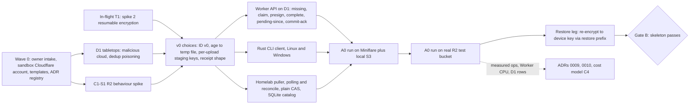

# Reliquary R&D research plan

- **Status:** Draft for owner review. Nothing runs until the owner says "go".
- **Date:** 2026-09-29
- **Saved as:** `docs/research/PLAN.md`

**Purpose.** This plan covers the research phase for Reliquary, from the settled requirements in `CLAUDE.md` and the two Accepted ADRs to a verified end-to-end prototype and a complete set of decisions. For each topic it says what to find out, how, and which decision the answer feeds: methods, alternatives, best practice, similar work, implementation goals, tools and libraries. Every workstream has to end in a decision (an ADR, a spec, a runbook or an owner decision request) or in an explicit "accepted risk". A survey with no decision attached does not count as done. The plan merges six lens drafts and two critiques. Where two lenses researched the same thing, one workstream now owns it and the others only feed it requirements. Nothing in this plan reopens a settled requirement. Anything that would change `CLAUDE.md`, ADR-0001 or ADR-0002 goes to the owner decision queue (§4.3) as a proposed superseding ADR.

---

## 1. Inputs already in flight

These two tracks are already running. The plan uses their results and does not repeat their work. New questions for them are listed below and are sent to them in Wave 0, not researched a second time here.

| Track | Where | What it covers | How this plan uses it |
|---|---|---|---|
| **T1. Client technology stack → ADR-0003** | `docs/research/client-stack.md` | Compares Rust core + Flutter, Tauri, native (UniFFI), KMP and pure Flutter. Current recommendation: **option C** (Rust core + UniFFI, Kotlin/Compose Android, Tauri 2 desktop + Rust daemon). Spikes 1–8: SAC first launch, resumable encryption vs `age` randomness, Android UIDT/WorkManager/`setRequireOriginal`, R2 part size and presigned UploadPart, Tauri updater, desktop process model, hash throughput, iOS paper check. | **Working assumption: option C.** Flutter- and KMP-specific tool lists are dropped unless ADR-0003 changes course. Spikes here extend T1 spikes and do not repeat them: A1-S1 adds BLAKE3 and energy use to spike 7; A2 uses spike 2; B2 uses spike 3; C1-S1 widens spike 4; B7/D5 extend spikes 1 and 5 (SAC after a self-update); B1 extends spike 6; B4-S1 extends spike 8. |
| **T2. Fact-check of ADR-0001/0002** | `docs/research/fact-check-adr-0001-0002.md` | Snowball, S3 egress, R2 limits and pricing, Queues pull consumers and retention, D1/DO capacity, Email Service, Play testing and verification rules, MOTW and Gatekeeper on USB-copied apps, signing costs. | All pricing and limit facts come from T2. The cost model (C4) and the control plane (C1) cite T2 and do not re-derive them. |

**Questions to send to T1 before ADR-0003 is accepted** (each could change it):
1. iOS timing and the constraints the core must meet (from B4).
2. Whether macOS TCC attributes access correctly to a separate LaunchAgent daemon (B7-S1).
3. TypeScript vs `workers-rs` for the Worker. This decides whether every format needs a second implementation (C1).
4. npm exposure of the Tauri frontend (D5-S4).
5. The iPhone share of the family's camera-roll bytes (E1-S2).

**Time-sensitive claims to send to T2.** The lens drafts rely on these, but they are not yet verified, so no ADR may depend on them until T2 confirms them:
- age v1.3 hybrid post-quantum recipients (ML-KEM-768+X25519): support in the Rust `age` crate, `kage`, Swift.
- The reported iOS 26.1 PhotoKit background resource upload extension, and iOS 26 `BGContinuedProcessingTask`.
- Android 16 job quotas while a foreground service runs; Android 17 local-network permission; Play target API 36 required for updates from 31 Aug 2026; 16 KB page-size requirement.
- Play limited-distribution account details; developer-verification timeline and what identity it exposes; how the Play account-deletion policy applies to invite redemption.
- Google Photos Library API restrictions since 2025; Firebase Dynamic Links shutdown.
- Cloudflare: Queues pull API rate limits via `api.cloudflare.com`; R2 conditional writes on presigned requests; R2 bucket locks; Workers Rate Limiting binding status; mTLS client-certificate limits per plan; D1 Time Travel and Durable Object PITR windows; Workers VPC status; Email Service status and pricing; absence of any hard spend cap.
- OpenZFS RAIDZ expansion status (and "AnyRaid"); Proxmox VE 9.x OCI-in-LXC and virtiofs; MinIO community edition status.
- Windows 10 consumer ESU end date; macOS 26 as the last Intel release; NDSA Levels v2.1.
- Azure Artifact Signing eligibility for the owner's jurisdiction.

---

## 2. Workstreams

### 2.0 Conventions

**Priorities**

| Level | Meaning |
|---|---|
| **P0** | On the critical path to the walking skeleton, or a one-way-door decision that must close before the first real family ingest (Gate A) or the first kit (Gate C items are flagged). |
| **P1** | Blocks the family pilot (Gate C). |
| **P2** | After the pilot. |

**Execution tags** (every spike has one)

| Tag | Who or what runs it |
|---|---|
| `[CT]` | An agent in the cloud container: docs, source, local emulators, x86 benchmarks. |
| `[SB]` | An agent using the dedicated **sandbox** Cloudflare account and throwaway domain (H1), never production. |
| `[OL]` | Owner-lab hardware: phones, Macs, Windows PCs, sticks, homelab. Agents deliver a **kit** (scripts, checklist, result template) under `docs/research/kits/<spike-id>/`. |
| `[FM]` | Family participants: consolidated visits, consent needed (E2 test plan). |
| `[EXT]` | An external calendar wait: Play review, identity verification, DMARC observation, postage. |
| `(build)` | Needs code beyond a throwaway spike. Runs in the build phase after research. |

**Shared budget sheet** (`docs/research/budgets.md`, owned by H1). Spike pass criteria cite these IDs and do not invent their own thresholds. The values are proposed defaults; the owner confirms them at intake (H2). The sheet also settles thresholds that conflicted between drafts.

| ID | Budget | Proposed default |
|---|---|---|
| BUD-TTS | Time to safe | New photo "stored at home" within 24 h while the device is online and the homelab is up; median time to "sent" under 1 h on idle Wi-Fi |
| BUD-BAT-D | Phone steady-state battery | < 2 % per day |
| BUD-BAT-S | Seed battery cost | Report % per 10 GB; target set after A1-S1 |
| BUD-TMP | Phone temp disk | ≤ 2 GB, and never push free space below 10 % |
| BUD-HASH | Hash + HMAC floor | First pass of a 128 GB library within one 6 h charge window on a low-end phone (≈ 6 MB/s effective, including I/O); stretch goal 50 MB/s compute |
| BUD-DESK | Desktop agent | Idle RAM < 150 MB, idle CPU < 1 % average; background work < 25 % of one core |
| BUD-SCAN | Metadata reconciliation | 500k files in < 5 min on a mid-range laptop at background priority |
| BUD-INGEST | Homelab ingest | ≥ max(100 MB/s, 2 × home downlink) |
| BUD-RESTORE | Restore | Single-file read from the store < 5 s; owner time per single-file request < 30 min; whole-device default set by A8-S3 |
| BUD-AUDIT | Fixity | Full app-level audit of 10 TB fits a monthly window without starving ingest |
| BUD-CPU-REQ | Worker auth | Request-signature verification < 1 ms CPU |
| BUD-REVOKE | Revocation | No new presigned URLs within 60 s; outstanding URLs expire within 15 min |
| BUD-RECOVERY | Break-glass | A non-author recovers 10 named photos from the doomsday kit in ≤ 2 h |
| BUD-ENROLL | Kit enrollment | A relative enrolls a computer from the kit unaided in ≤ 20 min |
| BUD-SUPPORT | Owner time | ≤ 2 h per month at steady state |
| BUD-CLOUD | Monthly cloud cost ceiling | Owner sets (H2) |
| BUD-ABUSE | Worst-case abuse spend before auto-suspend | Owner sets (H2) |
| BUD-TEL | Telemetry | < 1 MB/day network and < 50 MB disk per device |

**Spike template.** Every spike states: hypothesis; the decision it informs; "pass → option X, fail → option Y"; the budget IDs it cites; its exec tag; and its data-handling class (H3).

### 2.1 ADR reservation and ownership of normative artifacts

Numbers are reserved centrally (H1 keeps `docs/adr/README.md`) so that numbers do not collide. Every normative artifact has exactly one owning workstream; other workstreams only supply requirements to it.

| ADR | Decision | Owner | Normative artifacts owned | Gate |
|---|---|---|---|---|
| 0003 | Client technology stack | T1 (in flight) | — | before B-track |
| 0004 | v1 scope, platforms (incl. iOS timing), non-goals | E2 (+B4) | — | A |
| 0005 | Build, adopt, fork or compose | F1 | requirement-fit matrix, effort model | A |
| 0006 | Content identity and dedup ID | A1 | `docs/spec/identifiers.md` + vectors | A |
| 0007 | Object envelope and metadata record | A2 | `docs/spec/object-format.md` + vectors | A |
| 0008 | Key hierarchy, custody, recovery | D2 | key inventory, ceremony runbook | A |
| 0009 | Ingest protocol, receipts, reconciliation | A3 | `docs/spec/ingest-protocol.md`, state table, formal model, protocol-state → UX-state map | A |
| 0010 | Control-plane topology and API v1 | C1 | `docs/design/api-v1.md` (OpenAPI), R2 key layout | B |
| 0011 | Bundle and manifest; USB transport | A4 | `docs/spec/bundle-format.md` + fixtures | A |
| 0012 | Homelab at-rest posture and storage engine | A6 | — | A |
| 0013 | Catalog database and schema | A6 | catalog schema, rebuild procedure | B |
| 0014 | Enrollment, device identity, revocation, abuse limits | D3 (+C2) | API auth spec, entropy table | C |
| 0015 | Update trust root, release signing, supply chain | D5 | release runbook, dependency policy | C |
| 0016 | Keepsake item model | A5 | media quirks matrix, golden corpus spec | A (core) |
| 0017 | Desktop runtime and resource governance | B1 | per-OS capability matrix | C |
| 0018 | Android background execution and media access | B2 | OEM matrix | C |
| 0019 | Android distribution channel and Play compliance | B3 | policy dossier | C |
| 0020 | Source layer and change detection | B5 | source-plugin interface spec | C |
| 0021 | Client local state and transfer pipeline | B6 | client DB schema | C |
| 0022 | Desktop packaging and self-update mechanics | B7 | "cost of not signing" table | C |
| 0023 | Keepsake discovery policy | E4 | default include/exclude rules | C |
| 0024 | Health model and status vocabulary | E3 | copy deck | C |
| 0025 | Nudge policy and notification channels | E3 | — | C |
| 0026 | Email provider and sending domain | C3 | DNS record plan | C |
| 0027 | Privacy and data minimisation | D6 | `docs/security/data-inventory.md`, family charter | C |
| 0028 | Restore pipeline v1 | A8 | restore-manifest spec | C |
| 0029 | Integrity, fixity and preservation policy | A7 | fixity-chain diagram | C |
| 0030 | Homelab hardware, filesystem, power | C5 | BOM | C |
| 0031 | Homelab deployment and IaC | C6 | bootstrap README | P2 |
| 0032 | Admin tooling and disaster recovery | C8 | runbooks, DR calendar | C |
| 0033 | Telemetry, crash reporting, alerting | B8 + C7 | SLO and alert table | C |
| 0034 | Repository layout, build, CI | G1 | — | build |
| 0035 | Test and verification strategy | G2 | invariant table | build |
| 0036 | Licence and release process | G3 | licence inventory | before adopting code |
| 0037 | LAN direct: build or defer | A4 | — | P2 |
| 0038 | Onboarding kit and code formats | E5 | kit spec, card template | C |
| 0039 | Accessibility and localisation | E6 | voice guide | C |
| 0040 | Family roles and life events | E7 | roles matrix | C |

Documents that are not ADRs but have a single owner: the threat register `docs/security/threat-model.md` (D1); the glossary and data model `docs/design/glossary.md` and `docs/design/data-model.md` (H4); the cost model (C4); the budget sheet, decision queue, one-way-door register and traceability matrix (H1).

---

### Track A: Core data path (formats and protocol)

#### A0. Walking skeleton on provisional choices
**Goal:** Connect the separate prototypes early. Show that desktop → Worker/R2 → homelab → verified restore works end to end on explicitly provisional (v0, version-tagged, throwaway) choices, and measure the numbers the P0 ADRs need.
**Priority:** P0 (critical path; defines Gate B).
**Exec:** CT, then SB; Windows run OL.
**Owns:** `spikes/skeleton/` (throwaway) and the measurement report. No ADR.
**Depends on:** D1-S1/S2, C1-S1, G2-S1, T1 spike 2 (or the temp-file workaround), H1 sandbox account.

| Concern | v0 choice | Replaced by |
|---|---|---|
| Dedup ID | `v0:` + HMAC-SHA256(K, SHA-256(content)) | ADR-0006 |
| Content encryption | `age` to a test homelab key into an on-disk temp file; multipart parts uploaded from that file (avoids the resumability question) | ADR-0007 |
| Staging key | Per-upload unique key with conditional create | ADR-0009/0010 |
| Cloud state | D1 only | ADR-0010 |
| Notification | Homelab polls a signed "pending since cursor" endpoint and reconciles; no Queues | ADR-0009/0010 |
| Store / catalog | Plain CAS on ZFS or ext4 + SQLite catalog | ADR-0012/0013 |
| Client | Rust CLI, Linux and Windows; no daemon or UI | ADR-0003/0017 |
| Credential / receipt | Static test device key; Ed25519 receipt from a test homelab signing key | ADR-0014/0009 |

**Key questions**
- Which measurements feed which ADR: Class A/B operations per file, D1 rows per 1,000-ID batch, Worker CPU per presign batch, homelab MB/s, peak staging bytes.
- How do Miniflare and the local S3 target differ from real R2, and which differences matter?
- What code, if any, is worth keeping after the skeleton?

**Similar work:** Ente museum (presigned multipart from clients to S3-compatible storage); Immich bulk-upload-check (dedup handshake); restic rest-server `--append-only` (minimal append-only HTTP).
**Libraries/tools:** wrangler/Miniflare, Hono or workers-rs (per C1), rusty-s3 / aws-sdk-s3, age/rage, rusqlite, toxiproxy.
**Methods:** thin integration build; fault injection; measurement.

| Spike | Exec | Pass / fail → decision |
|---|---|---|
| A0-S1 Integrated run | CT→SB (+OL Windows) | 10,000 mixed files plus one 6 GB video reach the homelab. Every SHA-256 is re-verified after decrypt, catalog rows are complete, staged objects are deleted only after a durable commit, and a second run uploads 0 bytes. Pass → Gate B candidate. Fail → the failing join becomes a named question in 0009 or 0010. |
| A0-S2 Crash | CT | kill -9 client and homelab at 20 random points each. Pass: no item lost or committed twice, and reconciliation alone recovers. |
| A0-S3 Restore leg | SB | Admin restores 20 files, re-encrypted to the device key, through the `restore/` prefix. Pass: byte-identical, and objects expire by lifecycle rule. |

**Deliverables:** `docs/research/a0-walking-skeleton.md` with measured numbers and a list of emulator vs R2 differences. Feeds ADR-0009, 0010, 0012 and C4.

#### A1. Content identity and dedup ID
**Goal:** Fix the hash algorithm, dedup-ID construction, encoding, versioning and rotation before any real data is hashed. Publish a normative identifier spec with cross-language test vectors.
**Priority:** P0 (one-way door; Gate A).
**Exec:** CT, OL.
**Owns:** ADR-0006, `docs/spec/identifiers.md`, and the *contract* for hash-cache keys. The per-platform signals themselves belong to B5 (desktop) and B2 (Android).
**Depends on:** F3, T1 spike 7, D2 (custody and delivery of K).

**Key questions**
- SHA-256 (hardware-accelerated on ARMv8 and SHA-NI) vs BLAKE3: throughput and energy per GB on real device classes. Is I/O the real bottleneck?
- HMAC(K, content) as in ADR-0001, HMAC(K, SHA-256(content)), or keyed BLAKE3? Compare read passes, whether the secret can be rotated from the cache without re-reading files, and any security difference (for example, precomputation once K leaks).
- Wire format: version prefix, domain-separation label, full 256 bits or truncated, and an encoding that is safe as an R2 key, a FAT/exFAT filename and a catalog key.
- Whole-file digest vs block or tree hash (Dropbox `content_hash`, BLAKE3/Bao) for per-part verification and parallel hashing. Reserve room for future chunk lists without adopting content-defined chunking now (see the 2025 CDC attacks in F3).
- Rotation: epoch-tagged IDs, the procedure after a device compromise, and how the homelab re-derives IDs.
- Minimum safe rules the contract imposes on clients: racy mtime (git's racy-git problem) and TOCTOU (hash while encrypting and abort on mismatch, vs encrypt once).
- The same ID must apply to items with no device of origin (A9 admin import).

**Alternatives:** SHA-256 + HMAC over content; SHA-256 + HMAC over SHA-256 (rotatable from the cache); BLAKE3 + keyed BLAKE3; tree hash + HMAC over the root; FastCDC per-chunk IDs (reserved for v2).
**Similar work:** git `racy-git.txt` (mtime-granularity pitfall); restic/rustic (inode+ctime+mtime change detection); Dropbox `content_hash` (per-block verification); Kopia and Tarsnap (keyed IDs that stop the provider testing for known files); Tahoe-LAFS convergence secret (closest analogue to a family secret, with documented attacks).
**Libraries/tools:** RustCrypto `sha2` (asm/ARMv8), `blake3`, `bao`, `hmac`, `fastcdc` (reservation only), ring or aws-lc-rs.
**Methods:** spec and source reading; benchmarks reusing the T1 spike 7 harness; property tests; vectors in two languages.

| Spike | Exec | Pass / fail → decision |
|---|---|---|
| A1-S1 Hash benchmark, SHA-256 vs BLAKE3, 4 device classes | CT + OL | Chosen algorithm meets BUD-HASH without thermal throttling; record MB/s and BUD-BAT-S. |
| A1-S2 Rotation over a 1M-entry cache | CT | HMAC over SHA-256 rotates in < 60 s on the client with zero file reads and in < 24 h at the homelab. Record the full re-read cost of the content variant. |
| A1-S3 Vectors | CT | Rust plus a second implementation (TS or Kotlin) agree on 50 vectors, including an empty file, > 4 GiB, and domain-separation negatives. |

**Deliverables:** ADR-0006; `identifiers.md` with vectors; benchmark note.

#### A2. Object envelope and metadata-record format
**Goal:** Specify the envelope for content objects and per-(device, file) metadata records: algorithm suite, recipients (recovery and possibly post-quantum), sender authentication, segmentation for resumable uploads, padding and versioning. Stock tools must still be able to read it in 30 years.
**Priority:** P0 for the envelope (Gate A); P1 for the metadata-record schema (versioned, extensible CBOR can follow A5).
**Exec:** CT, OL.
**Owns:** ADR-0007, `docs/spec/object-format.md`, and the resumable content-encryption decision (uses T1 spike 2).
**Depends on:** T1 spike 2, D2, F3, D1.

**Key questions**
- Which construction: age X25519, age hybrid PQ recipients (verify through T2), HPKE (RFC 9180) + STREAM, Tink streaming AEAD, or libsodium `secretstream`? Criteria: spec stability (C2SP), audits, implementations in Rust/Kotlin/Swift/TS, and whether a stock CLI can decrypt.
- Post-quantum from day one? This is a keep-forever archive and ciphertext crosses R2 and the post (harvest now, decrypt later). What do header size and phone CPU cost?
- Recipient set: an online ingest key plus an offline recovery key (D2). Rotation should only rewrap file keys, never re-encrypt 10 TB.
- Sender authentication: age is anonymous, so anyone with the homelab public key can forge objects. Options: a device Ed25519 signature over (ciphertext digest, dedup ID, metadata digest, device sequence), HPKE auth mode, or sign-then-encrypt inside the metadata record. The metadata record must be bound to its object, device and time (lessons from F3: MEGA, Nextcloud, CCS 2024).
- Resumability: segments aligned to multipart parts (R2 requires equal part sizes except the last). Either regenerate them deterministically from a (file key, nonce) stored in the client DB, or require a temp file (iOS background URLSession uploads only from files). Temp space is limited by BUD-TMP, and the file key must be erased after commit.
- Detect truncation and reordering; allow random access for restores.
- Length hiding: Padmé vs size buckets vs none, decided by F3-S1. How does zstd for documents interact with padding?
- Metadata-record fields (from A5 and the H4 glossary). Deterministic CBOR (RFC 8949) vs protobuf vs JSON. Schema evolution for pluggable sources.
- Algorithm agility and a migration path for anything kept encrypted at rest (depends on A6's at-rest posture).

**Alternatives:** age v1 X25519; age hybrid PQ; HPKE base/auth + STREAM; Tink Hybrid + Streaming AEAD; libsodium `crypto_box_seal` + `secretstream` (Ente style); saltpack-style signcryption; OpenPGP RFC 9580 via Sequoia (for tooling longevity).
**Similar work:** age/C2SP spec + CCTV vectors (how to publish a format); Duplicacy RSA mode (metadata chunks were not covered; avoid this); bupstash put-only keys and Tarsnap write-only keys (devices that cannot decrypt); Ente per-file `secretstream` keys (audited, on mobile); Cryptomator file format and rclone crypt (64 KiB blocks); saltpack (sender authentication); PURBs/Padmé (size padding); Borg 1 AES-CTR nonce reuse and the Borg 2 redesign.
**Libraries/tools:** age/rage, Go `filippo.io/age`, kage, typage, age-plugin-yubikey, hpke/hpke-rs, RustCrypto `chacha20poly1305`, `ml-kem`/libcrux, ed25519-dalek, Tink, libsodium/dryoc, Sequoia, ciborium/minicbor, zstd, CryptoKit (HPKE).
**Methods:** spec and audit reading; the format section of the D1 register; interop and energy spikes.

| Spike | Exec | Pass / fail → decision |
|---|---|---|
| A2-S1 Throughput and energy, X25519 vs PQ (single PQ benchmark; replaces three duplicates) | CT + OL | Encryption is never the bottleneck against a 100 Mbit uplink. PQ header ≤ 3 KB per object and ≤ 10 % throughput loss on a low-end phone; record BUD-BAT-S. Fail → X25519 now, with a migration plan. |
| A2-S2 Kill-and-resume, 50 random kills | CT | Every object decrypts to the exact SHA-256, at most one segment is re-encrypted per kill, a property test shows no (key, nonce) reuse, and no file key survives commit. |
| A2-S3 Interop | CT | Rust output decrypts with the Go age CLI and vice versa; kage and typage parse the headers; 100 % of CCTV and project vectors pass. |
| A2-S4 Forgery and truncation | CT | A forged object + manifest (attacker holds only the public key) and a dropped final chunk are both rejected before any catalog write, with specific error codes. |

(The stock-tools decryption check is part of the combined recovery drill, D2-S3.)
**Deliverables:** ADR-0007; `object-format.md` with vectors; benchmark note.

#### A3. Ingest protocol, receipts and the client/server state machine
**Goal:** One co-designed, model-checked protocol covering the server claim/commit machine and the client's per-file states. It must never lose an item, never delete a staged object before a durable commit, and give each device verifiable proof that its data is safe at home.
**Priority:** P0.
**Exec:** CT, SB.
**Owns:** ADR-0009; `docs/spec/ingest-protocol.md` (sequence diagrams, state table, error codes, receipt format); the formal model and invariants; the single map from protocol states to user-visible states (E3 uses it). The dedup-poisoning, receipt-tamper and compromised-Worker tests belong to D4.
**Depends on:** D1-S1/S2, C1-S1, A1, A2, F3.

**Key questions**
- States. Server: unknown → claimed (TTL, device, upload ID) → staged → verifying → committed or rejected. Client: discovered → hashed → dedup-checked → encrypted/staged → uploading → staged in R2 → committed (receipt) → re-verified. Side states: on USB in transit, cloud-only, excluded, failed (with reason).
- Concurrency: exclusive claim with TTL vs parallel uploads under per-upload keys, deduplicated at the homelab. How is a claim taken over when the claimant disappears mid-multipart? What happens when R2's 7-day auto-abort hits a slow phone?
- "Already have it" semantics: the device still sends its metadata record; the item is safe only after homelab verification; the answer grants no read rights.
- Receipts: homelab-signed per file, or a per-device signed Merkle log or watermark (Sigsum/Tessera-style)? Relayed by the Worker; the device audits that every item has one; verifiable offline; also delivered by USB for offline devices (A4).
- Dedup poisoning or verification failure: reject, reset the claim, ask other holders to upload, flag the device.
- Reconciliation comes first; the queue is only an optimisation. Define the cursor, the idempotent ack and behaviour when an outage outlasts queue retention. Evaluate the Queues pull consumer (and its `api.cloudflare.com` rate limits) only as a latency improvement.
- The durable-commit contract as an interface (this breaks the dependency cycle with A6): put-by-ID is fsynced before the ack; idempotency key = (dedup ID, metadata-record ID); staging is deleted only after the ack.
- Metadata-only events: renames, deletions on the device (tombstones, sightings), batching.
- Clocks: use server time and per-device sequence numbers; define where BUD-TTS is measured.
- Mixed transports: an "in transit via USB" state, fallback to R2, receipts exactly once across both paths.

**Alternatives:** exclusive claim with TTL; optimistic parallel upload + homelab dedup; two-phase upload token then batch-create (Google Photos Library API style); S3 multipart with presigned parts vs tus in a Worker vs one object per segment; receipts per file vs Merkle log vs none.
**Similar work:** Google Photos Library API two-phase upload (analogue of claim/commit); an Immich CLI issue in which "duplicate" was treated as "safe" (drafts cite #31622; verify), showing that duplicate must never mean safe; Ente museum multipart; restic rest-server append-only; Duplicacy lock-free dedup; Dropbox upload sessions and B2 large-file API; tus.io resume semantics; Certificate Transparency and Sigsum (signed append-only logs).
**Libraries/tools:** TLA+/PlusCal with TLC or Apalache, Stateright, P language; wrangler/Miniflare; ed25519-dalek; rs-merkle.
**Methods:** formal model; protocol section of the D1 register; fault injection on the A0 harness.

| Spike | Exec | Pass / fail → decision |
|---|---|---|
| A3-S1 Model check: 3 devices × 3 items, bounded crashes, dropped or duplicated messages, homelab offline | CT | Invariants hold: no staged object deleted before a durable commit; every claimed item is eventually committed or re-claimable; "safe" only with a valid receipt; dedup never merges different plaintexts. Every counterexample is fixed in the spec. |
| A3-S2 Fault injection on the A0 harness | CT | Two devices upload the same 2 GB file and one is killed; homelab offline for a simulated 15 days; 5 % of notifications dropped. Pass: exactly one blob, both devices hold receipts, no orphans after reconciliation. |
| A3-S3 Real-R2 resume after 24 h and after 7 days | SB | Completes without re-sending finished parts, or the protocol reclaims cleanly at the 7-day abort; lifecycle rules clean up abandoned uploads. |

**Deliverables:** ADR-0009; `ingest-protocol.md`; the model; the state → vocabulary map.

#### A4. Bundle and manifest format, USB transport, LAN decision
**Goal:** Specify the transport-agnostic bundle and signed manifest; the USB write, verify and ingest procedure; the LAN decision; and support for devices that are rarely or never online.
**Priority:** P0 for the manifest format (Gate A); P1 for the USB procedure; P2 for LAN.
**Exec:** CT, OL.
**Owns:** ADR-0011, ADR-0037, `docs/spec/bundle-format.md` with sample bundles, and the USB write and USB ingest runbooks. The writer implementation belongs to B6.
**Depends on:** A2, A3 (a bundle is the protocol's object plus a signed manifest entry, not the other way round), T2, C4.

**Key questions**
- Unit of transfer: one object per file, restic-style packs of small files, or fixed segments? Where is the threshold, given R2 operation costs (T2, C4)?
- Manifest contents: bundle ID, device ID, per-device monotonic sequence plus a hash chain to the previous manifest (gaps reveal missed uploads), object list with ciphertext digests and segment layout, device signature. What does the Worker validate and what does the homelab validate?
- Adopt BagIt (RFC 8493), an OCFL inventory or CARv2, or a minimal custom format? Which is easiest to read in 20 years? Does an encrypted payload fit BagIt semantics?
- USB: exFAT vs FAT32 (4 GiB file limit, so videos must be segmented); atomic writes (temp + fsync + rename, manifest last as the "sealed" marker); read-back verification; surprise removal; spanning several sticks; detecting fake-capacity sticks; USB-A vs USB-C.
- Homelab USB ingest happens in a disposable VM with read-only mounts and HID blocked (D4).
- par2/Reed-Solomon error correction vs re-requesting damaged objects over R2.
- Devices rarely or never online: can enrollment requests, receipts and signed updates travel inside bundles, and how does such a device show honest status?
- LAN: the same S3 protocol against a LAN S3 endpoint (Garage, SeaweedFS, versitygw) found by mDNS, vs a custom receiver. Account for **hairpin traffic**: a device at home uploads to R2 over the home uplink and the homelab pulls it back over the same ISP link, counting against data caps. The Android 17 local-network permission and the iOS local-network prompt apply (verify).
- Can the same format carry restore bundles (A8)?

**Alternatives:** per-file objects + CBOR/JSON manifest; restic-style packs; BagIt bag; CARv2; tar/zip per bundle; OCFL-like inventory; LAN none / LAN S3 gateway / custom HTTPS / SMB drop.
**Similar work:** BagIt (LoC; completeness and fixity for sneakernet); OCFL `inventory.json`; IPFS CARv2; git-annex `whereis` and special remotes (which offline drive holds what); restic pack format; Backblaze B2 Fireball and CrashPlan seeded backup (reconciling after a shipped drive); `restic copy` and Kopia `repository sync-to`.
**Libraries/tools:** bagit-python, rocfl, go-car/iroh-car, par2cmdline-turbo, reed-solomon-simd, f3, Garage, SeaweedFS, versitygw, mdns-sd.
**Methods:** spec reading; fault injection; the ops-per-TB cost model is part of C4; real sticks on real OSes.

| Spike | Exec | Pass / fail → decision |
|---|---|---|
| A4-S1 USB write torture (single owner of this test) | OL (kit) | A 50 GB bundle including a 12 GB video, written to FAT32, exFAT and NTFS sticks from all three desktop OSes, pulled out at 10 random points. Pass: resumes without rewriting completed objects; homelab ingests every sealed bundle with zero corrupt or duplicate items and ignores unsealed ones. |
| A4-S2 Damage localisation | CT | Flip 100 random bytes. Pass: damage is pinned to specific objects, the rest is ingested, and only the damaged objects are re-requested. |
| A4-S3 Double-path ingest | CT | Ingest the same stick twice, and a stick whose items already arrived via R2. Pass: no duplicate blobs or sightings; receipts exactly once. |
| A4-S4 BagIt fit | CT | An encrypted-payload bag validates in bagit-python, and a single flipped bit is detected. |
| A4-S5 LAN decision | OL | 200 GB via LAN S3, R2 and USB, including owner handling time and ISP cap or hairpin cost. Build LAN only if it is > 2× faster end to end than USB for a typical seed and needs no listener beyond the LAN. |

**Deliverables:** ADR-0011, ADR-0037, `bundle-format.md`, runbooks.

#### A5. Keepsake item model and media semantics
**Goal:** Define a keepsake item as a group of byte-exact resources with roles. Capture each platform's media quirks. Build the golden media corpus.
**Priority:** P1. The grouping and roles core must land before the metadata-record schema freezes (a Gate A input to A2). iOS depth is limited to "must not preclude" until B4 decides.
**Exec:** OL, FM, CT.
**Owns:** ADR-0016, the media quirks matrix, the golden corpus spec (fixtures stored per H3).
**Depends on:** H3, B4, T1.

**Key questions**
- Asset-group model: resource roles (original, paired video, edit render, adjustment data, RAW, sidecar) and grouping keys (Live Photo content identifier, Motion Photo XMP, RAW+JPEG basename, XMP sidecars).
- Android: Google and Samsung Motion Photos; Ultra HDR / ISO 21496-1 gain maps (never transcode); `IS_PENDING`/`IS_TRASHED`; SD cards; app folders such as WhatsApp.
- Desktop: RAW+JPEG, XMP sidecars, `.AAE`, Apple Photos libraries and Lightroom catalogs (back up as opaque files or parse them?).
- iOS (enough not to preclude it): PHAssetResource types, original vs current edit, bursts, spatial video.
- Transcoded duplicates (HEIC→JPEG on Windows import, messenger recompression): record a perceptual hash at the homelab for grouping (not dedup), later?
- Capture time: EXIF `DateTimeOriginal` + `OffsetTimeOriginal`, QuickTime UTC. Which value drives "backed up through date X"?
- Filesystem metadata needed for a faithful restore (btime, xattrs, Finder tags, ADS) and what to ignore.
- Large-video policy (5–100 GB): temp disk, thermal/battery/metered limits, ordering, ETA.
- Restore fidelity: Live Photos back into Photos, MediaStore `DATE_TAKEN`. Generalising to future sources (Takeout JSON sidecars).

**Alternatives:** flat file items; asset groups; Live Photo as one zip blob (Ente) vs two blobs + a group record; originals only vs originals + edits; perceptual grouping later vs never.
**Similar work:** osxphotos (best map of PhotoKit edge cases); icloudpd; Immich Live and Motion Photo linking; Ente zip packaging (and why separate byte-exact blobs dedup better); PhotoSync; Google Motion Photo and Ultra HDR specs; a libultrahdr issue where re-encoding dropped XMP (never re-encode originals).
**Libraries/tools:** ExifTool, exiv2, nom-exif/kamadak-exif, libheif, libultrahdr, LibRaw, ffprobe/MediaInfo, image_hasher.
**Methods:** doc and source reading; hand-labelled corpus; round-trip prototype.

| Spike | Exec | Pass / fail → decision |
|---|---|---|
| A5-S1 Golden corpus of ~40 items (Live Photo original + edit, ProRAW, burst, portrait, spatial video; Pixel Motion Photo + Ultra HDR; Samsung motion photo; RAW+JPEG+XMP; 20-min 4K60 HEVC; ProRes; WhatsApp-received media; Windows auto-converted imports) | OL/FM | Extracted resources, grouping keys and capture times match the hand labels for 100 % of items. |
| A5-S2 Round trip (with A8) | CT/OL | Every original is SHA-256-identical; Live Photos play; Motion Photos animate; gain maps are present. |
| A5-S3 20 GB video on a phone through metered switches, low battery, app kills and a reboot | OL | Completes within BUD-TMP, and no finished segment is re-uploaded. |

**Deliverables:** ADR-0016, quirks matrix, corpus spec, large-video policy note.

#### A6. Homelab at-rest posture, storage engine and catalog
**Goal:** Close the storage-engine decision that `CLAUDE.md` lists as open: store verified content and metadata forever so it is restorable by hash, scrubbable, rebuildable without the catalog and readable for decades. Decide the at-rest posture and the catalog. This workstream includes the storage-engine prior-art survey.
**Priority:** P0 for the posture and the knockout screen (Gate A); P1 for the bake-off.
**Exec:** CT, OL.
**Owns:** ADR-0012, ADR-0013, the catalog schema and the rebuild-from-store procedure. People-side departure policy belongs to D6; refcounting mechanics are here.
**Depends on:** A2, A3 (commit contract), A9 (items with no device of origin), H4, C5, H3, H2.

**Key questions**
- **Decide the at-rest posture first.** Options: keep the received age ciphertext as it is; store plaintext on ZFS native encryption; or re-encrypt into restic/Kopia/PBS. Consequences to compare: must the private key be online for ingest and scrubs? Unattended unlock after a power cut; derivative generation; cost of adding a recovery recipient later (rewrap vs re-encrypt); what a stolen box exposes; whether an heir can read it; whether an optional read-only Immich or PhotoPrism view is possible.
- **Knockout criteria before any bake-off:** library-driven per-file ingest keyed by our ID; a specified format with an independent reader; single-file restore by hash; a compatible licence (G3); fit with the chosen posture. Bake off at most three survivors.
- Snapshot-oriented engines vs continuous per-file ingest at 3–5M objects, 10 TB, growing 1–2 TB per year: index RAM and verify cost.
- Readability without Reliquary: a browsable tree vs opaque packs.
- Catalog: Postgres vs SQLite. Model blobs, items and asset groups, sightings, persons and devices, an archive of raw encrypted metadata records (so the catalog can be rebuilt from the store), ingest events, receipts, restore jobs, scrub results. Size at 5M items. Backups (pgBackRest/WAL or SQLite backup) and consistency after crashes.
- The ingest service is Rust and shares the format crates. Parsers are sandboxed (D4). Backpressure and BUD-INGEST.
- Admin-only pruning with cross-user dedup: refcounting across persons.
- Keep a future off-site copy easy (zfs send, restic/Kopia copy, rclone crypt) without choosing one now.

**Alternatives:** plain CAS on ZFS + Postgres; OCFL 1.1 storage root; restic via rustic_core; Kopia; Borg 2; Proxmox Backup Server; Plakar/Kloset; bupstash; git-annex; CAS + a generated read-only browsable view; catalog Postgres vs SQLite vs an event log with projections.
**Similar work:** restic/rustic (specified format with an independent Rust reimplementation); Kopia (library API, robustness tests, ECC); Proxmox Backup Server (Rust chunk store with keyed digests close to HMAC IDs, verify jobs, already part of the owner's setup); Plakar/Kloset (check maturity and single-vendor risk); bupstash (put-only keys); OCFL (plain-file longevity, used by Fedora Commons); git-annex; Perkeep; Immich storage template and PhotoPrism originals (browsable layouts families use); Duplicati 2 local-DB fragility (avoid).
**Libraries/tools:** OpenZFS, rustic_core, restic + rest-server, Kopia, Borg 2, PBS, Plakar, rocfl/ocfl-py, git-annex, Postgres + pgBackRest, SQLite, sqlx/rusqlite, fio, hyperfine, LazyFS.
**Methods:** spec and source reading; knockout screen; bake-off; crash testing; no-software recovery exercise.

| Spike | Exec | Pass / fail → decision |
|---|---|---|
| A6-S1 At-rest posture decision matrix | CT → owner (OD-07) | Owner picks a posture before Gate A. |
| A6-S2 Bake-off of ≤ 3 engines on the 200–500 GB H3 corpus | OL | Meets BUD-INGEST; single-file restore by SHA-256 < 5 s; full verify extrapolated to 10 TB within BUD-AUDIT; RAM < 4 GB. Record overhead and catalog size. |
| A6-S3 Crash consistency: kill -9 ×100, VM power cut ×10 (LazyFS in container) | CT/OL | No acknowledged item lost; nothing acknowledged before it is durable; store and catalog reconcile automatically. |
| A6-S4 Catalog loss | CT | Rebuild from the store gives a byte-identical canonical export. |
| A6-S5 Format independence | CT | Restore with an independent implementation (restic↔rustic), or with coreutils + age + sqlite3 and a one-page procedure. Byte-identical; weighted in the ADR. |

**Deliverables:** ADR-0012, ADR-0013, bake-off report, Proxmox layout sketch (with C6).

#### A7. Integrity, fixity and preservation policy
**Goal:** Define the fixity chain from device to disk and back, app-level audit and repair cadence, scheduled restore drills, format policy and the NDSA target level. Digital-preservation practice is merged in here.
**Priority:** P1.
**Exec:** CT, OL.
**Owns:** ADR-0029, fixity-chain diagram with gap analysis, drill runbook, format policy table, NDSA gap analysis. Disk-level redundancy belongs to C5.
**Depends on:** A2, A3, A4, A6, C5.

**Key questions**
- At each hop (device read → part checksum → R2 → AEAD → homelab recompute → storage checksum → catalog digest → restore decrypt → device write): what detects corruption, what repairs it, and what gaps remain (RAM bit flips, no ECC)?
- App-level audits: full vs sampled (`restic check --read-data-subset` style), cadence, recording results as PREMIS-like events, alerting through C7.
- Repair sources: a device that still has the file, the warm cache, par2 on top of ZFS or not.
- Automated random-sample restore drills with re-encryption to a test device key; canary files.
- Format policy (LoC Recommended Formats Statement): originals are always kept byte-exact. When should derivatives be made (JPEG/TIFF for HEIC/RAW, H.264/FFV1 for HEVC/ProRes)? Identify formats at ingest (Siegfried/DROID, JHOVE, decode tests), flag broken source files while the device still has them, and keep a full ExifTool JSON per item.
- Software durability: version every format; archive the specs and static binaries (age, ExifTool, ffmpeg, Reliquary decoder) next to the data.
- NDSA Levels target (owner decision OD-16).

**Alternatives:** ZFS redundancy + monthly scrub + SHA-256 audits; plus par2/Reed-Solomon; SnapRAID + mergerfs; full vs sampled audits; originals only vs originals + derivatives.
**Similar work:** NDSA Levels (v2.0; verify v2.1); LoC RFS; LOCKSS and Archivematica (fixity practice); AVP Fixity; git-annex `fsck`/`numcopies`; restic check and Kopia verify; Backblaze Drive Stats; ExifTool CVE-2021-22204 (parsers must be sandboxed).
**Libraries/tools:** Siegfried, DROID, JHOVE, ExifTool, libheif, ffmpeg/ffprobe, MediaInfo, LibRaw, libvips (sandboxed), PREMIS, par2cmdline-turbo.
**Methods:** standards reading; fault injection at every hop; audit timing on real hardware.

| Spike | Exec | Pass / fail → decision |
|---|---|---|
| A7-S1 Fault injection at every hop | CT/OL | 100 % detected; redundant storage repairs itself; everything else raises an alert naming the item and a repair source (for example "Mom's phone still has it"). |
| A7-S2 Audit timing on 1 TB, extrapolated | OL | Within BUD-AUDIT. |
| A7-S3 Format survey of the owner's library (aggregates only) | OL | Inventory with % undecodable and a list of at-risk formats. |
| A7-S4 Nightly 50-item restore drill | CT | Runs unattended for 2 weeks; injected failures raise an alert within one run. |

**Deliverables:** ADR-0029, runbook, format policy.

#### A8. Restore pipeline v1
**Goal:** Make admin-initiated restore a first-class, regularly exercised path: selection, authorization, packaging, delivery, device write-back and "new phone day".
**Priority:** P1 (the restore leg is already prototyped in A0).
**Exec:** CT, OL.
**Owns:** ADR-0028, the restore-manifest addition to the bundle spec, `docs/runbooks/restore.md`. Break-glass belongs to D2/E7, drills to A7, admin UX to C8.
**Depends on:** A2, A4, A5, A6, D3 (device keys), C8.

**Key questions**
- Selection by person, device, date, album or folder. "Everything device X had on date D" needs sightings recorded from day one (H4). Items deleted on the device.
- Authorization: restore jobs start only at the homelab; restore manifests are homelab-signed; the device checks the signature and its own recipient key; replays are rejected.
- Delivery: device-key re-encryption into an expiring `restore/` prefix, a stick posted back, LAN, or handing over files. Staging cost of large restores.
- Bulk restore (100–1,000 GB): resumability and ordering.
- Write-back: never overwrite (use a dedicated folder or album); handle MAX_PATH, case collisions and NFC/NFD; reapply timestamps; insert into PhotoKit/MediaStore with pairs intact; verify SHA-256 after writing; Windows Controlled Folder Access.
- Where do restored files land, and how is the person told, given that v1 has no end-user restore UI?
- Record the provenance needed now for future self-service restore (only files the device uploaded and the homelab verified).
- Restoring a departed or deceased member's archive to another person.

**Alternatives:** R2 `restore/` prefix with device-key re-encryption (ADR-0001); USB restore stick; LAN pull; plain handover as a stopgap; read-only homelab gallery later.
**Similar work:** Backblaze restore by posted drive; Arq, restic and Kopia restore and mount ergonomics; osxphotos import; Google Takeout (an export ordinary people can open).
**Libraries/tools:** age/rage, ed25519-dalek, PHAssetCreationRequest, MediaStore insert with `IS_PENDING`, unicode-normalization, Windows long-path APIs.
**Methods:** design + threat-model section; prototype; timings.

| Spike | Exec | Pass / fail → decision |
|---|---|---|
| A8-S1 1,000 mixed items incl. Live Photos and a 10 GB video to a freshly enrolled Android phone and Windows laptop | OL | 100 % SHA-256 match; pairs preserved; nothing overwritten; restore objects expire on schedule. |
| A8-S2 Tamper drill: modified staged restore object and a forged manifest injected through the Worker | CT | The device rejects both and reports it. |
| A8-S3 300 GB via USB vs R2, including handling time | OL | Sets the default for whole-device restores. |

**Deliverables:** ADR-0028, spec addition, runbook.

#### A9. Admin-side import of existing archives and the seed campaign
**Goal:** Let the homelab import existing archives (NAS folders, old drives, SD cards, Takeout and iCloud exports) using the same IDs and catalog, so that devices find "already have it" for most of their library. Plan the seed mix per person.
**Priority:** P1. Its data-model requirement (items with no device of origin, admin attribution) is a Gate A input to A6, C1 and H4.
**Exec:** OL, CT.
**Owns:** importer design note, seed-campaign plan, possibly the first server-side source plugin (B5 interface).
**Depends on:** A1, A2, A6, B5, C4, H2.

**Key questions**
- The importer shares the Rust identity and format crates and emits metadata records with `source = admin-import` and provenance ("from drive X, by the admin, on date D, attributed to person P"). It publishes committed IDs to the cloud index so devices skip them. What does that reveal to the cloud?
- How are shared drives attributed to people? Is there an "unknown person" bucket?
- Takeout JSON sidecars and iCloud exports: how faithful are immich-go, Google Photos Takeout Helper, ExifTool and osxphotos? Re-encoded copies ("storage saver") must never dedup against originals.
- Old media: image failing drives first (ddrescue); CDs and DVDs; camcorder files; duplicate analysis before import.
- Seed mix per person: legacy import vs USB kit vs LAN at a family gathering vs R2. Owner handling time and R2 cost (C4).
- Chain of custody for drives borrowed from relatives. How interim-protection data (E2) enters later.

**Alternatives:** import first, then devices; devices only; hybrid by person.
**Similar work:** immich-go; GooglePhotosTakeoutHelper; osxphotos; icloudpd; czkawka and dupeGuru; GNU ddrescue.
**Libraries/tools:** as above, plus the shared Rust crates.
**Methods:** prototype on a real sample.

| Spike | Exec | Pass / fail → decision |
|---|---|---|
| A9-S1 Import a 100 GB sample of the owner's archive plus one Takeout export | OL | Capture dates correct for ≥ 99 % of a hand-checked sample; a device holding overlapping files then uploads only the difference. |

**Deliverables:** importer note, seed plan, provenance fields sent to H4.

---

### Track B: Clients
*Working assumption: ADR-0003 option C (see §1).*

#### B1. Desktop runtime, OS integration and resource governance
**Goal:** Decide the process-model details beyond T1 spike 6: autostart without admin rights or signing; awareness of power, metered networks and fullscreen; throttling; locked files; credential storage; multi-user PCs; OS and architecture support; and a measurable resource budget.
**Priority:** P1.
**Exec:** OL.
**Owns:** ADR-0017, per-OS capability matrix, OS support policy, multi-user attribution note.
**Depends on:** T1 spikes 5–6, B7-S1, E1.

**Key questions**
- Per-user agent vs system service vs daemon + UI. IPC choice (named pipes, Unix sockets, XPC) and how it is authenticated. Version mismatch between daemon and UI during a self-update.
- Autostart per OS without admin (HKCU Run, Task Scheduler, SMAppService or LaunchAgent plist, systemd `--user` or XDG autostart). Detecting that the user switched autostart off.
- Power and network: battery saver, Low Power Mode, thermal state. Windows ConnectionCost, NWPathMonitor `isExpensive`/`isConstrained`, NetworkManager Metered. Hotspots, captive portals, VPNs. Sleep assertions during USB writes.
- Throttling: EcoQoS and background mode, macOS QoS classes, ionice/CPUWeight. Bandwidth shaping (token bucket vs LEDBAT-like). A household-wide budget (hairpin, C4). Backing off during fullscreen or Focus.
- Locked or changing files: VSS needs admin; APFS snapshots; a stable-window heuristic.
- Key and credential storage: DPAPI/CNG/TPM; Keychain (ACL bound to the code signature, see B7); Secret Service with an encrypted-file fallback; how the `keyring` crate behaves on each.
- Multi-user PCs and attribution to people; volumes that come and go (volume identity).
- Support policy: Windows 10 (consumer ESU end, verify), Windows on ARM, minimum macOS and Intel support, glibc baseline, Wayland/X11, aarch64.

**Alternatives:** single per-user process; per-user daemon + separate UI; system service + per-user UI; scheduled-task only; resident agent with an OS watchdog.
**Similar work:** Tailscale and the Mullvad VPN app (daemon/GUI split, IPC auth); Syncthing + SyncTrayzor/syncthingtray (run conditions); Backblaze (pause on battery, throttle UX); Arq 7 (APFS snapshots, VSS); Nextcloud desktop (cfapi); KopiaUI and Duplicati (pitfalls to avoid).
**Libraries/tools:** windows crate, objc2, zbus (NetworkManager, UPower, logind), keyring, interprocess, auto-launch, sysinfo; WPR/WPA, powercfg, launchctl, `sfltool dumpbtm`, powermetrics, powertop.
**Methods:** doc and source reading; VMs on Proxmox; a real Mac; power profiling.

| Spike | Exec | Pass / fail → decision |
|---|---|---|
| B1-S1 Autostart matrix: Win10 22H2, Win11, macOS 15/26 (ad-hoc signed), Ubuntu 24.04 GNOME, Fedora GNOME/KDE | OL | Restarts after reboot and after a crash with no admin prompt; a disabled autostart is detected. |
| B1-S2 Condition detection (battery, saver, metered Wi-Fi, phone hotspot, Low Data Mode) | OL | Each reported correctly within 10 s. |
| B1-S3 Hash 50 GB on a 2018 laptop during a video call | OL | No visible stutter; within BUD-DESK. |
| B1-S4 Two OS accounts with fast user switching | OL | Correct attribution; neither UI can control the other's daemon. |

**Deliverables:** ADR-0017, capability matrix, support policy.

#### B2. Android runtime and media access
**Goal:** Decide how the Android app enumerates the camera roll, detects changes, reads original bytes and uploads within Android 14–17 background limits and OEM app killers.
**Priority:** P1.
**Exec:** OL, CT.
**Owns:** ADR-0018, OEM compatibility matrix with "keep Reliquary running" copy, media-access note.
**Depends on:** T1 spike 3, B3, A5, E4, E2 (whether documents are in scope).

**Key questions**
- Execution model per job type (seed, trickle, retries): WorkManager periodic + content-URI triggers; `dataSync` foreground service (6 h per 24 h cap); UIDT jobs. Android 16 job quotas while a foreground service runs (verify).
- Change detection: content-URI triggers, ContentObserver, MediaStore generation columns, and `getVersion` (a MediaStore rebuild invalidates `_ID`). Must follow A1's cache-key contract.
- Permissions: `READ_MEDIA_*`, partial access, `ACCESS_MEDIA_LOCATION` + `setRequireOriginal` (T1 spike 3), notification permission, battery-optimisation exemption policy, auto-reset of permissions for unused apps.
- Non-media keepsakes: SAF tree grants vs `MANAGE_EXTERNAL_STORAGE` vs media-only (OD-19).
- OEM power managers (Samsung, Xiaomi HyperOS, Oppo/OnePlus, Pixel standby buckets): user guidance and kill detection (`ApplicationExitInfo`).
- Network policy: unmetered by default; Data Saver; roaming; no SSID-based home detection (needs location permission).
- Upload mechanics: temp file vs streaming (BUD-TMP); presigned URL expiry vs deferred jobs; OkHttp vs Cronet; resuming after process death.
- Native code: 16 KB page-size `.so`; ABI splits; target-API yearly bump.
- Minimum Android version (from the census); ChromeOS; Family Link children; work profiles and Samsung Secure Folder; Google Photos Locked Folder is invisible to the app.

**Alternatives:** WorkManager only; `dataSync` for the seed then WorkManager; UIDT for "Back up now" and the seed + periodic WorkManager; always-on foreground service (Syncthing-Fork style).
**Similar work:** Immich mobile (2025 background rewrite using native WorkManager; issue tracker catalogues failures by OEM); Ente Photos (E2EE with background upload); Nextcloud Android auto-upload; Syncthing-Fork run conditions; dontkillmyapp.com; Google Photos and OneDrive camera upload (the UX baseline users know).
**Libraries/tools:** WorkManager, JobScheduler (UIDT), MediaStore, SAF, OkHttp/Cronet, cargo-ndk, UniFFI, Power Profiler, Perfetto, `dumpsys batterystats`/`deviceidle`, `am set-standby-bucket`, Firebase Test Lab.
**Methods:** doc reading; issue mining; spikes on physical devices across OEMs.

| Spike | Exec | Pass / fail → decision |
|---|---|---|
| B2-S1 Seed survival: 30 GB, screen off, on Pixel (16/17), Samsung, Xiaomi and an Android 10 phone, per execution model | OL | ≥ 95 % done within 24 h on unmetered Wi-Fi without reopening the app; no FGS-timeout crash or ANR. |
| B2-S2 Trickle | OL | A new photo reaches "sent" within BUD-TTS; battery within BUD-BAT-D. |
| B2-S3 16 KB-page `.so` | CT (KVM) / OL | Loads on a 16 KB emulator image and passes Play checks. |

**Deliverables:** ADR-0018, OEM matrix, media-access note.

#### B3. Android distribution channel and Play compliance
**Goal:** Choose between the Play closed testing track and the free limited-distribution account. Find out whether the app as designed passes Play policy and which design changes it forces (account deletion vs keep-forever). Cover encryption export compliance.
**Priority:** P0 for the Wave 1 desk checks (channel choice, account deletion); P1 otherwise. Account registration is long-lead (H5).
**Exec:** CT, EXT.
**Owns:** ADR-0019; policy dossier (declaration texts, Data safety draft, foreground-service declaration and demo-video script, privacy policy with D6); design-change requests against ADR-0002.
**Depends on:** T2, D6, E2 (OD-19), B2.

**Key questions**
- Closed track vs limited distribution (≤ 20 authorized devices): install and update path; whether declarations and review apply; replacement phones and children's devices against the cap; removing devices; which developer identity is shown; whether you can move from one channel to the other without changing the package name or signing key (a one-way door).
- Does automatic whole-camera-roll backup qualify for the Photo & Video Permissions declaration? What evidence does it need, and does review apply on closed tracks?
- `MANAGE_EXTERNAL_STORAGE` vs SAF for documents. The foreground-service type declaration and demo video vs a UIDT-only design. Battery-optimisation exemption requests.
- Account deletion: does invite redemption count as in-app account creation? Find a compliant flow that never deletes backups without the admin (for example, admin-created accounts or a documented retention exception).
- Data safety: does admin-decryptable client-side encryption count as "collected"? EXIF location; privacy policy URL; prominent disclosure; stalkerware policy (persistent notification).
- Developer verification: which identity is exposed; personal vs organisation account.
- Encryption export: mass-market and publicly-available exemptions; effect of a public vs private repo; App Store `ITSAppUsesNonExemptEncryption` and the French declaration later.
- Checklist for later iOS compliance (Guideline 5.1.1 including account deletion, `PrivacyInfo.xcprivacy`).

**Alternatives:** broad media permissions + declaration vs photo picker (not viable for auto backup); SAF vs all-files access; UIDT vs `dataSync` FGS vs WorkManager only; closed track vs limited distribution.
**Similar work:** Immich, Ente, Nextcloud, Synology Photos and Proton Drive on Play (permissions and Data safety wording); Syncthing's official Android app discontinued in late 2024 partly because of Play friction (cautionary); FolderSync and Seafile (SAF vs all-files access).
**Libraries/tools:** Play Console, bundletool, apkanalyzer, jadx/apktool.
**Methods:** policy reading (mark "secondary only" where `play.google.com` is blocked); manifest census; one dry run.

| Spike | Exec | Pass / fail → decision |
|---|---|---|
| B3-S1 Manifest census of 5 comparable Play apps | CT | At least 2 comparable apps are on Play with broad media access and background upload. |
| B3-S2 Account-deletion desk check | CT | A documented compliant flow; otherwise a design change goes to the queue (OD-11). |
| B3-S3 Closed-track review dry run (the only one; replaces duplicates) | EXT | Approved; otherwise record the reasons and apply the pre-decided fallback (media only). |

**Deliverables:** ADR-0019, dossier, change requests.

#### B4. iOS decision and readiness
**Goal:** Resolve the contradiction: `CLAUDE.md` lists iOS as a v1 platform, but ADR-0002 defers it. Make sure the core does not preclude iOS. Evaluate distribution options and an interim bridge for iPhone photos.
**Priority:** P0 for the owner decision and the ADR-0003 inputs (Waves 0–1); P2 for building.
**Exec:** CT, OL, FM.
**Owns:** iOS decision memo (a section of ADR-0004), iOS constraints memo to T1, and the proposed amendment to `CLAUDE.md` or ADR-0002.
**Depends on:** E1-S2, T1 spike 8, H2.

**Key questions**
- Owner decision OD-01: iOS in v1 or deferred. Record the outcome in `CLAUDE.md` or in a superseding ADR.
- Constraints the core must meet now: file-based upload handoff, pre-encrypted part files, short cancellable work units, persisted resumable state, asset-identifier source locators, Swift bindings through UniFFI.
- Background options: `BGProcessingTask`, background URLSession from files, `BGContinuedProcessingTask`, and the reported iOS 26.1 PhotoKit background upload extension. Verify that the extension exists and whether it can upload app-encrypted files to R2 presigned URLs. If it only sends raw asset bytes, it cannot satisfy ADR-0001.
- Distribution for 5–15 iPhones: TestFlight (builds expire after 90 days; external testers need Beta App Review), unlisted App Store, Ad Hoc (UDID cap), custom apps through Apple Business Manager, EU alternative distribution. Cost and chores for each.
- Interim bridge: iCloud Photos originals downloaded to a Mac or PC Reliquary already covers, or icloudpd at the homelab (Advanced Data Protection and re-authentication cadence). Does it fit the trust model and the "files on the device only" rule for v1 sources?

**Alternatives:** iOS in v1; iOS after pilot with a bridge; iOS deferred with no bridge.
**Similar work:** Immich iOS (background-refresh limits, discussion of the new extension); Ente iOS; PhotoSync (trigger-based transfers); icloudpd; osxphotos.
**Libraries/tools:** PhotoKit, BackgroundTasks, URLSession background configuration, CryptoKit, UniFFI Swift.
**Methods:** Apple docs (`developer.apple.com` is reachable); paper check; minimal app if the hardware exists.

| Spike | Exec | Pass / fail → decision |
|---|---|---|
| B4-S1 Paper check (extends T1 spike 8) | CT | No core API change is needed for iOS, or the list of changes reaches T1 before ADR-0003 is accepted. |
| B4-S2 Minimal app uploads app-encrypted part files through the extension or background URLSession to R2 | OL (needs Mac + Apple account) | Defines the iOS architecture. Blocked if there is no hardware or account. |
| B4-S3 Interim bridge on one relative's iPhone | FM/OL | A 500-photo sample arrives as originals (not optimised) with correct dates. |

**Deliverables:** decision memo, constraints memo, amendment proposal.

#### B5. Source layer, change detection, placeholders and roadmap sources
**Goal:** Define the pluggable source interface. Per desktop OS, decide how files are enumerated, how changes are detected, how file identity stays stable, how cloud placeholders are handled and how reads are made consistent. Check whether the roadmap sources are feasible at all.
**Priority:** P1.
**Exec:** CT, OL.
**Owns:** ADR-0020; source-plugin interface spec; per-OS recipes for detecting placeholders without hydrating them; the default include/exclude rules file (shared with E4); desktop cache-key and change-signal matrix.
**Depends on:** A1 (contract), B1, B2, E4.

**Key questions**
- Watch vs scan vs journals. Cost of a metadata walk over 500k files. Is the hybrid (watcher as a hint, journal catch-up, reconciliation scan) worth its complexity?
- Watcher failure modes: inotify limits, fanotify privileges, `ReadDirectoryChangesW` overflow, FSEvents coalescing, network drives.
- Stable identity: NTFS file ID, inode + device (inodes are reused), APFS file ID. Detect renames and moves without rehashing. When is a file stable enough to read? Verify after reading.
- Placeholders: Windows cfapi attributes and `FILE_FLAG_OPEN_NO_RECALL` (OneDrive, Google Drive, Dropbox, iCloud for Windows); macOS dataless files. Policy options: skip and report, throttled hydration, or wait for a future connector. What does the user see?
- Honour OS exclusion hints (`FilesNotToBackup`, the Time Machine exclusion xattr, `CACHEDIR.TAG`).
- macOS TCC grants with an ad-hoc build. Apple Photos via PhotoKit vs reading the library package.
- Lossless locators: NFC/NFD, unpaired UTF-16, non-UTF-8 bytes, case-insensitive filesystems, paths > 260 characters. Store raw bytes plus a display form.
- Removable and archive volumes: FAT/exFAT timestamps have 2 s granularity in local time and shift with DST; volume identity; offering a one-off import.
- Large mutable files (PST, VM images, Lightroom catalogs): exclude, cap versions, or snapshot?
- Interface: `enumerate(since_token)` returning locator, size, times, platform ID, availability, metadata hints and a content reader. It must also support server-side and export-file sources, and sources with no device identity.
- **Roadmap sources:** Google Photos Library API (only app-created items since 2025, plus the Picker API; verify); iCloud (no public API; icloudpd); Gmail restricted scopes and verification; Takeout (including scheduled exports); Facebook and Instagram "Download your information"; WhatsApp export; EU portability APIs. Where would each run (device, desktop, homelab), does it fit the trust model, and do OAuth apps left in "Testing" status lose their refresh tokens?

**Alternatives:** periodic full scan; watchers + reconciliation; journals (USN, FSEvents IDs) + reconciliation; OS search index for discovery only; placeholder policy options as above.
**Similar work:** Syncthing scanner and watcher; Watchman (overflow recovery); Everything by voidtools (USN indexing); Arq (dataless-file policy); Backblaze exclusions; restic and Kopia change detection; osxphotos; Nextcloud desktop VFS; immich-go and Takeout helpers.
**Libraries/tools:** notify + notify-debouncer-full, jwalk, ignore, windows crate (USN, `FILE_ID_INFO`, cfapi), fsevent bindings / objc2, nix (fanotify, statx), infer, unicode-normalization, dunce.
**Methods:** doc and source reading; benchmarks; VMs with each cloud client installed.

| Spike | Exec | Pass / fail → decision |
|---|---|---|
| B5-S1 Scan benchmark: 500k synthetic + 200k photos on NTFS, APFS, ext4/btrfs, exFAT | CT + OL | Within BUD-SCAN. |
| B5-S2 Watcher burst of 100k creates and renames | CT | Nothing missed after reconciliation; overflow detected and triggers a rescan. |
| B5-S3 Placeholder safety (single owner): 10 GB cloud-only content each in OneDrive, Google Drive, Dropbox, iCloud Drive | OL | 0 bytes hydrated (network and disk counters); cloud-only count accurate. |
| B5-S4 Identity and racy-mtime torture: rename, move, cross-volume copy, exFAT DST shift, same-size edit within 1 s of hashing, restore from trash, SMB share | CT/OL | No content change missed; no rehash on rename or move where a stable ID exists; sampled deep-verify catches the in-place edit. |
| B5-S5 Roadmap-source matrix | CT | Each source rated feasible, export-only or infeasible, with trust-model fit. |

**Deliverables:** ADR-0020, interface spec, recipes, rules file.

#### B6. Client engine: local state, pipeline scheduling, transfer and USB writer
**Goal:** Make the implementation decisions for the client half of A3: local DB engine, schema and migrations; scheduling within disk and memory budgets; resumable transfer; the USB bundle writer; idempotency.
**Priority:** P1.
**Exec:** CT, SB.
**Owns:** ADR-0021, DB schema v0 with migration and rollback policy, USB writer spec (with A4), failure-mode catalogue (input to G2), throughput report per device class.
**Depends on:** A3, A4, B1, B2, B5, T1 spikes 2, 4, 7.

**Key questions**
- DB engine: SQLite (rusqlite, WAL, STRICT tables) vs redb vs LMDB, for 0.5–2M rows with a single-writer daemon. Power-loss durability (`F_FULLFSYNC`), corruption detection and rebuild, migrations across self-updates and rollbacks. Should the local DB be encrypted at rest? The hash cache is a plaintext inventory of files; decide explicitly with D6.
- Read passes and staging (stream vs temp file) within BUD-TMP, plus cleanup.
- Transfers: part-size policy (T1 spike 4); presigned URL lifetime vs slow links; persisting UploadId and ETags; retries with jitter; clock skew; TLS-intercepting antivirus and proxies (OS trust store, no pinning); IPv6-only networks; HTTP/2 vs HTTP/3.
- Ordering: irreplaceable files first; newest vs oldest; fairness across sources; an honest ETA.
- USB writer: detecting removable drives (GetDriveType, DiskArbitration, udisks2), free-space accounting, write + fsync + read-back, fake-capacity checks, resume after the stick is pulled, spanning, device-signed manifest, safe eject, keeping the machine awake, realistic ETAs for USB 2.0.
- Mixing transports: "in transit via USB", fallback to R2, choosing which files go by stick.
- Idempotency under crash replay; deterministic metadata records. On revocation, should the device clear its cache and any pending ciphertext?

**Alternatives:** SQLite via rusqlite vs sqlx vs redb vs heed; stream vs temp file vs hybrid; own minimal S3 client vs OpenDAL/object_store; one file per object vs packed segments on USB.
**Similar work:** restic/Kopia packers and indexes; rclone multipart resume and `--bwlimit`; Syncthing v2 move from LevelDB to SQLite; Immich mobile Isar→Drift migration; Ente upload queue; tus.io; CrashPlan seeding.
**Libraries/tools:** rusqlite, rusqlite_migration/refinery, redb, heed, reqwest/hyper, rustls + rustls-platform-verifier, tokio, backon, governor, fs4, zbus (udisks2), objc2 DiskArbitration, f3, proptest, toxiproxy.
**Methods:** property tests; crash injection; network fault injection.

| Spike | Exec | Pass / fail → decision |
|---|---|---|
| B6-S1 1,000 random kill -9 and hard resets during hashing (100k rows) and upload | CT | DB always opens; zero duplicate commits; no committed state lost. |
| B6-S2 5 GB file through Worker-issued presigned parts under netem (5 % loss, 30 s outages, 200 kbps), restarted mid-part | SB | Completes with ≤ 5 % of bytes re-sent. |
| B6-S3 Clock skew of ±2 h and ±1 day | CT | Succeeds via server-time correction, or fails with a clear message. |

(The USB torture test is A4-S1; throughput is A1-S1 and A2-S1.)
**Deliverables:** ADR-0021, schema, writer spec, failure catalogue.

#### B7. Packaging, install-from-USB and self-update mechanics
**Goal:** Decide per-OS installers that run from a USB stick without admin rights, and the mechanics of self-update (atomic swap, rollback, deltas, offline updates). Quantify what "no OS signing" really costs, including macOS app identity across updates. The update trust root belongs to D5; MOTW, Gatekeeper and SAC facts come from T1/T2.
**Priority:** P1, except **B7-S1, which is P0**: it could force a Developer ID and partly reverse ADR-0002 §5.
**Exec:** OL, CT.
**Owns:** ADR-0022, "cost of not signing" evidence table with a recommendation, USB stick layout (with E5), CI release pipeline sketch (with G1).
**Depends on:** T1 spikes 1, 5, 6; D5; B1; G1.

**Key questions**
- Windows: per-user `%LOCALAPPDATA%` install (Tauri NSIS or Velopack style) vs Inno/NSIS vs MSI vs a portable exe; uninstall cleanup; WebView2 availability offline on Windows 10; ARM64 builds.
- SAC: how many family PCs have it on (census)? How does it treat each self-update, which is a new unsigned hash? Defender and consumer antivirus. Cheapest fallback is Azure Artifact Signing (US and Canada individuals only).
- macOS: `.app` on exFAT (AppleDouble files, xattr loss) vs DMG; `/Applications` vs `~/Applications`; ad-hoc universal2; app translocation. **Key risk:** with ad-hoc signing the designated requirement is the cdhash, so TCC grants and Keychain ACLs may reset on every update. Does a stable self-signed identity keep them? Does a LaunchAgent helper get TCC attribution?
- Linux: AppImage with the static type-2 runtime (no libfuse2); exec bit lost on FAT/exFAT automounts; Flatpak portals conflict with reading the home folder; .deb/.rpm; glibc baseline.
- Updater mechanics: updating a two-process app while it runs; replacing locked files; atomic swap; rollback after a crash loop; delta updates on metered links; offline update bundles delivered by USB.
- Version skew and a forced-update threshold (linked to C1's minimum-version handshake).
- "Start here": one obvious file per OS (with E5).

**Alternatives:** Windows: Tauri NSIS per-user / Velopack / Inno / WiX / portable exe. macOS: ad-hoc / stable self-signed / Developer ID + notarisation. Linux: AppImage / Flatpak / native packages. Updater: tauri-plugin-updater / Velopack / Sparkle + WinSparkle + AppImageUpdate / custom.
**Similar work:** apps using the Tauri updater; Velopack adopters; Sparkle EdDSA appcasts; Syncthing's upgrade mechanism; LocalSend (cross-platform, partly unsigned; how it handles warnings); Tailscale standalone macOS build; VS Code and Signal Desktop staged rollout.
**Libraries/tools:** Tauri bundler, tauri-plugin-updater, Velopack, cargo-packager, cargo-dist, Sparkle 2, WinSparkle, appimagetool (static runtime), linuxdeploy, rcodesign, codesign/spctl/xattr, WiX, Inno Setup, VirusTotal, Defender MpCmdRun.
**Methods:** clean installs on real hardware and Proxmox VMs; antivirus scanning.

| Spike | Exec | Pass / fail → decision |
|---|---|---|
| **B7-S1 macOS identity across updates** (the only copy; replaces 5 duplicates): ad-hoc vs stable self-signed vs Developer ID, with the engine inside the app vs as a LaunchAgent helper | OL (kit, Wave 1) | Photos, Desktop/Documents, Full Disk Access grants and a Keychain item all survive an update to v2 without prompts. If only Developer ID passes → OD-09. |
| B7-S2 First-run matrix from exFAT/FAT32 sticks (Win10, Win11 with SAC off/eval/on, macOS 15/26 Apple Silicon and Intel, Ubuntu, Fedora, Mint), plus SAC after a self-update | OL | A non-technical tester installs using the guide, with no admin prompt, and the app survives stick removal and reboot. Every dialog is logged (extends T1 spike 1). |
| B7-S3 Update mechanics | CT/OL | A crash-looping update rolls back within 2 launches; locked files are replaced on Windows; an offline USB update applies. |
| B7-S4 Antivirus scan | CT/OL | Defender clean; at most 1 generic detection overall. |

**Deliverables:** ADR-0022, evidence table, stick layout, pipeline sketch.

#### B8. Client diagnostics and crash reporting
**Goal:** Decide what operational data leaves devices and in what form. Crashes and diagnostics reach the admin through the encrypted R2 relay; no plaintext identifiers reach the cloud.
**Priority:** P1.
**Exec:** CT, OL, FM.
**Owns:** client part of ADR-0033; heartbeat and telemetry data dictionary (field, purpose, plaintext or encrypted, retention); crash pipeline; diagnostics-bundle spec.
**Depends on:** A3, C1, C7, D6.

**Key questions**
- The minimum plaintext heartbeat the Worker needs (last committed, pending counts, error codes, versions, free space, battery-restricted flags). Which fields go encrypted to the homelab instead? Reconcile with ADR-0002's activity timestamps and D6's minimisation.
- Crash capture per layer: Rust panics and minidumps; Kotlin exceptions; ANRs and tombstones via `ApplicationExitInfo`; MetricKit later. Symbol upload to the homelab.
- Transport: encrypted envelopes via Worker and R2 to the homelab, then into Bugsink, GlitchTip or self-hosted Sentry. SaaS (Sentry.io, Crashlytics) conflicts with the trust model.
- Scrub at the source and encrypt. Rotated, capped logs. "Send diagnostics to admin" in 2 taps or fewer. Remote log level via signed config. Kill switch.
- Field metrics to tune defaults without breaking trust (throughput, time to safe, how often the OS kills the app).

**Alternatives:** self-hosted Sentry-compatible server via R2 relay; Sentry.io with scrubbing; Crashlytics; ACRA + Acrarium; minimal custom; OpenTelemetry to the homelab vs a bespoke heartbeat.
**Similar work:** Tailscale bugreport IDs; Syncthing opt-in usage reporting; Mozilla Glean and Socorro; Signal user-initiated debug logs; Immich log export.
**Libraries/tools:** sentry (Rust, custom transport), sentry-android, crash-handler/minidumper, rust-minidump, symbolic, Bugsink, GlitchTip, tracing + tracing-appender.
**Methods:** privacy review of every field; prototype relay.

| Spike | Exec | Pass / fail → decision |
|---|---|---|
| B8-S1 Encrypted crash relay: induced panic and segfault on desktop OSes and Android | CT/OL | A symbolicated report appears at the homelab within one ingest cycle; a grep of R2 finds no plaintext paths or usernames. |
| B8-S2 Diagnostics bundle | FM | Sent in ≤ 2 taps; the admin diagnoses 5 seeded faults from it. |
| B8-S3 Overhead | CT | Within BUD-TEL. |

**Deliverables:** data dictionary, pipeline design, bundle spec.

---

### Track C: Cloud and homelab operations

#### C1. Cloudflare control-plane mapping and API v1
**Goal:** Map the A3 protocol onto Cloudflare: where state lives, object-key layout, API conventions and versioning, Worker language, background jobs, migrations and limits. Run the single R2 behaviour spike.
**Priority:** P0.
**Exec:** SB, CT.
**Owns:** ADR-0010; `docs/design/api-v1.md` (OpenAPI); R2 key layout; list of load-bearing limits with verification dates; C1-S1 results (used by A3, D4, B6, G2).
**Depends on:** A3, D1-S1/S2, T2, H1 sandbox.

**Key questions**
- D1 vs SQLite-backed Durable Objects vs a hybrid, for the dedup index, claims, device registry, invites and quotas. D1 is single-threaded per database: is that a ceiling during a 25-device seed? How should DOs be sharded?
- Key layout: per-upload staging keys, `meta/`, `restore/`. One bucket or several, to isolate credentials and lifecycle rules. **Staging must never have an age-based expiry shorter than the worst outage.** How does the 7-day multipart auto-abort interact?
- Which cloud state can be rebuilt from the homelab catalog, and which exists only in the cloud (invite hashes, verification state, counters) and therefore needs backup (C8)?
- Notifications: polling + reconciliation first; R2 event notifications → Queues; Queues pull rate limits (T2).
- How the homelab authenticates: a scoped R2 token (read + delete on staging only) and signed Worker endpoints.
- Workers VPC / Tunnel push into the homelab: record the rejection (it breaks outbound-only) unless there is a strong reason.
- **Worker language:** TypeScript (Hono) vs Rust `workers-rs`. This decides how many implementations of each format must exist. CPU and subrequest limits when presigning hundreds of parts.
- API conventions: batching, idempotency keys, pagination, error model; a minimum-client-version handshake with a plain-language "update required"; a server-time header; a bootstrap/config endpoint so hostnames can change; **the API on the owner's own domain**, not workers.dev.
- Background jobs (nudges, stale devices, dead-man's switch): Cron Triggers vs DO alarms vs Workflows.
- Change management: D1 migrations (expand/contract), DO class migrations, environments, gradual deployments, compatibility dates, and a policy for depending on beta features.

**Alternatives:** D1 only; DO per family + D1 for reporting; hybrid; KV as an existence cache (likely rejected for claims); Queues vs polling vs event notifications only; Workers VPC push (likely rejected); TypeScript vs workers-rs.
**Similar work:** Ente museum (key layout, abandoned uploads); Immich bulk upload check; restic rest-server; Headscale schema (nodes, pre-auth keys, expiry); Cloudflare examples (presigning with aws4fetch, DO rate limiter).
**Libraries/tools:** wrangler, workerd/Miniflare, @cloudflare/vitest-pool-workers, Hono, workers-rs, Drizzle or Kysely, aws4fetch, chanfana, zod, k6, fast-check, Cloudflare plugin/MCP.
**Methods:** docs through Context7, Cloudflare MCP and `cloudflare/cloudflare-docs` sources; prototype; load test; adversarial review.

| Spike | Exec | Pass / fail → decision |
|---|---|---|
| **C1-S1 R2 behaviour (one run, Wave 1):** If-None-Match on presigned PUT and CompleteMultipartUpload; Content-Length and `x-amz-checksum-sha256` signed into presigned URLs, with a tampered body; presigned UploadPart; ETag readback; 7-day auto-abort; lifecycle per prefix; bucket locks | SB | Behaviour documented. If overwrites are not rejected → per-upload keys are mandatory, or uploads go through the Worker. |
| C1-S2 Claim race: 50 concurrent claims, 10,000 trials, D1 vs DO | CT/SB | Exactly one winner every time; record p50/p99. |
| C1-S3 "Which of 1,000 IDs are missing" against a 5M-row index | SB | p99 < 500 ms; cost < $1 per million IDs checked. |
| C1-S4 Presign 200 parts in one request | SB | Within Paid-plan CPU limits; URLs work from curl. |
| C1-S5 Old client against v2 API | CT | An additive change is invisible; a breaking change returns a machine-readable "update required". |

**Deliverables:** ADR-0010, API draft, limits list.

#### C2. Abuse resistance, quotas and Cloudflare account hardening
**Goal:** Layered rate limits, per-device quotas, bounds on denial-of-wallet, tight scoping of the homelab's credentials, and account hardening.
**Priority:** P1.
**Exec:** SB.
**Owns:** the rate-limit and quota matrix (a section of ADR-0014), account-hardening checklist.
**Depends on:** C1, D3, C4, D4.

**Key questions**
- Layers: the Workers Rate Limiting binding (per location, eventually consistent; a brake, not a quota), WAF rules, exact counters in Durable Objects. Which endpoints need which: redeem, pair, lookup, presign, commit status?
- Denial of wallet with no hard spend cap (verify): per-device bytes and objects per day, outstanding claims, staged-bytes cap, auto-suspend, billing notification thresholds (BUD-ABUSE). Bound the cost of ransomware re-uploads (with D4).
- The homelab's Cloudflare tokens are the crown jewels: they can delete uncommitted staged objects. Scope and rotation.
- Hardening: hardware-key 2FA, a second super-admin, recovery codes, least-privilege tokens, alerts on audit-log events and token creation, a dedicated account, payment-card expiry (a lapsed Workers Paid plan drops queue retention to 24 h and stops email).
- Turnstile on any human-facing page.

**Alternatives:** Rate Limiting binding vs WAF vs DO counters (probably all three, layered).
**Similar work:** Cloudflare DO rate-limiter examples; OWASP API Security Top 10.
**Libraries/tools:** Workers Rate Limiting, WAF, Durable Objects, Turnstile, Cloudflare notifications and audit logs.
**Methods:** attack-cost model (fed into C4).

| Spike | Exec | Pass / fail → decision |
|---|---|---|
| C2-S1 Rate-limit bypass from several regions and VPN exits | SB | The DO counter enforces the global cap exactly; the binding's per-location multiplier is documented. |
| C2-S2 Stolen-credential flood at maximum rate | SB | Auto-suspend happens before BUD-ABUSE is spent; the owner is alerted within 1 h. |

**Deliverables:** quota matrix, checklist.

#### C3. Email delivery and the owner's alert channel
**Goal:** Choose the provider, sending domain, DNS authentication, bounce and suppression handling, anti-phishing email design and verification-link design. Set up an out-of-band owner alert channel that works even when the homelab is down.
**Priority:** P1. Blocked on OD-03 (where email lives).
**Exec:** SB, EXT.
**Owns:** ADR-0026, DNS record plan, template drafts (with E6), owner alert routing (with C7). Nudge *policy* belongs to E3.
**Depends on:** D6/OD-03, C1, T2, E3.

**Key questions**
- Provider: Cloudflare Email Service (beta, per T2) vs Resend vs Postmark vs others. Bounce and complaint webhooks, suppression, logs and retention, lock-in, price at 100–1,000 emails per month, beta risk.
- Domain: the owner's existing domain or a dedicated one; a sending subdomain; registrar lock, DNSSEC, auto-renew; **recovery email not on the same domain**.
- SPF/DKIM/DMARC alignment; DMARC rollout p=none → reject; where `rua` reports go; MTA-STS and TLS-RPT.
- Inbox placement at the family's real providers for a new, low-volume domain; Gmail and Yahoo sender rules, including one-click unsubscribe.
- Anti-phishing design: no action links ("open the Reliquary app"), a consistent sender, a familiar tone.
- Verification links vs link scanners (Safe Links, Gmail prefetch): GET shows a confirmation page, POST confirms.
- Owner channel from the cloud side (ntfy.sh, Pushover, Telegram, email) with a periodic test alert. Where replies go. Relatives without their own email address.

**Alternatives:** Cloudflare Email Service; Resend; Postmark; Mailgun/SMTP2GO/Brevo (no SES: no AWS); owner channel ntfy/Pushover/Telegram/email.
**Similar work:** Backblaze "not backed up in N days" emails; Healthchecks.io integrations; Postmark stream separation and DMARC digests; Immich/Nextcloud SMTP problems (why send from the cloud side); Ente transactional email.
**Libraries/tools:** Email Service binding, Resend/Postmark APIs, Email Routing, Cloudflare DMARC Management, parsedmarc, mail-tester.com, Google Postmaster Tools, MJML, ntfy, Pushover.
**Methods:** live sending on a sandbox domain; two weeks of DMARC reports.

| Spike | Exec | Pass / fail → decision |
|---|---|---|
| C3-S1 Inbox placement from 2–3 providers to Gmail, Outlook.com, iCloud and Yahoo, over 2 weeks | SB/EXT | Lands in the inbox at all four with aligned DMARC pass. |
| C3-S2 Link scanner on a Safe Links mailbox | SB | Single-use token not consumed by the scanner. |
| C3-S3 Provider 5xx and timeouts | CT | Retries with an idempotency key never send duplicates. |

**Deliverables:** ADR-0026, DNS plan, templates.

#### C4. Cost, capacity and storage-budget model
**Goal:** One parameterised model covering the monthly cloud bill (steady state, seed, restore, worst-case abuse), 10-year homelab capacity and running costs, storage-budget governance, pool-full behaviour and ISP limits.
**Priority:** P1. v0 in Wave 1 with parameterised hardware tiers, which breaks the cycle with C5.
**Exec:** CT.
**Owns:** `docs/research/c4-cost-model.md` + script or CSV; BOM tiers (with C5); capacity forecast and disk-purchase trigger; billing-alert list; fair-share policy proposal. It absorbs the other lenses' ops-per-TB, growth and risk-cost models.
**Depends on:** T2, A0 (measured operations per file), A4, C2, E1, H2.

**Key questions**
- Line items: Workers Paid baseline, requests, CPU, D1 rows, DOs, Queues, R2 storage and Class A/B operations, email. Operations per file come from A0 measurements, not assumptions.
- Seed scenarios: 10 TB through R2 with 8, 16 or 64 MiB parts vs mostly USB vs legacy import (A9). Peak staging for a given drain rate.
- Home ISP: data caps when pulling 2–10 TB; hairpin traffic; restores over the (smaller) home uplink; a throttle schedule for the puller.
- Growth per person per year (from the census), dedup ratio, redundancy overhead, headroom, disk-purchase trigger.
- Homelab running costs: power, UPS battery cycle, drive replacements at Backblaze failure rates, hardware refresh every 5–7 years.
- Optional costs: Apple $99/yr, Azure Artifact Signing, Play $25, domain, any SaaS.
- **Storage governance:** soft per-person budgets; categories that need owner approval (game captures, dashcam footage, VM images) and how that approval reaches devices without users touching configuration; end-to-end behaviour when the pool fills (ingest backpressure, R2 staging cap, what devices say, owner alert, emergency-expansion runbook); seasonal bursts.

**Alternatives:** Workers Paid vs Free; R2 Standard vs Infrequent Access for staging; part sizes; fewer large vs more small drives; new vs recertified drives.
**Similar work:** Backblaze Drive Stats; Ente pricing posts (a $/TB-month sanity check); ServeTheHome, r/DataHoarder and r/homelab builds; Immich community library sizes.
**Libraries/tools:** Python + pandas or a spreadsheet, Drive Stats data, diskprices.com, a smart plug.
**Methods:** scenarios and sensitivity analysis.

| Spike | Exec | Pass / fail → decision |
|---|---|---|
| C4-S1 Model v0, then v1 with A0 numbers | CT | Steady-state bill known within ±25 %; worst-case abuse cost bounded below BUD-ABUSE; the disk-purchase trigger date is computed. |

**Deliverables:** model, BOM tiers, alert list, fair-share proposal (OD-20).

#### C5. Homelab hardware, filesystem, redundancy and power
**Goal:** Disk layout and redundancy, filesystem, ECC and hardware class, burn-in, scrubs and SMART, the mechanics of encryption at rest and unattended unlock (the posture itself comes from A6), snapshot immutability, UPS and NUT, physical environment, and a BOM. (Previously called "homelab-storage".)
**Priority:** P1.
**Exec:** CT, OL.
**Owns:** ADR-0030, two-tier BOM, scrub/SMART/snapshot schedule, UPS + NUT note, disk-replacement runbook.
**Depends on:** A6, C4, H2.

**Key questions**
- ZFS RAIDZ2 vs mirrors vs dRAID (and the status of RAIDZ expansion; verify) vs btrfs RAID1c3 vs mdraid + dm-integrity vs SnapRAID. Which detect **and** repair silent corruption without admin action?
- ZFS on the Proxmox host vs a TrueNAS VM with HBA passthrough. How does the ingest service reach storage (LXC bind mount, virtiofs, NFS)?
- How much does ECC matter, and which affordable platforms have it?
- Drives: CMR only, mixed purchase batches, burn-in, vdev width vs resilver time, hot vs cold spare.
- Unlocking an encrypted pool after a power cut while the owner is away (manual vs Clevis/Tang vs TPM2). What does theft of the box expose?
- Snapshots the ingest service cannot destroy (`zfs allow`, holds, sanoid).
- UPS sizing, pure sine wave, NUT shutdown order, BIOS "restore on AC power", battery self-tests.
- Heat, noise, flood and fire placement; remote diagnostics.
- Do not adopt new pool features early (lesson from the OpenZFS 2.2.0 block-cloning corruption).

**Alternatives:** as listed; UPS line-interactive vs online; encryption: none + physical security / ZFS native / LUKS / self-encrypting drives.
**Similar work:** TrueNAS default schedules and alert catalogue; PBS verify jobs; Synology Btrfs-on-mdraid scrubbing; Backblaze Drive Stats; OpenZFS 2.2.0 incident; ServeTheHome and Level1Techs ECC builds.
**Libraries/tools:** OpenZFS, ZED, sanoid/syncoid, TrueNAS CE, smartmontools, Scrutiny, badblocks, fio, NUT, PeaNUT, Clevis/Tang, systemd-cryptenroll.
**Methods:** fault injection in VMs; power-pull on real hardware.

| Spike | Exec | Pass / fail → decision |
|---|---|---|
| C5-S1 Silent-corruption drill in VMs | CT | Scrub detects and repairs; the application reads correct data; an alert fires. |
| C5-S2 Power cut with UPS + NUT | OL | Guests then host shut down cleanly; auto-boot; pool imports; unlock path works; ingest resumes. |
| C5-S3 Resilver at 70 % fill (or extrapolated) | OL | Degraded window < 48 h for the chosen drive size. |
| C5-S4 Unattended unlock | OL | Boots unattended at home; fails closed when the disks are moved to another machine. |

**Deliverables:** ADR-0030, BOM, schedule, runbook.

#### C6. Homelab deployment, IaC, secrets and upgrades
**Goal:** How services run on Proxmox; Cloudflare and Proxmox configuration as code; secrets; outbound-only delivery of signed releases; upgrade and exit policy.
**Priority:** P2 for depth; P1 minimum is a rebuild-from-zero README.
**Exec:** OL, CT.
**Owns:** ADR-0031, infra layout (with G1), bootstrap README, upgrade runbooks, secrets inventory, exit note.
**Depends on:** A6, C1, C5, G1, D5.

**Key questions**
- Runtime: VM vs unprivileged LXC vs Docker in a VM vs OCI-in-LXC (tech preview; verify). Isolation for the process that holds the private key; storage access; PBS backups.
- Service split (puller, verifier, catalog DB, restore worker, USB importer) vs one binary. The disposable USB-ingest VM (D4).
- Egress-only networking: nftables, VLAN, DNS, chrony (presigned URLs depend on correct time).
- Cloudflare as code (wrangler vs OpenTofu provider v5, without drift); Proxmox as code (OpenTofu + bpg/proxmox, cloud-init, Ansible, Packer, NixOS). How much IaC one owner should carry, judged by bus factor.
- Secrets: SOPS + age, wrangler secrets; rotation schedule.
- Delivery: the homelab pulls signed releases and rolls back automatically when a health check fails; Renovate.
- Upgrades: Proxmox majors, Debian, ZFS module compatibility, caution with `zpool upgrade`, Postgres majors, compatibility dates, format bumps. All rehearsed in the staging environment (H1).
- Exit: moving to new hardware; leaving Cloudflare (R2 is portable; Workers, D1 and DOs much less so). Policy on community helper scripts.

**Alternatives:** VM + Compose/Podman quadlets; LXC per service; OCI-in-LXC; NixOS VM; IaC: wrangler only / OpenTofu + wrangler / Pulumi / Ansible.
**Similar work:** Immich deployment and breaking-change notes; Ente self-hosting; Home Assistant OS pre-update backups; Proxmox community helper scripts (supply-chain risk); GitOps homelab repos using Renovate + SOPS.
**Libraries/tools:** Proxmox VE 9.x, PBS 4.x, OpenTofu, bpg/proxmox, Cloudflare provider v5, Ansible, Packer, cloud-init, Podman, SOPS + age, Renovate, cosign/minisign, pgBackRest, nftables, chrony.
**Methods:** rebuild rehearsal in nested Proxmox.

| Spike | Exec | Pass / fail → decision |
|---|---|---|
| C6-S1 Rebuild from zero using only the README | OL/CT (nested) | Ingest live and reconciling in ≤ 2 h. |
| C6-S2 LXC + bind mount vs VM + virtiofs | OL | Choose VM unless LXC is ≥ 1.3× faster *and* PBS restore passes. |
| C6-S3 Pull-based signed update with a deliberately bad release | CT/OL | Rolled back automatically with no data loss. |

**Deliverables:** ADR-0031, README, runbooks.

#### C7. Operational alerting, SLOs and the dead-man's switch
**Goal:** One alert catalogue and SLO table that prove "backups are working" end to end, a cloud-side dead-man's switch for the homelab, routing without alert fatigue, and an audit trail.
**Priority:** P1.
**Exec:** SB, OL, CT.
**Owns:** operations part of ADR-0033; `docs/design/observability.md` (SLOs and alerts); routing matrix; morning-digest spec (with C8); log retention and PII policy. It absorbs the alert catalogues from the admin, assurance and email lenses.
**Depends on:** C1, C3, C5, C6, A7, B8.

**Key questions**
- Signals: oldest staged-but-uncommitted object, last commit per device, verify failures, reconciliation lag, staging bytes, scrub age and result, SMART, pool free space, UPS on battery, last restore drill, token/certificate/domain expiry, billing thresholds, unexpected enrollments, spikes in Worker errors or rate limiting.
- Cloud telemetry (Workers Logs, OTel export, Analytics Engine, Logpush to R2) with PII removed (D6).
- Homelab stack: Prometheus vs lighter tools (Beszel, Uptime Kuma, Gatus) vs Proxmox's built-in notifications.
- Dead-man's switch: a Worker cron alerts the owner through a cloud-side channel when the homelab heartbeat is older than N hours; a Healthchecks.io ping as a second check.
- Routing: immediate vs digest, silences, plain-language text, periodic test alerts ("monitor the monitors").
- Audit trail for admin actions, enrollments and revocations, protected against the admin's own mistakes.
- Rule: nothing decrypted is ever sent to SaaS.

**Alternatives:** Grafana Cloud free tier vs self-hosted; lighter stacks; Healthchecks hosted vs self-hosted; owner channels.
**Similar work:** Healthchecks.io ("late" vs "down"); Proxmox notification matchers; TrueNAS alert catalogue; Backblaze and Arq overdue thresholds; Google SRE Workbook SLO chapter.
**Libraries/tools:** Workers Observability, Analytics Engine, Logpush, Prometheus, node_exporter, smartctl_exporter, Grafana, Alertmanager, Uptime Kuma, Gatus, Beszel, Healthchecks, ntfy, Pushover.
**Methods:** SLO design; failure injection with timing of alert arrival.

| Spike | Exec | Pass / fail → decision |
|---|---|---|
| C7-S1 Homelab VM powered off | SB/OL | The owner receives a push and an email from the cloud side within the window (e.g. 2 h), in plain language. |
| C7-S2 Fire drill: fill staging, fail a disk, skip a scrub, UPS on battery | OL | Exactly one actionable alert each; each auto-resolves. |
| C7-S3 Telemetry at a simulated 25 devices | CT | Within free tiers or BUD-CLOUD. |

**Deliverables:** SLO table, routing matrix, PII policy.

#### C8. Admin tooling, disaster recovery and unattended survivability
**Goal:** The owner's v1 tools and the resilience programme: invites and printed cards, device lifecycle, restore requests, a health overview that is not a dashboard, support, runbooks, a DR drill calendar, control-plane backup, loss of the Cloudflare account, a yearly maintenance calendar and the owner's time budget. (Merges the ops-dr-admin and admin-experience drafts.)
**Priority:** P1.
**Exec:** SB, OL, CT.
**Owns:** ADR-0032; admin task catalogue; runbooks (device lost, disk failed, homelab down, Cloudflare account lost, key recovery with D2, restore request, person leaves, new phone day); DR calendar; weekly owner digest; yearly maintenance calendar; audit-log requirements.
**Depends on:** A8, C1, C7, D2, D3, E3, E5, E7.

**Key questions**
- Surface: CLI (clap) on the homelab, TUI, LAN-only web page, or push/chat. Revoking a phone from the owner's own phone while travelling (needs cloud-side admin auth from D3). A read-only Immich or PhotoPrism for browsing vs "no admin dashboard in v1" (OD-13).
- Invite lifecycle: generate, print (Typst), track, reissue, batch-print for a family gathering. Device lifecycle: rename, retire, revoke, new phone day.
- Restore intake using the words relatives actually use; delivery via A8.
- Weekly owner digest, CLI status command, push only for anomalies. Support channel, diagnostics (B8), remote help (Quick Assist, RustDesk).
- Control-plane backup: D1 Time Travel and DO PITR (verify their windows) vs a nightly export pulled by the homelab. Rebuilding in a fresh Cloudflare account; re-pointing clients through the bootstrap endpoint and the owner's domain.
- **Unattended survivability:** what fails, and in what order, if the owner is away for 3, 12 or 24 months? Domain or card expiry; Workers Paid lapse (queue retention drops to 24 h, email stops); token expiry; Play inactivity and target-API rules; Android permission auto-reset; OS upgrades breaking the client; Proxmox or Debian end of life; disk and UPS wear. Which of these degrade safely and which fail silently? Yearly maintenance hours; handover to a deputy; a watch list of platform changes (Android behaviour changes, Play policy, WWDC, Cloudflare changelog, OpenZFS and Proxmox releases). Could a competent stranger take over from the docs alone?
- Owner time budget (BUD-SUPPORT). Runbooks kept in the repo **and** printed.

**Alternatives:** Rust CLI vs Python; TUI vs LAN web vs Access-protected page; card tooling (Typst, HTML print CSS, printpdf); relying on D1 Time Travel/PITR alone vs adding a nightly export.
**Similar work:** UrBackup central server; Synology Active Backup; Backblaze Groups; Tailscale admin console and the Headscale CLI; Vaultwarden organisation admin; Backrest (a restic web UI); PBS restore and verify UI; the GitLab 2017 database-loss postmortem (untested backups).
**Libraries/tools:** clap, ratatui, axum, Typst + qrcode, `wrangler d1 export`, Healthchecks, ntfy, RustDesk.
**Methods:** task analysis; tabletop exercises; time logging during the pilot.

| Spike | Exec | Pass / fail → decision |
|---|---|---|
| C8-S1 Phone lost while the owner travels | SB | Revoked from the owner's phone in < 5 min without homelab access. |
| C8-S2 Cloudflare account rebuilt in a fresh account with a changed hostname | SB/OL | A test client resumes through the DNS switch with no loss of dedup state (or state rebuilt from the homelab) in < 4 h. |
| C8-S3 Restore rehearsal: "Dad's 2021 tax PDF", "Christmas 2019 photos" | CT/OL | Within BUD-RESTORE; the recipient finds the files unaided. |
| C8-S4 Tabletop: 12 months with no maintenance | CT | Every failure has a detection signal and a safe-degradation path, or appears on the maintenance calendar. |

**Deliverables:** ADR-0032, runbooks, calendars, digest spec.

---

### Track D: Security and trust

#### D1. Threat model and security requirements
**Goal:** One threat register (STRIDE + LINDDUN) with trust boundaries, attacker profiles, numbered security requirements (SR-xx) that ADRs cite, and an accepted-risk list. The two blocking tabletops run first.
**Priority:** P0. The tabletops block A3 and C1 in Wave 1; the full register follows in Wave 2.
**Exec:** CT.
**Owns:** `docs/security/threat-model.md`: a single register with sections per component (format, protocol, cloud API, enrollment, homelab, update channel, clients). Also the SR list, the accepted-risk register (OD-17) and superseding-ADR drafts for any changes to ADR-0001/0002.
**Depends on:** T1, T2, F3.

**Key questions**
- Assets: plaintext content and metadata, homelab private key, dedup secret, device keys and credentials, update key, invite codes and tokens, family PII, catalog, Cloudflare account, admin workstation, USB kits in both directions, printed cards and the printing path, the nudge channel, the key-ceremony machine.
- Attackers: internet attacker, device thief, ransomware, a curious or malicious relative, Cloudflare account takeover / insider / legal compulsion, postal interception, a phisher (fake kit, fake update, fake nudge), a compromised dependency or CI, a compromised homelab VM, an incapacitated owner, an estranged member.
- Which properties still hold if (a) the control plane is fully malicious, (b) one device and the dedup secret are compromised, (c) the ingest VM is compromised?
- Spoofing: can the cloud substitute the homelab public key at enrollment, a device public key (redirecting a restore), or the dedup secret on delivery, or fake commit status? Classify every value that crosses Cloudflare as either authenticated end to end or not.
- Tampering (overwrites, dedup poisoning, claim squatting); repudiation (where the audit trail lives so the cloud cannot rewrite it); disclosure (sizes, timing, IP logs, dedup oracle, email content, local cache); denial of service and cost; privilege escalation through homelab parsers and Worker IDOR.

**Alternatives:** STRIDE per element (primary); LINDDUN GO; attack trees for the top 5 catastrophic outcomes (silent data loss, mass plaintext disclosure, malware pushed to all devices, permanent key loss, unrecoverable after the owner's death); ATT&CK for ransomware; misuse cases.
**Similar work:** Ente whitepaper and Cure53 audit; 1Password security design; Tarsnap design; the restic threat model; Apple Platform Security (Advanced Data Protection); Tailscale Tailnet Lock (a compromised coordination server cannot add nodes, which is the analogue for a malicious Worker injecting device keys); Borg append-only limitations.
**Libraries/tools:** OWASP Threat Dragon, pytm, Threagile, LINDDUN GO, Deciduous, Mermaid.
**Methods:** data-flow diagrams; tabletops; a red-team agent.

| Spike | Exec | Pass / fail → decision |
|---|---|---|
| **D1-S1 Malicious-cloud tabletop (Wave 1, days 1–2)** | CT | Every value that crosses Cloudflare is either verified with a key the cloud lacks, or recorded as a required change. Expected changes: per-upload staging keys, homelab-signed receipts, a pinned homelab key, device-signed manifests, dedup secret delivered encrypted by the homelab. → OD-04. |
| **D1-S2 Dedup poisoning and claim squatting tabletop (Wave 1)** | CT | Detection plus automatic re-upload with no silent loss; otherwise a protocol change. |
| D1-S3 Red team against the full register | CT | Every attack is mapped to a mitigation or to an accepted risk. |

**Deliverables:** register, SR list, accepted-risk list, superseding drafts.

#### D2. Key hierarchy, custody, recovery and succession cryptography
**Goal:** Key inventory; a hierarchy with an online ingest key and an offline recovery recipient; custody; offline backup (Shamir, paper, hardware); rotation; compromise response; the cryptographic side of succession. It takes the break-glass requirement from E7 and all Shamir work from the other lenses, and runs the **single combined recovery drill**.
**Priority:** P0 (Gate A: the recovery recipient, PQ and rotation must be fixed before the first real ingest).
**Exec:** CT, OL, FM.
**Owns:** ADR-0008, key-ceremony runbook, Shamir share plan, the combined drill, annual drill checklist. The people-side succession runbook belongs to E7; the printed break-glass runbook is co-owned.
**Depends on:** D1, A2, A6 (posture), E7 (requirement), T1 spike 2.

**Key questions**
- Inventory with custody, backup, rotation and compromise response for each: homelab decryption key(s); homelab signing key (receipts, device list, restore manifests); dedup secret; device X25519 and Ed25519 keys; update keys (D5); Play upload key; Cloudflare tokens; invite pepper; DKIM keys; catalog key.
- Online ingest key plus an offline recovery key as a second recipient **from day one**; rotation by rewrap only; what the at-rest posture implies.
- Custody of the online key: encrypted file vs TPM-sealed (systemd-creds, clevis, Proxmox vTPM) vs YubiKey (throughput for unattended ingest) vs HSM.
- Offline backup: SLIP-39 word shares vs raw Shamir of an age identity (age-plugin-sss is experimental) vs a paper QR vs extra hardware keys as recipients. Choice of k-of-n and holders; drill cadence.
- Delivering the dedup secret encrypted to the device key by the homelab, never in plaintext through the Worker. Is that compatible with instant enrollment (with D3)?
- Key ceremony: generate on an air-gapped machine; put fingerprints on cards and kits. PQ and crypto agility for keep-forever data (with A2).

**Alternatives:** custody options above; single key vs ingest + recovery; SLIP-39 / vsss-rs / paper / multiple hardware tokens / a printed Emergency Kit; PQ now vs later.
**Similar work:** 1Password Emergency Kit; Ente recovery key and Legacy; Bitwarden Emergency Access; Apple Legacy Contact and ADP recovery key; Tarsnap key permissions; Signal SVR; Keybase paper keys; Trezor SLIP-39; Dark Crystal (social key recovery).
**Libraries/tools:** age/rage, age-plugin-yubikey, age-plugin-tpm, age-plugin-se, age-plugin-sss, python-shamir-mnemonic, vsss-rs, systemd-creds, clevis/tang, tss-esapi, ykman, minisign.
**Methods:** spec reading (age plugin protocol, SLIP-39, NIST SP 800-57); benchmarks; ceremony dry run; adversarial crypto review.

| Spike | Exec | Pass / fail → decision |
|---|---|---|
| D2-S1 YubiKey unwrap throughput | CT/OL | ≥ 20 unwraps/s unattended; otherwise hardware keys are used only for offline recovery. |
| D2-S2 Recovery recipient: encrypt to ingest key + a 2-of-3 split recovery recipient, destroy the ingest key, recover | CT | Recovery succeeds; the cost of adding a recipient later is measured (rewrap of 1M files vs full re-encryption). |
| **D2-S3 Combined recovery drill (the only one)**: a non-author relative with only the doomsday kit (printed runbook, k shares, disks or homelab access) reconstructs the key and recovers 10 named photos with stock tools | FM | Within BUD-RECOVERY with no owner help; every point of confusion logged. Also covers the stock-tools decryption check (A2), no-software recovery (A6-S5), cold restore (preservation) and the break-glass tabletops of A8 and E7. |

**Deliverables:** ADR-0008, runbooks, share plan.

#### D3. Trust anchors, enrollment, device credentials, revocation and admin auth
**Goal:** Decide how devices, homelab and cloud authenticate each other. Invite, QR and pairing codes must be unguessable, unreplayable and hard to phish; the cloud must not be able to inject keys or devices; revocation must be fast; the admin needs strong authentication. (Merges the two credential lenses and the pairing crypto.)
**Priority:** P1. A static test credential is enough for the skeleton. **Pinning trust anchors in the first kit is a Gate C one-way door.**
**Exec:** SB, CT, FM.
**Owns:** ADR-0014 (including C2's quotas); API authentication spec; entropy and rate-limit table; sequence diagrams (invite, Android QR, desktop pairing, revocation, homelab key rotation); lost/stolen device runbooks.
**Depends on:** D1, D2, C1, C2, T2, E5.

**Key questions**
- Distributing trust anchors: homelab encryption and signing keys compiled in, printed as a fingerprint on the card, or delivered by the cloud but homelab-signed. What happens on rotation?
- Getting authentic device public keys to the homelab: an admin/homelab-signed device list (Tailnet Lock analogue), asynchronous homelab approval, co-signing by an existing device, key transparency. This must be weighed against "near-zero-effort enrollment" and "adding devices never requires the admin" (OD-05).
- Credential form: bearer token vs Ed25519/P-256 device key with RFC 9421 signatures vs DPoP (RFC 9449) vs mTLS (Cloudflare-managed client certs; limits to verify) vs Biscuit capability tokens. Lifetimes, refresh, clock skew, hardware key storage (Secure Enclave supports only P-256; Android Keystore Ed25519 depends on version; TPM).
- Invite codes stored as an HMAC with a Worker-held pepper; a check character; rate limits per IP, ASN and globally; notify the person and owner on every redemption and every new enrollment.
- QR token and typed pairing code: entropy vs guess rate; a PAKE (SPAKE2/CPace, magic-wormhole style); a confirmation on the existing device to defeat relayed or screenshotted QR codes.
- Revocation: propagation time (BUD-REVOKE), what happens to a revoked device's pending uploads, clearing local state.
- Admin auth: Cloudflare Access with hardware keys, offline-key-signed commands, or homelab-only.
- Re-enrolling someone who has lost every device without falling for social engineering. A hijacked email must give an attacker nothing beyond nudges.
- **Cloned device identity** through OS backup and migration (`allowBackup`/`dataExtractionRules`, Keychain ThisDeviceOnly, Time Machine, Windows migration tools); detecting clones. Is Play Integrity or key attestation worth it?

**Alternatives:** bearer token; RFC 9421; DPoP; mTLS; Biscuit; OAuth device-flow pattern; PAKE; signed device list vs key transparency (Meta AKD) vs approval queue.
**Similar work:** Tailscale auth keys, device approval and Tailnet Lock; Headscale pre-auth keys; Signal and WhatsApp linked devices; magic-wormhole; Keybase sigchains; Bitwarden login-with-device; TV sign-in via the OAuth device flow; Syncthing device IDs.
**Libraries/tools:** WebCrypto Ed25519/P-256 in Workers, httpsig crates, jose, biscuit-auth, spake2, pake-cpace, magic-wormhole.rs, API Shield mTLS, Access, Turnstile, Android Keystore attestation, CryptoKit.
**Methods:** RFC reading; brute-force calculation; prototype; phishing and relay walkthroughs.

| Spike | Exec | Pass / fail → decision |
|---|---|---|
| D3-S1 RFC 9421 verification in a Worker (Ed25519 and P-256, key from Android Keystore) | SB | Within BUD-CPU-REQ; replay protection holds with 5 min skew. |
| D3-S2 Brute-force model: 25 live codes, 30-day expiry, 10k attacker IPs | CT | P(any hit) < 2⁻²⁰. |
| D3-S3 PAKE pairing through a DO relay | SB | Offline guessing impossible; one online guess per code. |
| D3-S4 QR relay attack | FM/SB | The confirmation step stops the attacker's enrollment. |
| D3-S5 Revocation mid-upload | SB | Within BUD-REVOKE. |

**Deliverables:** ADR-0014, auth spec, diagrams, runbooks.

#### D4. Integrity enforcement, append-only and ransomware resistance (attack tests)
**Goal:** Own the attack tests that keep "devices can only append" and "safe means verified at home" true under ransomware, credential theft, a malicious cloud and hostile input at the homelab, including returned USB sticks. The designs live in A3, C1 and A6; D4 proves them.
**Priority:** P1 for the tests; the design inputs feed Gate A.
**Exec:** CT, SB, OL.
**Owns:** attack-suite spec; dedup-poisoning recovery procedure; ransomware-detection spec (thresholds, copy with E6, admin alert); homelab isolation diagram (ingest VM, storage, USB-ingest VM, egress rules); parser fuzzing plan (with G2).
**Depends on:** A3, C1-S1, A6, C5, D1.

**Key questions**
- Given C1-S1, is append-only enforced by conditional writes, per-upload keys or Worker-proxied uploads? On which prefixes can R2 bucket locks apply, given that the homelab must delete staged objects?
- The device never shows green without a valid homelab signature over its current state.
- Ransomware on a device: signals (mass change, entropy spike, extension churn, canary files); a circuit breaker (pause, nudge, admin alert); a bound on the cost of re-uploading garbage.
- Homelab immutability against a compromised ingest service or admin workstation: `zfs allow`, holds, append-only rest-server, PBS protected snapshots, a separate storage VM. Manual pruning gated by a delay and a second credential.
- Parser attack surface (manifests, age headers, EXIF/XMP, thumbnails, video probing): sandboxing (VM, gVisor, bubblewrap, seccomp), memory-safe parsers, resource limits against decompression bombs and huge dimensions.
- Returned USB sticks: BadUSB/HID, malicious filesystems → a disposable VM, read-only mount, USBGuard.
- Can a malicious cloud cause only availability loss? Test deletion before pull, false "already have it", replayed messages.

**Alternatives:** dedup-ID keys vs per-upload keys; direct presigned vs Worker-proxied uploads; per-file receipts vs Merkle log; ZFS snapshots / restic append-only / Kopia + object lock / PBS; different ransomware detection signals.
**Similar work:** restic rest-server append-only; the Borg append-only caveat (a later compaction from a compromised client can undo it); Tarsnap write-only keys; Veeam hardened repository; S3/B2 Object Lock; rsync.net immutable snapshots; ImageTragick and ExifTool CVE-2021-22204; CISA #StopRansomware Guide.
**Libraries/tools:** ed25519-dalek, rs-merkle, sanoid, rest-server, PBS, gVisor, bubblewrap, seccomp, USBGuard, cargo-fuzz, nom-exif vs ExifTool, image-rs vs sandboxed libvips.
**Methods:** attack simulation against the A0 harness; ransomware simulation in a VM.

| Spike | Exec | Pass / fail → decision |
|---|---|---|
| D4-S1 Dedup poisoning (single owner of this test) | CT/SB | The homelab flags it within one ingest cycle; the genuine holder re-uploads automatically; the attacking device is flagged to the admin. |
| D4-S2 Compromised Worker: "already have it" to everything, flipped commit status, replayed receipts | CT/SB | Within one receipt timeout, affected items show "not safe" and the admin is nudged. |
| D4-S3 Ransomware simulation: encrypt 5,000 files | OL/CT | Client pauses and flags within 5 min with < 1 GB uploaded; importing 5,000 new photos does not trigger it. |
| D4-S4 Compromised ingest credentials | CT | Deleting or overwriting stored data is impossible without a separate admin credential. |
| D4-S5 Malicious USB: malformed manifest, zip bomb, 100k-pixel image, crafted filesystem | CT/OL | Rejected with no crash or resource exhaustion; the host never auto-mounts or accepts HID. |

**Deliverables:** attack suite, procedures, isolation diagram, fuzz plan.

#### D5. Update trust root and supply chain
**Goal:** Signing, manifest, rotation, protection against rollback and freeze, key custody, build provenance, dependency policy and SBOMs. **The embedded keys and manifest format must be settled before the first kit ships.**
**Priority:** P0 for the trust-root design (Gate C one-way door); P1 for the rest.
**Exec:** CT.
**Owns:** ADR-0015; release runbook; dependency policy (`deny.toml`, cargo-vet, Gradle verification, npm stance); SBOM and provenance plan; runbooks for update-key compromise and loss; amendments to ADR-0002 §5.
**Depends on:** D1, D2, B7, T1 spike 5, G1.

**Key questions**
- Does the Tauri updater's minisign signature cover the version metadata (downgrade), and is there any freeze protection? Options: a thin signed manifest (version, hashes, expiry, minimum safe version) or TUF (tough / rust-tuf).
- Embed two keys from day one (primary + offline backup); rotate with an old-key-signed update; kill switch; procedure for key loss.
- Bootstrap trust for the USB kit: a release hash or key fingerprint on the invite card; detecting tampering with a posted stick.
- Reproducible builds; local builds (ADR-0002's MOTW reasoning) vs CI with attestations and SLSA; hardening the build machine.
- Dependencies: minimal set, cargo-vet/deny/audit, a cool-down before adopting new releases. npm exposure of the Tauri frontend (worms such as Shai-Hulud in 2025) → a no-npm or minimal vendored frontend? Gradle dependency verification. SBOM format (CycloneDX vs SPDX), cargo-auditable.
- Windows: each self-update is a new unsigned hash, so SAC and Defender reputation start over (from B7-S2) → OD-09.
- Server side: pin images by digest, cosign; deploy the Worker only from a protected branch; GitHub account with hardware 2FA.
- Android: Play App Signing and custody of the upload key.

**Alternatives:** Tauri updater as-is; plus a signed manifest; TUF via tough; Sparkle EdDSA; a Sigstore second signature; Azure Artifact Signing; SOURCE_DATE_EPOCH builds vs Nix; local vs CI builds.
**Similar work:** Tor Browser and Tails; Signal Android reproducible builds; F-Droid; cargo-vet shared audits; TUF adopters (PyPI PEP 458, Bottlerocket/tough); Sparkle; Syncthing signed auto-upgrade; the xz-utils, polyfill.io and tj-actions/changed-files incidents.
**Libraries/tools:** tauri-plugin-updater, minisign/rsign2, tough/tuftool, rust-tuf, cargo-vet, cargo-deny, cargo-audit, cargo-auditable, cargo-cyclonedx, syft/grype, OSV-Scanner, diffoscope, GitHub artifact attestations, cosign, zizmor, harden-runner, Renovate, pnpm `onlyBuiltDependencies`.
**Methods:** source reading of the updater's verification path; threat-model section; red team.

| Spike | Exec | Pass / fail → decision |
|---|---|---|
| D5-S1 Updater red team (the only one; replaces three): older signed build presented as newer, stale manifest, rotated-out key, unsigned binary, truncated download, file swapped after verification | CT | All rejected and the current version keeps running; otherwise add a signed manifest or TUF. |
| D5-S2 Key rotation: v1 embeds K1 and K2; v2 is signed with K2 only | CT | v1 clients update and pin K2 with no manual step. |
| D5-S3 Reproducibility of the Linux binary and AppImage on two machines | CT | Bit-identical, or every difference is explained and fixable; status recorded for the other targets. |
| D5-S4 Dependency census of a Tauri 2 + Rust skeleton | CT | cargo-deny and audit clean; npm tree < 50 packages with no install scripts, or a no-npm frontend is shown to be viable. |

**Deliverables:** ADR-0015, runbooks, policy.

#### D6. Privacy, consent, family charter and legal
**Goal:** Data inventory; minimise what the cloud and email provider see; consent and transparency (the admin can see everything); policy for departures, deaths and deletion requests; a non-lawyer legal memo that turns each question into a conservative default plus a question for counsel.
**Priority:** P1. OD-03 (where email lives) is needed in Wave 1.
**Exec:** SB, FM, CT.
**Owns:** ADR-0027, `docs/security/data-inventory.md`, consent screen spec and one-page family backup charter (copy with E6), Play-ready privacy policy (with B3), departure/death/export procedures (people side with E7; mechanics in A6), legal memo.
**Depends on:** D1, D3, B3, E7.

**Key questions**
- Personal data per store: device, hash cache, R2, D1, Queues, Workers logs and analytics, email provider, catalog, sticks, cards.
- Minimisation: email held only at the homelab, which sends nudges itself (this amends ADR-0002 §2). The cloud-side dead-man's switch still needs at least the owner's contact. Coarse timestamps; no plaintext device names; Worker logs without IPs; R2 jurisdiction if relatives live in the EU.
- Side channels: the padding decision (with A2/F3); the within-family dedup oracle.
- Consent: adults are told plainly that the admin can read everything; teens, minors, in-laws; exclusions and whether declined items leak anything; auto-discovery may sweep up other people's data, ID scans or screenshots of passwords.
- Coercive control and stalkerware optics: persistent notification, no hidden mode, visible pause and exclude. This must be weighed against "users never touch configuration" (OD-12).
- Departures, divorce, death and deletion requests vs keep-forever and admin-only pruning. Per-person data keys would reopen the escrow model, so raise that only as an owner decision.
- Legal: the GDPR household exemption (Art. 2(2)(c), Recital 18; *Lindqvist* C-101/01; *Ryneš* C-212/13); relatives in other jurisdictions; minors; third parties in photos; legal compulsion of the keyholder; RUFADAA; the admin's liability for copyrighted or unlawful material swept in by discovery; whether Cloudflare's and Play's terms fit a private family service; keeping the project separate from the owner's business.
- Telemetry and logs never contain paths (with B8).

**Alternatives:** email in the cloud vs homelab-only vs push vs in-app only; exact vs coarse timestamps; no padding vs Padmé vs buckets; one-page charter vs in-app consent vs both.
**Similar work:** Ente legacy features and disclosures; how Immich and Nextcloud disclose admin access; Apple Family Sharing and Google Family Link consent; Life360 controversies; Coalition Against Stalkerware criteria; PURBs/Padmé; Mozilla *Privacy Not Included; Freed et al. (CHI 2018); Havron et al. (USENIX Security 2019).
**Libraries/tools:** LINDDUN GO, Workers Logs/Logpush settings, R2 jurisdictional restrictions.
**Methods:** LINDDUN walkthrough; primary legal sources; comprehension testing.

| Spike | Exec | Pass / fail → decision |
|---|---|---|
| D6-S1 Minimal-PII variant: homelab computes staleness from receipts and sends email | SB | D1 holds no email or name, and nudges still arrive within 24 h of staleness. |
| D6-S2 Worker log audit | SB | A configuration with no personal data in logs is achievable. |
| D6-S3 Privacy comprehension (consolidated visit) | FM | ≥ 5 of 6 adults correctly say who can see their files, and nobody believes files sit unencrypted in the cloud. |

**Deliverables:** ADR-0027, inventory, charter, policy, legal memo with counsel questions.

#### D7. Security assurance programme
**Goal:** How a single maintainer keeps security verified: standards, gates, cadence, testing, pentest plan, incident response and vulnerability handling.
**Priority:** P2. The IR runbooks for key compromise are a P1 subset needed before the pilot; the staging environment moved to H1.
**Exec:** CT.
**Owns:** `docs/security/assurance-plan.md`, pentest plan mapped to threat IDs, IR runbook set, SECURITY.md draft, external-review budget.
**Depends on:** D1–D6, G2.

**Key questions**
- Scope: ASVS 5.0 L2, MASVS, API Top 10.
- Cadence: a gate per ADR and per release; quarterly dependency review; annual threat-model refresh; annual key and restore drills.
- Automated testing: fuzzing, known-answer tests (CCTV, Wycheproof), Miri, SAST, secret scanning.
- Self-run pentest on staging. When is a paid crypto/design review worth it (before the first family rollout? before iOS?) and what would it cost?
- IR runbooks: stolen device, leaked credential, leaked dedup secret, intercepted invite, Cloudflare takeover, update-key compromise or loss, homelab compromise, homelab key loss, malicious USB, ransomware. Disclosure process if the repo is public.

**Alternatives:** self-assessment only; one external audit; a community audit (OSTIF) if open source.
**Similar work:** Ente's published audits; Tarsnap bug bounty; restic security policy; OSTIF; Radically Open Security (non-profit pentest cost reference); Tailscale security bulletins.
**Libraries/tools:** ASVS, MASVS/MASTG, OWASP ZAP, Burp CE, MobSF, Frida, Semgrep, CodeQL, gitleaks, cargo-fuzz, AFL++, ClusterFuzzLite, Wycheproof, Miri.
**Methods:** mapping to threat IDs; tabletops.

| Spike | Exec | Pass / fail → decision |
|---|---|---|
| D7-S1 Tabletop for Cloudflare takeover and update-key compromise | CT | Each has a detection signal and a recovery path that does not require touching every device, or that need is accepted explicitly. |
| D7-S2 CI security baseline (build) | CT | < 10 min per PR. |

**Deliverables:** assurance plan, IR runbooks.

---

### Track E: Product and assistant UX

#### E1. Family research and census
**Goal:** The evidence base: people, devices, OS versions, where keepsakes live, comfort with technology, languages, accessibility needs, who helps whom, attitudes to admin access, managed devices. **One consolidated visit per relative** covers the census and every FM test (E2 test plan).
**Priority:** P0 for the iOS-share gate and v1 languages and accessibility; refinement otherwise.
**Exec:** FM, CT.
**Owns:** research protocol and consent script (with H3); **the single aggregate-only census script**, which also serves C4, A7-S3, G2's device matrix, B1/B2 support policy and E4; anonymised summary (raw data kept outside the repo); 3–5 proto-personas including a helper and extreme users; current-state journey maps; iOS-share memo.
**Depends on:** H2, H3.

**Key questions**
- Per person: devices, OS versions, storage, camera-roll size and monthly growth, placeholders (iCloud Optimize, Google Photos "free up space", OneDrive).
- Share of camera-roll bytes on iPhones and iPads; Chromebooks; shared computers; **managed work or school devices** (MDM, WDAC, EDR, work profiles) and whether they hold keepsakes.
- Where keepsakes live (camera roll, Documents, messaging apps, email, drawers, drives, SD cards, tapes, prints); what has been lost before; what would hurt most.
- What people believe is already backed up, and whether they pay for cloud storage.
- Comfort with technology; own email and Google account; can they install an app, scan a QR code, type a 12-character code; notification and email habits.
- How they feel about the admin seeing everything; what they would exclude.
- Languages; vision, motor, hearing and cognitive needs.
- Research ethics: the owner is researching his own relatives. Use a neutral facilitator?

**Alternatives:** owner-run interviews following The Mom Test; neutral facilitator; survey + device checklist; home visit with the census script; diary study.
**Similar work:** Marshall, "Rethinking Personal Digital Archiving" (benign neglect); Kaye et al. (CHI 2006); Grinter et al. (2005) and Poole et al. (2008) on household tech labour; Kiesler et al. (2000) and the "warm expert" concept; Odom et al., "Technology Heirlooms?" (CHI 2012); *The Mom Test*; Krug, *Rocket Surgery Made Easy*; LoC personal digital archiving guides.
**Libraries/tools:** Rust jwalk + infer (census script), ExifTool, LimeSurvey or Google Forms, sticky notes.
**Methods:** contextual inquiry; semi-structured interviews; card sort; affinity mapping.

| Spike | Exec | Pass / fail → decision |
|---|---|---|
| E1-S1 Census script on 3 devices | CT build + FM run | Counts and sizes per category in < 10 min; no filenames leave the device; the relative confirms the numbers; at least one unmentioned keepsake location found. |
| E1-S2 iOS-share gate | FM | If ≥ 40 % of camera-roll bytes are on iPhones or iPads → escalate OD-01 before ADR-0004. |
| E1-S3 Interview pilot: owner vs neutral facilitator | FM | Keep the facilitator if they surface at least as many concrete past-behaviour stories. |

**Deliverables:** protocol, census summary, personas, journeys, ranked needs.

#### E2. v1 scope, success metrics, test plan, pilot and interim protection
**Goal:** Decide the v1 slice and non-goals (with B4 and F1); define success measures that respect the trust model; own the single usability test plan and the staged pilot with gates and kill criteria; recommend cheap interim protection for the months before Reliquary exists.
**Priority:** P0 (provisional scope from the owner intake in Wave 0; final scope after the census in Wave 2).
**Exec:** CT, FM.
**Owns:** ADR-0004; success-metrics spec with an instrumentation map; **the consolidated family test plan**; pilot plan with gates and rollback; pre-mortem; interim-protection note.
**Depends on:** E1, B4, F1, T1, T2, H2.

The consolidated test plan covers E1 interviews and census, E1-S3, E2-S1, E3-S1, E4-S1 labelling, E4-S3, E5-S1/S3/S4, D6-S3 and E7-S1. It groups them into one visit per relative so participants are not over-tested or pre-trained. Longitudinal tests (E3-S2, E5-S6) run separately.

**Key questions**
- The thinnest slice that delivers "your keepsakes are safe at home and you can tell". Must a verified restore drill come before anything is called "safe"?
- What to prune: documents on Android (OD-19), the macOS Apple Photos library, LAN direct, the USB return trip, iOS or an interim bridge, discovery categories, nudge channels, the wizard.
- Metrics: time to first protected keepsake; % of discovered keepsake bytes committed at 7 and 30 days; surprise gaps found in an audit; owner support minutes; unaided enrollment; nudge action vs mute rate; restore-drill success and time; SUS/SEQ. Each needs a data source that fits the trust model. No third-party analytics.
- Pilot order (owner → tech-comfortable relative → extreme user → everyone), stop and rollback conditions, kill or pivot criteria.
- **Interim protection:** the lowest-effort stopgap per device type today (keep each phone's cloud backup on, scheduled Takeout or iCloud export, copying camera rolls at family visits). Which stopgaps would damage a later import ("storage saver" re-encoding, stripped EXIF)? How does stopgap data enter Reliquary later (A9)?
- Relatives will ask to browse and share the collection. Have an answer ready (a non-goal for v1; later perhaps an owner-run, LAN-only Immich).

**Alternatives:** desktop first vs Android first; owner-only dogfooding; "concierge MVP" (owner seeds by USB, client only discovers and reports).
**Similar work:** HEART framework (CHI 2010); RITE method; Nielsen's "test with 5 users"; Patton's story mapping; Immich and Ente issues about backups that never finish; Backblaze's deliberately small feature set.
**Libraries/tools:** Penpot/Figma, paper prototypes, OBS, SUS/SEQ sheet.
**Methods:** story mapping; Kano/MoSCoW; pre-mortem.

| Spike | Exec | Pass / fail → decision |
|---|---|---|
| E2-S1 Clickable enroll + health prototype with 5 relatives | FM | ≥ 4 of 5 complete "enroll and tell me if your photos are safe" unaided; otherwise RITE and retest. |
| E2-S2 Metric feasibility | CT | Every kept metric has a trust-model-compliant data source. |
| E2-S3 Interim-protection recommendation | CT | One actionable stopgap per device type the owner can apply this month. |

**Deliverables:** ADR-0004, metrics spec, test plan, pilot plan, interim note.

#### E3. Health model, status vocabulary, surfaces and nudge policy
**Goal:** Define what "backed up" means to a person; roll-ups by file, device, person and category; gap reasons, each with a fix and who must act; surfaces per platform; nudge triggers, cadence, escalation, caps and stop conditions; the "safe to delete" policy and how single-copy risk is explained. **The vocabulary is derived from A3's state table.**
**Priority:** P1.
**Exec:** FM, OL, CT.
**Owns:** ADR-0024 and ADR-0025; copy deck mapping states to words; surface map; email templates (with C3 and E6).
**Depends on:** A3, E1, E4, C3, B1, B2, A6/C5, A7, F2.

**Key questions**
- The states: found, waiting (and why), sending, sent (staged in the cloud), on a USB stick in transit, stored at home (committed and verified). "Sent but not stored at home" must never read as safe. Should health degrade when the pool is not redundant or a scrub is overdue?
- One sentence per person; a category view; words such as Protected / Catching up / Needs attention / Not protected / Not set up. Never rely on colour alone.
- Staleness measured against activity, with thresholds per usage pattern.
- Gap reasons with a fix and an owner (person, helper or owner): permission revoked or partial, cloud-only placeholder, locked file, too big for the network, recently changed, server unreachable, home catching up, declined, device full, metered network, invisible areas (Locked Folder, Secure Folder, iOS Hidden album).
- Homelab down or backlogged: users see "sent; home storage is catching up"; the owner gets an alert.
- Surfaces: the tray is unreliable (Windows 11 overflow, GNOME without AppIndicator, MacBook notch), so consider the main window, notifications, an Android widget and email. Which is primary for each persona?
- Nudges: triggers; ladder (in-app → OS notification → email → helper or owner); digest vs immediate; quiet hours; caps; snooze; reassurance vs silence; seasonal bursts; stop conditions (retired device, departed or deceased person).
- Notification mechanics: Android 13+ runtime permission and channels; unpackaged Windows apps need an AUMID and a Start-menu shortcut; ad-hoc-signed macOS; Linux portal or libnotify.
- **"Safe to delete" (OD-18):** will the assistant ever recommend or perform deletion? If so, gated on a homelab receipt, a redundant pool, a recent scrub and a successful sample restore. What does it say when asked? How does it interact with Google Photos "free up space" and iCloud Optimize? How do adults acknowledge that there is no off-site copy?

**Alternatives:** binary; traffic light; Backblaze-style "as of"; per-category checklist; timeline; fixed vs activity-relative vs adaptive thresholds; channel sets.
**Similar work:** Backblaze "You are backed up as of…"; Time Machine overdue alerts; Windows Backup app; Google Photos badges and "free up space" tied to confirmed backup; Ente "verified before free-up"; the Immich backup page and its "never finishes" reports; CrashPlan and Arq report emails; Duolingo (guilt nudges as an anti-pattern); Pielot et al. (MobileHCI 2014); Mehrotra et al. (CHI 2016); Vance, Anderson et al. on habituation to warnings; Weiser & Brown on calm technology.
**Libraries/tools:** XState or Mermaid statecharts, Jetpack Glance, Tauri tray and notification plugins, tray-icon/muda, ksni, notify-rust, MJML.
**Methods:** literature; competitor teardown; terminology tests; Wizard-of-Oz pilot.

| Spike | Exec | Pass / fail → decision |
|---|---|---|
| E3-S1 Comprehension: 3 alternative health screens with ≥ 6 relatives (the only wording test; replaces 4) | FM | ≥ 5 of 6 correctly answer "are last month's photos safe?" and "what should you do next?". |
| E3-S2 Wizard-of-Oz nudge pilot, 5 people, 4 weeks | FM | ≥ 60 % of actionable nudges lead to a fix within 3 days; at most 1 person annoyed. |
| E3-S3 Tray and notification visibility (Win10/11, macOS notch, GNOME, KDE, Android 13+) | OL | A relative finds the status in ≤ 30 s and a test nudge is shown; otherwise make the window, notifications or widget primary. |
| E3-S4 Commit-ack honesty on the A0 harness | CT | With the homelab down the device never shows "safe"; BUD-TTS measured. |

**Deliverables:** ADR-0024, ADR-0025, copy deck, surface map, templates.

#### E4. Keepsake discovery
**Goal:** The discovery policy: taxonomy, per-OS locations, include/exclude signals, handling of sensitive items, proposal UX and permission flows. Validate precision and recall on real devices without exporting filenames.
**Priority:** P1.
**Exec:** FM, OL.
**Owns:** ADR-0023; per-OS location catalogue; default exclusion list v1 with provenance (the rules file is shared with B5); permission-flow storyboards; golden-set report; requirements for the source interface (to B5).
**Depends on:** E1, B5, B2, E2, H3, F2.

**Key questions**
- Taxonomy: photos, videos, scans, documents (tax, medical, legal/ID, school, children's art), genealogy (GEDCOM), voice memos, messaging media and exports, email archives, creative work, digitised home video. Which are in v1?
- Locations: Known Folders including OneDrive redirection; macOS Photos through PhotoKit; XDG directories; MediaStore buckets.
- Signals: magic bytes vs extension; EXIF make/model to tell camera originals from downloads and memes; event-style folder names; PDF producer strings from scanner apps; localised keywords; OS search indexes vs our own crawler.
- Default exclusions seeded from Time Machine StdExclusions, `FilesNotToBackup`, Backblaze's list and `CACHEDIR.TAG`. Screenshots, memes and forwarded images: include (cheap with dedup) or rank lower (budget impact, C4)?
- Composite assets shown as one keepsake (A5). Placeholders follow B5's policy. Offer a one-off import from removable media and old devices (A9)?
- Sensitive items (ID documents, medical records, intimate photos): include with notice, or ask? Declining must leak nothing.
- Proposal UX: counts, sizes, sample thumbnails and a single "accept"; later proposals without nagging. Order of permission prompts.
- On-device ML (ML Kit, Apple Vision) to tell scans from photos? Cloud AI is excluded by the trust model.

**Alternatives:** everything minus exclusions (Backblaze); curated allow-list; scored heuristic; OS-index driven; rules + on-device ML; a local embedding model (research only).
**Similar work:** Backblaze defaults; Time Machine and Windows exclusion lists; Windows Backup and File History; Google Photos device-folder prompts and auto-categories; Mylio Photos (finding photos across drives); Immich and Ente folder selection; Paperless-ngx matching rules (document-type heuristics); osxphotos; imessage-exporter; export formats (Takeout, WhatsApp, Telegram, Facebook).
**Libraries/tools:** ignore/jwalk, infer, nom-exif, lopdf, MediaStore, SAF, ML Kit text recognition, PhotoKit, NSMetadataQuery, Known Folders API, Windows Search, xdg-user-dirs.
**Methods:** golden set labelled privately on each device; prototype scanner; permission walkthroughs.

| Spike | Exec | Pass / fail → decision |
|---|---|---|
| E4-S1 Golden set on ≥ 5 devices, ≥ 200 files labelled per person, locally | FM | Recall ≥ 98 % for camera originals and ≥ 85 % for important documents; junk < 10 % of proposed bytes. Fail → move toward "everything minus exclusions". |
| E4-S2 Scan cost | OL | 50k-item phone library in < 15 min using < 3 % battery; 500 GB home folder on a 5-year-old laptop in < 30 min at background priority. |
| E4-S3 Permission flows (Android partial access, macOS TCC) with 3 relatives | FM | ≥ 2 of 3 grant full access with a correct understanding; nobody ends up in a silent partial state. |

**Deliverables:** ADR-0023, catalogue, rules, storyboards, report.

#### E5. Onboarding kit, first run and the other-devices wizard
**Goal:** Every artifact and step of first contact: stick layout and labels, card code format and design, Start-here guide, first-run flow, Android opt-in and QR flow, pairing-code UX, the return trip and recovery from mistakes. Closes ADR-0002's open UX questions. Code cryptography belongs to D3.
**Priority:** P1 (Gate C).
**Exec:** FM, OL, EXT.
**Owns:** ADR-0038; kit spec; card template (Typst); Start-here guide per OS with a screenshot pipeline; first-run and wizard storyboards with failure paths; return-trip procedure and packaging insert; failure-recovery playbook.
**Depends on:** E1, E6, D3, B3, B7, T1 spike 1, T2.

**Key questions**
- Stick layout per OS; exFAT side effects (AppleDouble files visible on Windows, AppImage exec bit); volume label; dual USB-A/C connector. Return-trip capacity (SSD? several trips?), postage, prepaid label, tracking, an "in transit" state.
- Code format: Crockford base32 + check symbol vs RFC 8628 consonant-only vs EFF short wordlist. Length and grouping; legibility; QR size and error-correction level; expiry wording; a card that expired in a drawer; 10-minute tokens vs slow users; graceful reissue.
- Guide: printed vs PDF vs HTML vs short video; per-OS screenshots including SAC and Gatekeeper screens; keeping them current; reading level; large print; languages.
- First run: the fewest decisions possible (name, email, consent, discovery proposal, background start, permissions). Email verification must not block backup.
- Android: opting in with the correct Google account; install referrer through the opt-in (uncertain per T2); in-app QR scan as fallback (Firebase Dynamic Links is shut down); Family Link children; old phones.
- Wizard: plain device questions; iPhone "not yet" plus the bridge (B4); shared computers; a helper enrolling a device for an elderly relative.
- Recovery paths: email typo, lost card, expired code, wrong OS user account, stick pulled mid-install, app deleted. After the stick is posted back: how the person learns it arrived and what was stored.

**Alternatives:** code formats; QR + typed vs QR only; guide formats; one universal stick vs a per-person stick; closed track vs limited distribution; stick vs larger drive vs LAN.
**Similar work:** 1Password Emergency Kit; RFC 8628 user-code guidance; Signal and WhatsApp device linking; Apple Quick Start; magic-wormhole codes; EFF wordlists; Tailscale QR login; Home Assistant companion onboarding; Legacybox and ScanCafe mail-in kits; Ente and Immich first run.
**Libraries/tools:** Typst, qrcode/segno, Avery templates, tauri-driver, Maestro/Espresso screenshots, fresh VMs, cheap Android phones, Play Console tracks.
**Methods:** cognitive walkthrough; paper prototypes; first-use tests on the relatives' own machines.

| Spike | Exec | Pass / fail → decision |
|---|---|---|
| E5-S1 8 relatives type 3 code formats from printed cards | FM | Chosen format: ≥ 95 % right first time, median < 60 s, and the check character catches every typo. |
| E5-S2 QR at 2 print sizes on 6 family phones (ECC Q, home printer) | OL | 100 % scanned within 10 s at the chosen size. |
| E5-S3 Kit first use by 3 extreme users, owner silent | FM | ≥ 2 of 3 protected within BUD-ENROLL with ≤ 1 request for help; any SAC or Gatekeeper dead end is a fail. |
| E5-S4 Android join from the wizard QR, including one mismatched Google account (the only such test) | FM | ≥ 2 of 3 unaided in < 10 min; record whether the referrer arrives. |
| E5-S5 exFAT artifacts across OSes; AppImage runs from the stick | OL | No confusing files on any OS; runs on default Ubuntu and Fedora mounts. |
| E5-S6 Post an encrypted test stick to a relative and back | FM/EXT | Ingested, and the relative sees confirmation within 48 h of arrival. |

**Deliverables:** ADR-0038, kit spec, card, guide, storyboards, playbook.

#### E6. Plain language, accessibility and localisation
**Goal:** How Reliquary speaks and who can use it: voice and terminology, banned jargon, layered trust explanations (the copy for D6's consent), accessibility requirements, and one message catalogue shared by the Rust core, Kotlin, the Tauri UI, emails and print.
**Priority:** P1.
**Exec:** CT, FM, OL.
**Owns:** ADR-0039; voice and terminology guide enforced by Vale; accessibility checklist and test plan; localisation architecture; print style spec.
**Depends on:** E1, D6, E3, E5.

**Key questions**
- The family's own words (keepsakes, memories, important papers, home server, backed up, safe) and banned words (homelab, R2, encrypt, dedup, HMAC). Reading level ≤ grade 8 / CEFR B1. Specific times ("yesterday at 9 pm").
- Trust messages: the cloud company cannot read your files; the owner can see everything; what email is used for; what happens if you lose a device. Test comprehension, because people's mental models of encryption are often wrong.
- Accessibility: WCAG 2.2 AA for the Tauri UI; TalkBack, NVDA/Narrator, VoiceOver, Orca (WebKitGTK support is limited; test it); 200 % text; 48 dp targets; status not shown by colour alone; reduced motion; COGA guidance; QR scanning that tolerates tremor; large-print cards; PDF/UA guide; captions.
- Patterns for older adults: fewer choices, persistent status, undo, no tight timeouts.
- Localisation: languages from the census; per-person locale in bilingual households (emails in the recipient's language); plurals, dates, relative times; RTL readiness; Fluent vs MessageFormat 2 vs gettext vs native resources generated from one source; family volunteers translating in Weblate; pseudo-localisation. Tone for loss, errors and death.

**Alternatives:** Fluent; MF2; gettext; platform-native generated from one source; layered notice vs "nutrition label" vs illustrated explainer.
**Similar work:** GOV.UK content design; US Federal Plain Language Guidelines; Microsoft and Mailchimp style guides; WCAG 2.2; W3C COGA; NN/g research on seniors; RNIB Clear Print; "Why Johnny Can't Encrypt"; Wu & Zappala (SOUPS 2018); Abu-Salma et al. (S&P 2017); LocalSend + Weblate; Mozilla Fluent + Pontoon.
**Libraries/tools:** Vale, textstat, fluent-rs, @fluent/bundle, messageformat 4, ICU4X, Weblate, axe-core, Accessibility Insights, Android Accessibility Scanner, NVDA, Orca + Accerciser, veraPDF, Typst tagged PDF (verify).
**Methods:** terminology tests; readability linting; screen-reader audits.

| Spike | Exec | Pass / fail → decision |
|---|---|---|
| E6-S1 One catalogue renders the same health sentence in Rust (email), Kotlin and Tauri with correct plurals in 2 languages + a pseudo-locale | CT | Pass or fail per target. |
| E6-S2 Screen-reader pass on enroll and health, plus 200 % text | OL/FM | Pass per platform, or gaps recorded. |
| E6-S3 All v1 strings | CT | ≤ grade 8, and pass the Vale jargon rules. |

**Deliverables:** ADR-0039, guide, checklist, architecture note.

#### E7. Family roles, life events and legacy
**Goal:** Roles (owner, deputy/successor, adult, helper, minor, departed, deceased); life events (joining, leaving, divorce, coming of age, new phone, death); memorial handling; legacy stewardship; the people side of succession. **The recovery-recipient requirement goes to D2 in Wave 1**; the rest is P1/P2.
**Priority:** P0 for the Wave 1 hand-off; P1 otherwise.
**Exec:** CT, FM.
**Owns:** ADR-0040; roles and permissions matrix; succession runbook and doomsday-kit spec (people side, with D2); life-event playbooks; spec for capturing legacy wishes; charter sections on leaving and death (with D6/E6).
**Depends on:** D2, D6, E1, A6.

**Key questions**
- Which roles are needed in v1? Helpers acting for elderly relatives (receiving their nudges, enrolling devices for them).
- The owner's bus factor: who keeps the homelab running, pays Cloudflare and the domain, decrypts and hands out keepsakes? What is written down and where? An inventory of accounts and credentials (Cloudflare, domain, Play, update key).
- Break-glass options (sealed paper key, Shamir among relatives, offline recovery recipient, lawyer or executor, time-delayed access) → the requirement for D2.
- Can an heir read the archive without Reliquary (standard formats, the age CLI, printed format documentation, BagIt manifests)? What goes in the doomsday kit?
- A relative dies: who marks it; every nudge and email to or about them stops immediately; stewardship; honouring wishes; an heir package; timing and tone.
- Divorce, estrangement, an adult child leaving, a child turning 18 (consent reaffirmed), new members. Deletion requests despite keep-forever (the written policy is with D6).
- Stories and captions from older relatives as keepsakes (roadmap).

**Alternatives:** owner as the only key holder; sealed paper; Shamir cards; an offline recovery recipient split with Shamir; time-delayed emergency access; professional escrow.
**Similar work:** Apple Legacy Contact; Google Inactive Account Manager; Facebook Legacy Contact (Brubaker & Callison-Burch, CHI 2016); Ente Legacy (waiting period); Bitwarden Emergency Access; Permanent.org Archive Steward; Dark Crystal; Massimi & Baecker (CHI 2011); Odom et al. (CHI 2010); Banks, *The Future of Looking Back*; RUFADAA.
**Libraries/tools:** age, age-plugin-sss, python-shamir-mnemonic, Typst share cards, bagit-python, tamper-evident envelopes.
**Methods:** tabletop (inside D2-S3); literature; interviews.

| Spike | Exec | Pass / fail → decision |
|---|---|---|
| E7-S1 Willingness to hold shares (consolidated visit) | FM | Is the chosen k-of-n feasible with real people? |
| E7-S2 Memorial state (spec now, test when built) | CT (build) | Marking a person deceased suppresses 100 % of nudges and emails to and about them within one cycle. |

**Deliverables:** ADR-0040, matrix, runbook, playbooks.

---

### Track F: Prior art and strategy

#### F1. Build, adopt, fork or compose, and what one maintainer can sustain
**Goal:** Before committing to a large custom build, score existing systems and combinations against the settled requirements, estimate the effort and ongoing maintenance for one person, and agree the weights used for every later decision.
**Priority:** P0 (Wave 1; the result can reshape the scope of tracks A and B).
**Exec:** CT, OL (optional).
**Owns:** ADR-0005; requirement-fit matrix; effort model (person-weeks per component vs the owner's hours per week; what ships in 6, 12 and 24 months); decision weights (integrity, effort, cost, family UX, maintenance) confirmed by the owner (OD-02).
**Depends on:** H2, T1.

**Key questions**
- Score each candidate against every settled requirement (escrow, opaque cross-user dedup, append-only devices, outbound-only homelab, USB transport, discovery, health and nudges, keep-forever, restore). Candidates: Ente self-hosted (museum on an S3-compatible store), Immich, Nextcloud + Memories, Synology Photos, PhotoSync to the homelab, restic or Kopia per desktop with append-only repositories, Syncthing untrusted devices, UrBackup internet mode, and the do-nothing baseline (Backblaze Personal plus each phone's own cloud backup). What does each miss, and how big is the patch?
- Which components to adopt rather than build: an existing mobile client as a starting point (AGPL consequences, G3), rustic_core, an existing updater, an S3 multipart client, Bugsink.
- Effort per component (Rust core, Android app, desktop app, Worker, homelab ingest, admin CLI, specs and vectors, tests). Yearly maintenance of a fork vs own code (upstream churn, licence duties, advisories, yearly platform bumps).

**Alternatives:** build; adopt and patch; fork; compose existing tools with thin glue.
**Similar work:** Ente (closest E2EE analogue, audited, AGPL); Immich (active, frequent breaking changes); Spacedrive (Rust core + Tauri + mobile, long pre-1.0 period and a rewrite: a lesson about scope); Syncthing Android's discontinuation; CrashPlan for Home's exit; Amazon Drive's shutdown.
**Libraries/tools:** GitHub MCP (repository and issue-health metrics), tokei.
**Methods:** requirement-fit scoring; architecture reading; effort estimation by analogy; adversarial review.

| Spike | Exec | Pass / fail → decision |
|---|---|---|
| F1-S1 Fit matrix for ≥ 8 candidates | CT | Every cell backed by a primary source; top 2 alternatives costed. **Decision rule:** adopt or fork if a candidate meets all settled requirements after a patch ≤ 30 % of the build estimate under an acceptable licence; otherwise build, adopting the listed components. |
| F1-S2 (optional) Ente museum + Immich soak (shared with F2-S1) | OL | Feeds the matrix. |

**Deliverables:** ADR-0005, matrix, effort model.

#### F2. Consumer and family backup apps: patterns and silent failures
**Goal:** A borrow/avoid pattern library and a catalogue of silent failures, to drive E3, E4, E5 and B2.
**Priority:** P1 (Wave 2, before the E3 and E4 decisions).
**Exec:** CT, OL.
**Owns:** pattern library (discovery defaults, candidate status vocabularies, nudge catalogue with cadences); silent-failure catalogue (failure → detection → user message); borrow/avoid table per product.
**Depends on:** T1, F1.

**Key questions**
- How do Immich, Ente, Google Photos, Synology Photos, Nextcloud, PhotoSync and Syncthing-Fork keep Android uploads running? What are the top failure modes by issue count?
- How do they present status? Does "backed up" mean uploaded or verified? Which words do non-technical users understand?
- Discovery defaults and noise suppression; nudge designs (CrashPlan's weekly report, Backblaze and Arq emails, Time Machine overdue, iOS "not backed up"); media edge cases; enrollment problems for elderly users.
- Vendor and platform risk (CrashPlan for Home's exit in 2017, Amazon Drive's shutdown in 2023, Syncthing Android's discontinuation in 2024). What does that say about depending on a Play closed track long term?

**Alternatives:** discovery: everything minus exclusions vs propose-and-confirm vs folder picking. Status: one state vs two stages ("sent" → "safe at home"). Nudge channels: in-app, OS notification, email, or an escalating combination.
**Similar work:**
- Immich: counts on the backup page (borrow); battery-optimisation confusion (avoid).
- Ente: free-up-space deletes only verified items (borrow).
- Google Photos/One and iCloud Photos: "storage saver" re-encoding breaks byte-exact dedup; Optimize Storage removes originals from the device.
- Backblaze Personal: backs up everything by default; its 30-day rule for disconnected drives is a surprise deletion rule (avoid).
- CrashPlan: weekly report emails families liked.
- Arq and Time Machine: "last backup" wording; silent "must create a new backup" failures.
- Synology Photos, Active Backup and UrBackup: admin-centric setup.
- Nextcloud auto-upload and Seafile: silent failures and duplicates (avoid).
- Vorta and KopiaUI: tray patterns and the macOS Full Disk Access onboarding flow.
- Tailscale, Signal, WhatsApp: device enrollment UX.

**Libraries/tools:** self-hosted Immich and Ente, Syncthing-Fork, Nextcloud Android, PhotoSync, `adb dumpsys jobscheduler/deviceidle`, dontkillmyapp.com, GitHub MCP.
**Methods:** read help centres; mine issues and count them; forums and Play reviews; hands-on teardown with screenshots.

| Spike | Exec | Pass / fail → decision |
|---|---|---|
| F2-S1 7-day soak of Immich, Ente and Nextcloud on one mid-range Samsung or Xiaomi with default OEM settings | OL | At least 10 concrete failure modes, each recording whether and how the app told the user and how Reliquary would detect it. |
| F2-S2 Issue mining across 4 trackers | CT | Top 20 failure classes with counts and dates. |

**Deliverables:** pattern library, failure catalogue, borrow/avoid table.

#### F3. Security literature on E2EE storage and deduplication
**Goal:** An annotated bibliography and an attack → mitigation matrix. A1, A2, A3 and D1 must satisfy the matrix. It covers padding, the dedup-ID construction, how metadata is bound to objects, rate limits on the dedup oracle, and post-quantum encryption.
**Priority:** P0 (Wave 1).
**Exec:** CT.
**Owns:** the bibliography (at least 20 sources, each with a one-line lesson); the attack matrix (each attack marked mitigated, accepted under the trust model, or open); the negative tests and vectors required of G2.
**Depends on:** T2, D1.

**Key questions**
- What leaks even with HMAC IDs: exact sizes, timing, per-device volume, and the "already have it" answer as an oracle for a compromised device? References: Harnik–Pinkas–Shulman-Peleg; the Tahoe-LAFS attacks.
- HMAC over content vs HMAC over SHA-256: is there a security difference? Also domain separation, deriving keys from one family root secret, and rotation.
- What can someone do with a stolen dedup secret plus a curious cloud? References: message-locked encryption (Bellare et al. 2013) and DupLESS.
- Malicious-cloud attack classes: Hofmann & Truong, CCS 2024 (eprint 2024/1616); MEGA (S&P 2023); Nextcloud E2EE (Albrecht et al. 2024). The cloud can swap, replay, drop or withhold data, so metadata must be bound to object, device and sequence.
- Key commitment ("invisible salamanders") and multi-recipient issues. What exactly do age's header MAC and STREAM guarantee?
- Incidents: the Tarsnap 2011 nonce bug; Borg multi-client nonce reuse; Valsorda's 2017 restic review; Dropbox "Dark Clouds" (2011); Proofs of Ownership (Halevi et al. 2011); the 2025 CDC attacks (eprint 2025/558, eprint 2025/532).
- Evidence for the PQ decision (harvest-now-decrypt-later). Reusable audit checklists: Ente/Cure53, Cryptomator, Tresorit after the ETH work.

**Alternatives:** dedup-ID constructions; server-aided MLE (likely infeasible with an outbound-only homelab); per-user dedup only; no padding vs Padmé vs buckets; X25519 vs PQ hybrid.
**Similar work:** the papers above; Tahoe-LAFS convergence secret; PBS keyed chunk digests; Apple ADP and WhatsApp encrypted backups as key-custody analogues.
**Libraries/tools:** age/rage + CCTV vectors, Wycheproof, RustCrypto, Padmé reference.
**Methods:** literature review mapped onto ADR-0001 §2 and §4; audit reports; small quantitative experiments; a red-team agent.

| Spike | Exec | Pass / fail → decision |
|---|---|---|
| F3-S1 Size fingerprinting: share of files with a unique exact size (public corpus + owner library sizes only), then after Padmé and after 64 KiB buckets | CT | Adopt padding if more than 50 % of files are unique today and padding costs under 3 % storage; otherwise record an accepted risk. |
| F3-S2 Dedup-oracle simulation: a compromised device probes 10k candidate files under the proposed limits | CT | Pass if the probe takes more than 30 days or triggers an admin alert. |
| F3-S3 Red-team agent against ADR-0001 plus the matrix | CT | Pass if every attack is either mapped to a mitigation or accepted. |

**Deliverables:** bibliography, matrix, required tests.

---

### Track G: Engineering practice

#### G1. Repository layout, build system, API contract and CI
**Goal:** Get the first scaffolding commit right. One repo should build the Rust core, UniFFI bindings, Android, Tauri desktop for 3 OSes, the Worker and the homelab services, with a slot reserved for iOS.
**Priority:** P1. Decided in Wave 3, after ADR-0003; spikes run in the build phase.
**Exec:** CT (build).
**Owns:** ADR-0034; directory tree; CI design with a cost estimate; SessionStart hook spec; proposed update of the CLAUDE.md build/test commands (once scaffolding exists).
**Depends on:** T1, C1 (Worker language), D5.

**Key questions**
- Layout: a cargo workspace (core, format, crypto, ffi, ingest, cli) plus `apps/android`, `apps/desktop`, `apps/ios` (reserved), `cloud/worker`, `deploy/homelab`, `docs`.
- Single source for the API contract: OpenAPI, protobuf, JSON Schema, or Rust types with generated TS and Kotlin.
- Orchestration: just + cargo xtask, Bazel/Buck2, Nx/moon, or Nix flakes.
- Dev environment for humans and Claude Code web sessions: devcontainer, Nix, or mise + rust-toolchain.toml. A SessionStart hook that installs Rust, the Android SDK/NDK, Node and wrangler.
- CI: GitHub Actions matrix, Android emulator on KVM runners, cargo-ndk, tauri-action, caching, path filters. Cost of macOS minutes on a private repo. Risk of a self-hosted runner on Proxmox.
- Pinning: MSRV, toolchain, Gradle catalog/AGP, NDK, and keeping UniFFI in lockstep between Rust and Kotlin.

**Alternatives:** just + xtask; Bazel/Buck2; Nx/moon; Nix; GitHub-hosted vs self-hosted vs Forgejo Actions.
**Similar work:** Mozilla application-services (canonical Rust + UniFFI + Kotlin/Swift); Bitwarden sdk-internal; matrix-rust-sdk + Element X (trade-offs of split repos); libsignal (bridge crates); Spacedrive; the Immich and Ente monorepos.
**Libraries/tools:** cargo workspaces, xtask, just, UniFFI, cargo-ndk, Gradle/AGP, Tauri CLI, tauri-action, wrangler, workers-rs, pnpm, Nix, devcontainers, mise, sccache, rust-cache, cargo-nextest.
**Methods:** read reference monorepos; build a walking-skeleton prototype; model CI cost.

| Spike | Exec | Pass / fail → decision |
|---|---|---|
| G1-S1 CI skeleton: `hash_file()` via UniFFI in a Kotlin app and a Tauri app, plus the Worker, on 3 OSes | CT (build) | Green everywhere; cold run under 25 min, warm under 10 min; minutes within budget. |
| G1-S2 Shared contract: change one field | CT (build) | Rust, TS and Kotlin all fail to build until they are updated. |
| G1-S3 Web-session bootstrap | CT (build) | Full test command runs within 10 min from a cold container. |

**Deliverables:** ADR-0034, tree, CI design, hook spec.

#### G2. Test and verification strategy, local emulator and device lab
**Goal:** Make "data integrity over everything" checkable: a table mapping each invariant to a technique and a CI stage; one deterministic-simulation (DST) harness; fuzzing; fault injection; a local end-to-end harness with a faithful R2 substitute (chosen in Wave 1); the device matrix; release gates.
**Priority:** P1. Choosing the local emulator is P0 (Wave 1, needed by A0).
**Exec:** SB, CT, OL.
**Owns:** ADR-0035; invariant table (invariants come from A3); DST harness design; fault-injection catalogue (mapped to B6's failure catalogue); R2 emulator fidelity report; device matrix and acquisition list (to H5); release-gate checklist and canary policy; the synthetic corpus generator (spec in H3).
**Depends on:** A3, C1-S1, G1, H3, B6, E1.

**Key questions**
- Techniques: proptest; golden files per format version; cargo-mutants; known-answer tests (CCTV, Wycheproof). Model checking stays in A3 and there is **one** DST harness (turmoil or madsim), not three.
- Fuzzing the homelab parser surface (cargo-fuzz, AFL++, bolero), continuously via ClusterFuzzLite if the repo is public.
- Fault injection: netem/toxiproxy, full disk, kill -9, LazyFS/dm-flakey, USB yanked via Proxmox passthrough, clock skew, R2 5xx, an outage longer than retention, an OS upgrade or app update mid-backup, a permission revoked mid-run.
- Local fidelity: Miniflare vs a local S3 server (Garage, SeaweedFS, RustFS, versitygw, LocalStack) for presigned multipart. MinIO community edition is excluded if it is archived (verify). When is a real R2 bucket required?
- Android (WorkManager testing, Gradle Managed Devices, real OEM devices, Firebase Test Lab); desktop (tauri-driver; install, autostart and update lifecycle).
- Scale: 1–5M-file libraries. Release gates and the number of canary days on the owner's devices. Device-lab cost.

**Alternatives:** the local targets above; turmoil vs madsim vs stateright; proptest vs bolero; emulators only vs an owned device lab vs a device farm.
**Similar work:** SQLite testing; FoundationDB simulation; TigerBeetle VOPR; Dropbox Nucleus randomized testing (closest analogue to our upload engine); Kopia robustness tests; Jepsen; Immich e2e; the dontkillmyapp benchmark app.
**Libraries/tools:** proptest, bolero, cargo-fuzz, AFL++, cargo-mutants, Miri, loom, turmoil, madsim, stateright, toxiproxy, LazyFS, Miniflare, vitest-pool-workers, Garage, SeaweedFS, RustFS, versitygw, testcontainers-rs, cargo-nextest, Firebase Test Lab, Maestro, tauri-driver.
**Methods:** write the invariants first, then map techniques to them; measure fidelity.

| Spike | Exec | Pass / fail → decision |
|---|---|---|
| **G2-S1 R2 fidelity (Wave 1):** the same presigned multipart and conditional-create script against real R2, Miniflare, Garage, SeaweedFS and versitygw | SB | Pick the local target with no difference in any behaviour the protocol relies on; document every difference. |
| G2-S2 DST: client, claim/commit and reconcile under partitions, crashes and 15-day outages, 10k seeds | CT (build) | Never reports "safe" without a verified homelab copy; no data loss. |
| G2-S3 Fuzz manifest and metadata parsers for 24 CPU-hours | CT (build) | No panics or OOMs; corpus committed. |
| G2-S4 Proxmox lab: Windows 10/11 and Linux VMs with USB passthrough and snapshots | OL | B7-S2 can be reset and re-run in under 10 min per OS. |

**Deliverables:** ADR-0035, invariant table, fidelity report, device matrix, gates.

#### G3. Licence, versioning, release process and documentation system
**Goal:** Choose the project licence and check dependency compatibility; set versioning and release rings; define the documentation structure; check the name.
**Priority:** P1 for the licence (it gates F1 and A6 before any code is adopted); P2 for the rest.
**Exec:** CT.
**Owns:** ADR-0036; licence memo and dependency licence inventory; release process (per-component versions, rings, support window for old clients, protocol and format versions independent of app versions); docs skeleton; name-check note.
**Depends on:** F1, G1, D5.

**Key questions**
- Licence: AGPL-3.0, GPL-3.0, MPL-2.0, Apache/MIT, or private (OD-15). Reusing Immich, Ente, PBS or Garage code forces AGPL; GPL conflicts with App Store terms (future iOS). Inventory: UniFFI (MPL-2.0), Tauri, age/rage, rustic, restic (BSD-2), Kopia (Apache-2.0), Duplicacy (non-OSI), Garage (AGPL), SeaweedFS (Apache-2.0), fonts and icons.
- Public or private repo: CI cost, secrets, disclosure policy, contributions, export classification (B3).
- Versioning (SemVer per component vs CalVer; release-please vs git-cliff); rings (owner's devices, then the family); Play staged rollout; support window for old clients (for example, a phone not updated for 2 years).
- Docs: MADR ADRs; research-note template (H1); RFC-style specs with vectors, as C2SP does; Diátaxis user and admin docs (mdBook?); screenshots generated from UI tests; runbook index; SECURITY.md.
- Does "Reliquary" collide with existing software or trademarks?

**Alternatives:** the licences above; mdBook vs plain Markdown; release tooling options.
**Similar work:** Bottlerocket; Syncthing release channels; restic signed releases; the age spec at C2SP; how Immich and Ente communicate AGPL and breaking changes.
**Libraries/tools:** REUSE, cargo-deny (licences), Gradle licence report, pnpm licenses, release-please, git-cliff, mdBook, MADR, Diátaxis.
**Methods:** licence scan; registry and trademark search.

| Spike | Exec | Pass / fail → decision |
|---|---|---|
| G3-S1 Licence scan of the skeleton | CT | Zero incompatibilities with the chosen licence. |
| G3-S2 Name search across package registries, app stores and trademark databases | CT | Collision report. |

**Deliverables:** ADR-0036, inventory, release doc, docs skeleton.

---

### Track H: Program foundations, integration and cross-cutting work

These six workstreams are the prerequisites (Wave 0) and the integration work. They have few alternatives or libraries to compare, so they use a shorter format.

#### H1. Research-run setup, governance and templates
**Goal:** Make the run executable and consistent.
**Priority:** P0 (Wave 0).
**Exec:** CT, plus owner actions.
**Owns:**
- `docs/research/README.md` (index and conventions).
- Templates: research note, spike report, MADR-style ADR, owner decision request.
- `docs/adr/README.md` registry, with numbers reserved as in §2.1.
- `docs/research/decision-queue.md`, `one-way-doors.md`, `budgets.md`, and `traceability.md`. The traceability file maps every CLAUDE.md requirement and every ADR-0001/0002 open question to the deliverable that closes it, and flags orphans and double owners.
- Proposed `.claude/agents` definitions (fact-checker, skeptic, ADR author, consistency reviewer, prior-art surveyor) and a settings diff. Neither is applied without owner approval.

**Key questions**
- **Source reachability.** As reported on 2026-09-29, these domains are blocked: developers.cloudflare.com, v2.tauri.app, docs.rs, learn.microsoft.com, support.microsoft.com, support.google.com, the Play policy pages, ocfl.io, restic.readthedocs.io, and api.github.com via curl. Reachable: raw.githubusercontent.com, developer.android.com, developer.apple.com, static.crates.io.
  - Routes around the blocks: widen the allowlist (an owner action; read the environment.network documentation page), Context7, the Cloudflare plugin's MCP, doc-source repos on raw GitHub (`cloudflare/cloudflare-docs`, `tauri-apps/tauri-docs`, restic `doc/`, `OCFL/spec`), and GitHub MCP for issue trackers.
  - Pages with no mirror (Play policy, SAC) are marked "secondary only" and may not be the only support for an ADR.
- Decision-request format: options, recommendation, cost, reversibility, deadline. Requests are batched so the owner can clear them in a few sittings.
- Superseding: never edit an Accepted ADR. Any change becomes a new Proposed ADR. CLAUDE.md settled requirements change only with the owner.
- Spike code: `spikes/<id>/`, throwaway by default, licence headers.
- **Sandbox environment:** a dedicated Cloudflare test account (scoped token, budget alert, distinct names), a throwaway domain for email tests, and nested Proxmox. Never reused for production.

| Spike | Exec | Pass / fail → decision |
|---|---|---|
| H1-S1 Reachability: fetch 10 primary sources (R2 limits/presigned, Queues pull, Tauri updater, Android data-transfer options, C2SP age, Immich mobile backup, OCFL spec, NDSA levels, Play photo/video policy, SAC FAQ) | CT | Pass if every one is reachable by some route. Otherwise raise an allowlist request to the owner before Wave 1 and mark the affected claims "secondary only". |
| H1-S2 Pilot run of F3 end to end (sweep → note → 3 skeptics → synthesis) | CT | Pass if every claim is dated and sourced and skeptic corrections are applied without a human stepping in. |

#### H2. Owner intake and infrastructure baseline
**Goal:** A one-hour intake that unblocks Wave 1.
**Priority:** P0 (Wave 0).
**Exec:** owner.
**Owns:** `docs/research/h2-owner-intake.md` (no secrets), the confirmed budget values, and the provisional scope input to E2.

**Questions**
- Where do the owner and each household live (any EU relatives)?
- What are the recurring-cost ceiling and the hardware budget (BUD-CLOUD, BUD-ABUSE)? How many hours a week are available for building, and how many for maintenance?
- Homelab: Proxmox version, CPU and ECC, RAM, disks and pool, UPS, other services on it, NIC.
- ISP: speeds down and up, data cap, CGNAT, IPv6.
- Domains, registrar and DNS host. Existing Cloudflare, Play, Apple and GitHub accounts, and who holds their recovery factors.
- Rough device mix and iPhone share. Existing archives (size, location).
- Public or private repo; licence preference; NDSA ambition; appetite for signing costs.
- Test hardware already owned. Relatives willing to take part, a possible neutral facilitator, and deputy or successor candidates.

#### H3. Shared corpus and research-data governance
**Goal:** Build test data once and reuse it everywhere, and set the rules for touching family data.
**Priority:** P0 (Waves 0–1). It blocks A1-S1, A6-S2, B5-S1, F3-S1, A7-S3 and E4-S1.
**Exec:** CT, FM.
**Owns:** `docs/research/h3-corpus-and-data-governance.md`, the synthetic generator spec (implemented in G2), the golden-set spec (with A5), and the consent script (with E1).

**Synthetic corpus spec:** 1–5M files; size and type distribution taken from the census; EXIF variants; HEIC; Live and Motion Photos; RAW+JPEG; videos over 4 GiB; NFD, emoji, invalid UTF-8, names over 260 characters and names differing only in case; placeholder fixtures.

**Rules**
- Agents see sizes, types and counts only. Never filenames, pixels or EXIF GPS.
- Private fixtures live on the homelab, outside the repo.
- No family data in CI, logs, issues or notes.
- Relatives whose media appears in fixtures give consent.
- The census produces aggregates only.

| Spike | Exec | Pass / fail → decision |
|---|---|---|
| H3-S1 Generator produces a 1M-file tree | CT | Pass if it finishes in under 1 h and matches the specified distribution. |

#### H4. Glossary and canonical cross-component data model
**Goal:** One glossary and one ERD spanning device DB → D1 → metadata record → catalog. For each field: its owner, and whether it is plaintext or encrypted at each hop.
**Priority:** P0 (input to Gate A).
**Exec:** CT.
**Owns:** `docs/design/glossary.md` and `docs/design/data-model.md` (Mermaid ERD).

**Questions**
- Terms to define: item, asset group, resource, blob, object, segment, part, sighting, tombstone, metadata record, bundle, manifest, receipt, claim, staged, committed, stored at home, safe.
- ID formats: UUIDv7 vs random; per-device sequence numbers; key IDs and versions; person, family, device, upload, bundle and receipt IDs.
- **History fields that must exist from v0,** because they cannot be reconstructed later: sightings, first and last seen, deleted on device, source plugin, admin-import provenance, and items with no device of origin (A9).
- The protocol → vocabulary mapping is owned by A3 and consumed by E3.

| Spike | Exec | Pass / fail → decision |
|---|---|---|
| H4-S1 Consistency review of every Wave 1–2 draft against the glossary | CT | Pass if there are zero undefined terms in the Gate A ADRs. |

#### H5. Long-lead items and procurement
**Goal:** Start calendar-bound activities at "go", in parallel with the agent waves.
**Priority:** P0 (starts in Wave 0).
**Owns:** `docs/research/h5-long-lead.md`. For each item: owner or agent trigger, prerequisite decision, start date, expected wait, fallback.

**Items**
- **Google Play:** developer account (decide personal vs organisation first, OD-10) and identity verification; evaluate the limited-distribution account; submit a hello-world with the intended permissions to the closed track (B3-S3); the 12-tester, 14-day rule applies only if production is ever needed.
- **Apple and signing:** Apple Developer enrollment if iOS is in v1; Azure Artifact Signing identity validation if chosen.
- **Email:** a sandbox domain, 2 weeks of DMARC observation and inbox placement (C3-S1).
- **Hardware to buy:**
  - Used phones: Samsung, Pixel, Xiaomi, a low-end 3–4 GB device, an Android 10 device.
  - USB storage: a stick set including cheap and fake-capacity sticks, a USB SSD, dual-connector sticks.
  - A Windows 11 PC with SAC on; an Apple Silicon Mac (Intel if available).
  - Homelab disks plus burn-in; a UPS.
- **Family and field time:** consolidated relative visits; the 4-week Wizard-of-Oz nudge pilot; 7-day soaks; posting a stick both ways.

#### H6. Integration synthesis and architecture overview
**Goal:** Roll every ADR into one architecture overview, find contradictions, close the traceability matrix, and produce the readiness reports for each gate.
**Priority:** P0 at each gate; final pass in Wave 3.
**Exec:** CT.
**Owns:** `docs/design/architecture-overview.md`, the Gate A/B/C readiness reports, and the proposed CLAUDE.md "Open decisions" update (the owner approves).
**Methods:** consistency-reviewer agents; 3 skeptics on the overview; the completeness critic (§5).

---

## 3. Things you may be forgetting

Each item is now owned by the workstream in brackets. The run is not complete until every box is ticked or recorded as an accepted risk.

**Trust and cryptography**
- [ ] "Safe" must mean a homelab-signed receipt. A lying Worker that answers "already have it" to everything would quietly stop all backups. (A3, D4)
- [ ] The cloud can substitute the homelab key, device keys (redirecting a restore), dedup-secret delivery and commit status unless each is pinned or signed end to end. (D1, D3)
- [ ] age is anonymous. Anyone holding the homelab public key, which is on every device and stick, can forge uploads, and USB bundles bypass Worker auth entirely. Needs device signatures. (A2, A4)
- [ ] Dedup poisoning and claim squatting by one compromised device, since every device holds the family secret. (A3, D4)
- [ ] Staged objects keyed only by dedup ID can be overwritten by another device. Needs per-upload keys or conditional writes. (C1-S1, A3)
- [ ] Any device can be used as a dedup oracle ("does the family have this file?"), and rotation cost depends on how the ID is built. (A1, F3)
- [ ] Harvest now, decrypt later: decide on post-quantum before the first real ingest, because the format is permanent. (A2, OD-06)
- [ ] Metadata the cloud still sees: exact sizes, timing, IP logs, which relatives share identical files. (D6, F3)
- [ ] The homelab parses hostile input (EXIF, video, manifests, USB filesystems). Sandbox and fuzz it; use a disposable USB-ingest VM with HID blocked. (D4)
- [ ] Restore is an attack surface: signed restore manifests, never overwrite existing files. (A8)
- [ ] The local hash cache is a plaintext file inventory, and the catalog is the most sensitive plaintext store. (B6, D6, A6)
- [ ] Crash reports and logs leak paths; nothing decrypted ever goes to a SaaS. (B8, C7)
- [ ] OS backup and migration (Android Auto Backup, iCloud Keychain, Time Machine, Windows migration tools) can clone a device's identity and credential. (D3)
- [ ] A plain SHA-256 of an invite code can be brute-forced if D1 leaks. Use an HMAC with a pepper. Notify the person and the owner on every redemption and enrollment; a stolen unlocked phone can show pairing codes. (D3)
- [ ] Wrong device clocks break presigned URLs and staleness checks. Use server time; run NTP on the homelab. (A3, C1, C6)
- [ ] Security of the admin workstation, the invite-printing path and the key-ceremony machine. (D1)

**Keys, continuity, accounts**
- [ ] The owner's bus factor: a doomsday kit, Shamir shares with relatives, and one tested recovery drill. (D2, E7)
- [ ] Losing a key means losing everything. Keep offline backups of the homelab key, dedup secret and update key, and drill recovery every year. (D2)
- [ ] The recovery recipient must exist **before** the first real ingest, or every file needs rewrapping or re-encryption later. (D2, Gate A)
- [ ] Losing or leaking the update key strands every desktop client. Embed a backup key from day one. (D5)
- [ ] The Cloudflare account is a single point of failure: 2FA loss, suspension, or an expired card (a lapsed Workers Paid plan drops queue retention to 24 h and stops email). There is no hard spend cap. (C2, C8)
- [ ] The domain is a dependency: auto-renew, registrar lock, and recovery email that is **not** on the same domain. (C3)
- [ ] Unattended survivability: what breaks if the owner is away for a year, and a yearly maintenance calendar. (C8)
- [ ] The API must live on the owner's own domain, with a bootstrap endpoint so it can move hosts. (C1)

**Data realities**
- [ ] Originals are often not on the device: iCloud Optimize Storage, Google Photos "free up space", OneDrive/iCloud Drive/Dropbox placeholders. Never hydrate silently; report honestly. (B5, E3)
- [ ] Without `setRequireOriginal` and `ACCESS_MEDIA_LOCATION`, Android returns GPS-redacted bytes, which silently breaks integrity checks and dedup. (B2, T1 spike 3)
- [ ] Composite media (Live Photos, Motion Photos, RAW+JPEG, sidecars, edits, gain maps) must never be re-encoded. (A5)
- [ ] Transcoded copies (HEIC→JPEG, messenger recompression) escape whole-file dedup. (A5, C4)
- [ ] Large mutable files (PST, Lightroom catalogs, VM images) combined with keep-forever retention. (B5, C4)
- [ ] Ransomware looks like "every file changed". Needs anomaly detection and an upload circuit breaker. (D4)
- [ ] Media held only inside messaging apps is often the only copy. (E4, B2)
- [ ] Filesystem quirks: NFC vs NFD, case collisions, MAX_PATH, FAT32's 4 GiB limit, FAT's 2 s local-time mtimes. (B5, A4, A8)
- [ ] EXIF dates without a timezone offset; drifting clocks. (A5)
- [ ] History (sightings, tombstones) must be recorded from v0; it cannot be reconstructed later. (H4, A6)
- [ ] Existing archives at home: import them at the homelab first to shrink the seed. (A9)
- [ ] The drawer pile: old phones, drives, SD cards, tapes, prints. (A9, E4)
- [ ] Protect keepsakes **now**, while research and build take months. (E2)

**Platforms and distribution**
- [ ] iOS is "v1" in CLAUDE.md but deferred in ADR-0002. (B4, OD-01)
- [ ] macOS ad-hoc re-signing may reset TCC grants and Keychain access on every update. (B7-S1)
- [ ] Windows Smart App Control, including after each self-update. (T1 spike 1, B7-S2, OD-09)
- [ ] Play obligations: Photo & Video declaration, foreground-service declaration, Data safety form, privacy policy, account deletion vs keep-forever, developer verification identity, yearly target-API bump, 16 KB pages. (B3, B2)
- [ ] Closed testing needs the phone's own Google account. Family Link children may be blocked. Firebase Dynamic Links has been shut down. (E5, B3)
- [ ] AppImage exec bit and libfuse2; GNOME has no tray; Windows 11 hides tray icons; the MacBook notch hides menu-bar icons. (B7, E3)
- [ ] Old and odd hardware: Windows 10 end of life, Intel Macs, Android 8–10, Windows on ARM, Chromebooks. (B1, B2, E1)
- [ ] Managed work or school devices; shared multi-user PCs. (E1, B1)
- [ ] Windows Controlled Folder Access can block restore writes. (A8)
- [ ] Devices that are rarely or never online. (A4)
- [ ] Encryption export classification for app stores. (B3)

**Operations and cost**
- [ ] An R2 lifecycle rule on the staging prefix could delete uncommitted uploads. The 7-day multipart auto-abort can kill a slow phone upload. (C1, A3)
- [ ] The homelab's Cloudflare tokens can delete uncommitted staged data. Treat them as crown jewels. (C2)
- [ ] Home ISP caps and hairpin traffic during the seed. (C4, A4)
- [ ] Unattended recovery after a power cut, including unlocking an encrypted pool. (C5)
- [ ] Correlated drive failures: mix purchase batches, keep a cold spare. (C5)
- [ ] Homelab-side ransomware or admin mistakes: snapshots the ingest service cannot destroy. (C5, D4)
- [ ] A cloud-side dead-man's switch for the homelab; test the alert channels themselves. (C7)
- [ ] A policy for depending on beta or tech-preview features. (C1, C3, C6, OD-14)
- [ ] A separate staging environment for rehearsals. (H1)
- [ ] Per-person fair share and what happens when the pool is full. (C4)
- [ ] Single-copy window: after commit, the homelab may hold the only copy, and "safe to delete" is dangerous. (E3, OD-18)

**People and product**
- [ ] Informed consent that the admin can see everything; stalkerware optics; a persistent notification. (D6)
- [ ] Departures, divorce, death, and deletion requests vs keep-forever; memorial handling. (D6, E7)
- [ ] Legal compulsion of the keyholder; the admin's liability for content swept in by discovery. (D6)
- [ ] Nudge emails look like phishing, and link scanners consume single-use links. (C3)
- [ ] Code lifetimes vs slow users; graceful reissue. (E5)
- [ ] The owner's own support time: "warm expert" burnout ends family IT projects. (C8, BUD-SUPPORT)
- [ ] A support channel and an encrypted diagnostics bundle. (B8, C8)
- [ ] Accessibility and language needs of older relatives; emails in each person's language. (E6)
- [ ] Seasonal bursts (holidays, births, weddings). (E3, C4)
- [ ] Relatives will ask to browse and share; have an answer ready. (E2)
- [ ] "Assistant" must never mean cloud AI; on-device only. (E4)
- [ ] Build vs adopt, and what one maintainer can sustain. (F1)
- [ ] Public vs private repo, licence, name collision. (G3)
- [ ] Every format needs a normative spec and cross-language test vectors. (A1–A4, G2)
- [ ] Version skew in USB-installed clients: a minimum-version floor and a plain "update required". (C1, D5, B7)
- [ ] What a revoked device shows, and clearing its cache and pending ciphertext. (D3, B6)
- [ ] Research hygiene: consent, aggregates only, no family data in the repo. (H3)

---

## 4. Sequencing and critical path

### 4.1 Waves

| Wave | Duration (rough) | Workstreams | Exit criteria |
|---|---|---|---|
| **0: Foundations** | Days 1–3 | H1, H2, H3 (spec), H4 (start), H5 (start); sandbox account; questions sent to T1/T2; provisional E2 scope from the intake; OD-14 | Sources reachable or marked "secondary only"; templates, ADR registry, budget sheet, decision queue in place; sandbox ready; long-lead items started. |
| **1: Blocking decisions** | ~2 weeks | D1-S1/S2 **first**; C1-S1; G2-S1; F1; F3; A1; A2; A3 (v0 + model); C1 (design, Worker language); A6 (posture + knockout); D2 (hierarchy, with E7's requirement handed over); B4 (decision memo); B3 desk checks; D6 (OD-03 only); C4 v0; E1 visits scheduled; B7-S1 kit sent to the owner; A0 build begins | OD-01/02/03/04/10/11/19 decided or scheduled; v0 choices fixed; ADR-0005/0006/0007/0008/0009 drafts exist. |
| **2: Design and measure** | ~3–5 weeks | A0 runs (container → R2 → restore leg) → **Gate B**; A4; A5; A6 bake-off; A7; A8; A9; B1; B2; B5; B6; B7; C2; C3; C5; C7; D1 full register; D3; D4; D5; E1 visits; E2 final; E3; E4; E5; E6; F2; H4 complete | **Gate A** accepted by the owner; Gate B passed; kits for OL/FM spikes delivered. |
| **3: Operate, assure, integrate** | ~2–3 weeks | B8; C6; C8; D6 rest; D7; E7; G1; G2 strategy; G3; H6 synthesis; completeness critic | Gate C readiness list and drafts complete; traceability has no orphans; definition of done met (§6). |
| **Build phase** (after research, not part of the "go" run) | — | Every `(build)` spike: G1-S1..S3, G2-S2/S3, D7-S2, E7-S2, prototype usability rounds, B2 real-app soaks, the full Play closed-track flow; then the pilot | Pilot gates in E2. |

**Dependency cycles, and how they are broken**
- A3 ↔ A6: A3 defines the durable-commit contract as an interface; plain CAS satisfies it.
- A4 is derived from A3's object plus a signed manifest entry, not the other way round.
- C4 ↔ C5: C4 v0 uses parameterised hardware tiers.
- C1 ↔ D3: a static credential is enough for the skeleton.
- A1 ↔ B5: A1 owns the cache-key contract; B5 and B2 own the signals.
- A2 ↔ D2: A2 owns the envelope; D2 owns the recipients.
- A1 no longer depends on A5: blob identity is a function of each resource's bytes, and grouping sits one layer above it.
- A2 depends on A5 only for the metadata schema, which may follow the envelope.

### 4.2 Gates

| Gate | When | Required |
|---|---|---|
| **A: formats frozen** | Before any real family byte is hashed or encrypted with production keys (it does **not** block the skeleton) | ADR-0004, 0005, 0006, 0007 (incl. PQ), 0008 (incl. recovery recipient), 0009 (receipts, commit contract), 0011 (manifest), 0012 (at-rest posture), 0016 core; H4 data model with v0 history fields; A9 provenance fields; D1 accepted risks signed (OD-17). |
| **B: skeleton passes** | End of Wave 2 | A0-S1..S3 pass on real R2; measurements fed into C1, A3 and C4. |
| **C: pilot-ready** | Before the first kit reaches a relative | ADR-0010, 0013, 0014 (pinned anchors), 0015 (trust root, two embedded keys), 0017–0030, 0032, 0033, 0038–0040; OD-09 decided; runbooks printed (lost device, restore, homelab down, key recovery); dead-man's switch live; D2-S3 recovery drill passed. |

### 4.3 Owner decision queue (batched; evidence from the listed workstreams)

| ID | Decision | Needed by | Evidence |
|---|---|---|---|
| OD-01 | iOS in v1 or deferred (reconcile CLAUDE.md with ADR-0002) | Wave 1 | B4, E1-S2 |
| OD-02 | Build, adopt or compose, and the decision weights | Wave 1 | F1 |
| OD-03 | Where email lives: cloud (ADR-0002) or homelab only | Wave 1 | D6 |
| OD-04 | Per-upload staging keys, homelab-signed receipts, device-signed manifests (superseding details of ADR-0001) | Wave 1 | D1-S1/S2, C1-S1 |
| OD-05 | Device approval or co-signing vs "near-zero enrollment" and "never requires the admin" | Wave 2 | D3 |
| OD-06 | Post-quantum recipients from day one | Gate A | A2, F3 |
| OD-07 | Homelab at-rest posture | Gate A | A6 |
| OD-08 | Recovery recipient, k-of-n and share holders | Gate A | D2, E7 |
| OD-09 | Signing spend (Windows and/or Apple Developer ID) | Gate C | B7-S1/S2, T1 spike 1 |
| OD-10 | Android channel (closed track vs limited distribution); personal vs organisation account | Wave 1 | B3 |
| OD-11 | Play account deletion vs keep-forever | Wave 1 | B3-S2 |
| OD-12 | User pause/exclude controls vs "users never touch configuration" | Wave 2 | D6, E3 |
| OD-13 | Any admin web page or read-only gallery vs "no admin dashboard in v1" | Wave 2 | C8 |
| OD-14 | Cost ceilings and policy on beta features | Wave 0 | H2, C4 |
| OD-15 | Public or private repo; licence | Before adopting code | G3 |
| OD-16 | NDSA target level; derivative preservation copies | Wave 2 | A7 |
| OD-17 | Accepted-risk register (admin reads everything, single admin, no off-site copy, single-copy window) | Gate A / C | D1 |
| OD-18 | "Safe to delete" in v1 or not | Gate C | E3 |
| OD-19 | Documents on Android in v1 (SAF vs all-files access vs media only) | Wave 1 | E2, B3 |
| OD-20 | Per-person storage budgets and categories that need approval | Wave 2 | C4 |

### 4.4 One-way doors (must close at the listed gate)

| Choice | Owner | Closes at |
|---|---|---|
| Dedup-ID construction and encoding | A1 | Gate A |
| Object envelope, PQ, sender authentication | A2 | Gate A |
| Recovery recipient in the key hierarchy | D2 | Gate A |
| At-rest posture | A6 | Gate A |
| Manifest and receipt formats | A4, A3 | Gate A |
| History fields (sightings, provenance) | H4 | Gate A |
| R2 key layout | C1 | Gate B |
| API hostname on the owner's domain + bootstrap endpoint | C1 | Gate C |
| Update trust root (two embedded keys, manifest format) | D5 | Gate C |
| Pinned homelab key(s) in the first kit | D3 | Gate C |
| Invite-code format printed on cards | E5 | Gate C |
| Android package name, signing key, distribution channel | B3 | First Play upload |

### 4.5 Critical path to the first end-to-end prototype (desktop → R2 → homelab ingest → verified restore)

**Steps in order**
1. Wave 0: sandbox account and intake.
2. Days 1–2 of Wave 1: D1-S1/S2 tabletops. In parallel: C1-S1 and G2-S1, which pick the local emulator.
3. Fix the v0 choices (A0 table), taking T1 spike 2's result or the temp-file workaround.
4. Build in parallel: the minimal Worker API (D1 only), the Rust CLI client, and the homelab puller with CAS and a SQLite catalog.
5. Run A0-S1/S2 on Miniflare plus the local S3 target. Then run A0-S1 and A0-S3 on real R2.
6. Pass Gate B, and feed the measurements into ADR-0009, ADR-0010 and C4.

**Not on the critical path, whatever their priority:** desktop runtime, packaging, source layer, Android, Play, discovery, enrollment (a static credential is enough), the storage-engine bake-off (plain CAS is used), homelab hardware, IaC, email and observability.

---

## 5. Execution design for the multi-agent run

### 5.1 Standard pipeline per workstream
Light workstreams (H, G3, E7) use a scaled-down version.

| Stage | Agents | What they do |
|---|---|---|
| 1. Multi-modal sweep | 3–5 scouts in parallel | **Docs scout:** official docs via Context7, the Cloudflare plugin MCP, raw GitHub doc sources, developer.android.com and developer.apple.com. **Source scout:** code of similar OSS via GitHub MCP and raw GitHub. **Issues and forums scout:** GitHub issues (with counts and dates), Reddit, Hacker News, Play reviews. **Pricing, policy and standards scout:** pricing and policy pages, RFCs, C2SP, NDSA, LoC, and papers (eprint, ACM, USENIX). Every source is logged with URL, access date, and whether it is primary or secondary. |
| 2. Deep read | 1–2 | Read the top sources in full; build a claims table (claim, source, date, primary?, confidence); answer the key questions. |
| 3. Spikes | 0–2 | Run the `[CT]` and `[SB]` spikes. For `[OL]`, `[FM]` and `[EXT]`, write a **kit** (README, scripts, checklist, result template) under `docs/research/kits/<spike-id>/` and mark the spike "kit-ready". Never substitute an emulator for real hardware without saying so. |
| 4. Adversarial verification | **3 skeptics** per set of key claims | Skeptic 1 checks source validity and recency (primary source? current version? dated?). Skeptic 2 checks logic and assumptions (does the evidence support the claim? missed alternatives? conflict with settled requirements or Accepted ADRs?). Skeptic 3 is the adversary or cost lens: security, failure modes, money, or the non-technical user for UX workstreams. A *key claim* is anything load-bearing for a decision, time-sensitive, or used as a budget or cost number. A claim is **verified** only if at least one primary source supports it and at least 2 of the 3 skeptics fail to refute it. Otherwise it is marked *contested* or *secondary only* and cannot be the sole support for an ADR. |
| 5. Synthesis | 1 | Write the research note `docs/research/<id>-<slug>.md` (for example `a1-content-identity.md`) from the H1 template: date, questions, method, sources table, findings with confidence, spike status, open questions, recommendation, and decision requests added to the queue. Write the ADR draft `docs/adr/NNNN-<slug>.md` with Status: **Proposed**, using the reserved number. |
| 6. Consistency review | 1 shared per wave | Check each draft against CLAUDE.md, the Accepted ADRs, the glossary (H4), the ownership table (§2.1) and the budget IDs. Flag duplicate ownership or contradictions to H6. |

### 5.2 End-of-run critics
- **Completeness critic (3 agents):** coverage against the owner's request (methods, alternatives, best practice, similar work, implementation goals, tools and libraries); against the §3 checklist; and against the traceability matrix. Critical gaps create follow-up tasks before the run is declared done.
- **Architecture skeptics (3 agents)** on H6's overview, looking for contradictions between ADRs.

### 5.3 Rough agent count per wave

| Wave | Active workstreams | Agents (approx.) |
|---|---|---|
| 0 | H1–H5 | ~8 |
| 1 | ~17 | ~130 (including ~10 spike runners) |
| 2 | ~28 | ~200 (including ~20 spike runners) |
| 3 | ~11 | ~70 + ~12 synthesis and critics |
| **Total** | | **~420** |

### 5.4 Run rules
- Cap the budget per workstream. Stop sweeping when two consecutive scouts add no new primary source.
- "No result" is a valid result; measurements are never invented.
- Blocked sources are escalated to H1, not quietly replaced with secondary ones.
- Never edit Accepted ADRs, CLAUDE.md or `.claude/` settings. Proposals go to the decision queue.
- No production credentials. The sandbox account only.
- No family data in the repo, logs or CI (H3).
- The Wave 0 pilot (H1-S2) must pass before Wave 1 fans out.

### 5.5 Left for human and device testing (a cloud container cannot do these)
The agents deliver kits for these; the owner or relatives produce the results.

- **Windows:** SAC and first-run behaviour on real Windows 11 (B7-S2), AV reputation (B7-S4), autostart and condition detection (B1-S1..S4), tray visibility (E3-S3).
- **macOS:** identity, TCC and Keychain across updates (B7-S1); anything iOS (B4-S2/S3).
- **Android:** background survival across OEMs (B2-S1/S2, F2-S1); original-bytes fidelity (T1 spike 3); large video on a phone (A5-S3); phone energy and throughput benchmarks (A1-S1, A2-S1).
- **Play:** closed-track review (B3-S3); account and identity verification.
- **USB:** torture tests on real sticks and OSes (A4-S1, E5-S5); posting a stick (E5-S6).
- **Homelab:** engine bake-off, power cut, resilver, unlock, audit timing, LAN seeding (A6-S2, C5-S2..S4, A7-S2/S3, A4-S5, C6); the owner's archive import (A9-S1).
- **Email:** inbox placement at real mailboxes over 2 weeks (C3-S1).
- **Family:** census, interviews, usability, comprehension, code typing, QR scanning, the nudge pilot, golden-set labelling, and the combined recovery drill (E1–E7, D6-S3, D2-S3).

---

## 6. Definition of done for the research phase

1. Every workstream has a research note that follows the template. Every key claim in it is verified or explicitly marked contested or secondary-only, with dated sources.
2. Every ADR in §2.1 due for Gates A–C exists as a Proposed draft with alternatives, evidence and a recommendation. **The Gate A ADRs are Accepted by the owner.**
3. **Gate B passed:** the walking skeleton completes desktop → R2 → homelab → verified restore on real R2. Its measurements appear in C4, ADR-0009 and ADR-0010.
4. The owner decision queue (§4.3) is empty or deferred with dates. Every one-way door (§4.4) is closed or tied to its gate. The accepted-risk register is signed.
5. All `[CT]` and `[SB]` spikes have run, with pass or fail recorded against budget IDs. All `[OL]`, `[FM]` and `[EXT]` spikes that block a Gate A or Gate C decision have results. The rest have ready kits and a scheduled date.
6. The traceability matrix has no orphans: every CLAUDE.md settled requirement and every open question from ADR-0001/0002 maps to a closing deliverable, and every artifact has exactly one owner.
7. Every item in the §3 checklist is addressed by a deliverable or recorded as an accepted risk.
8. These artifacts exist and are internally consistent: the threat register, the key inventory and the combined recovery drill result, the cost model, the budget sheet with owner-confirmed values, the glossary and data model, and the architecture overview (H6).
9. The completeness critic and the architecture skeptics report no critical gaps or contradictions.
10. A proposed update to the "Open decisions" section of CLAUDE.md (each outcome linked to its ADR) is ready for owner approval. The Gate C readiness list says exactly what remains before the first kit reaches a relative.
