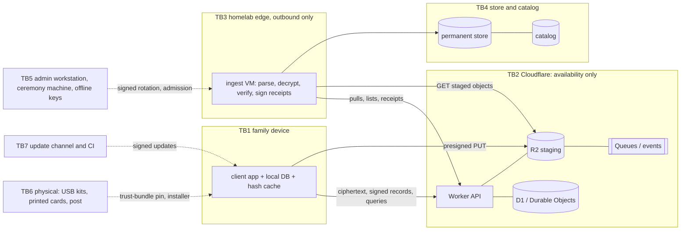

# Reliquary threat register (v0)

- **Status:** Draft. This is the Wave 1 slice: the cloud API, the ingest protocol, and the enrollment and restore values that cross Cloudflare. The full register (all components, LINDDUN GO walkthrough, attack trees, D1-S3 red team) is Wave 2.
- **Owner:** D1 (PLAN §2.1). Other workstreams supply requirements to this file; they do not edit it.
- **Date:** 2026-09-29 (last updated 2026-10-06)
- **Evidence:** `docs/research/d1-threat-model.md` (research note, claims K1–K14 and their verdicts); `spikes/D1-S1/` (malicious-cloud tabletop and executable demos); `spikes/D1-S2/` (explicit-state protocol model, including the charitable-ADR baseline in `evidence/v0-charitable/`).
- **Feeds:** OD-04, OD-17, OD-05 (input), DR-F3-2 (with F3); ADR-0009 (A3), ADR-0010 (C1), ADR-0014 (D3), ADR-0008 (D2), ADR-0028 (A8), ADR-0015 (D5), ADR-0024 (E3), ADR-0027 (D6).
- **Settled text this register must not override:** CLAUDE.md "Settled requirements", ADR-0001 and ADR-0002 (both Accepted). Where a requirement here would change that text, it is marked **touches settled text** and goes to the owner through an OD item. Appendix A holds the draft amendment text for OD-04.

## 0. ID scheme

IDs are stable. A retired ID is never reused, and its replacement is listed in §11.

| Prefix | Meaning | Range in this version |
|---|---|---|
| TB- | Trust boundary | TB1–TB7 |
| AP | Attacker profile | AP1–AP9 |
| V- | A value that crosses Cloudflare (D1-S1 inventory) | V-01–V-34 |
| T- | Threat | T-01–T-26 |
| SR- | Security requirement that ADRs and specs cite | SR-01–SR-31 |
| AR- | Accepted-risk candidate for OD-17 | AR-01–AR-09 |

Priority **P0** means the A0 walking skeleton must model the requirement so that Gate B measures the real protocol shape. **P1** means required before the first kit reaches a relative (Gate C) unless a gate is named.

## 1. Principle: the cloud is trusted for availability only (SR-01)

No decision about whether data is safe, whose key is trusted, what is decrypted, or to whom it is re-encrypted may rest only on a value from Cloudflare, unless that value is verified with a key Cloudflare does not hold. A malicious or compromised Cloudflare side may deny service. It must not be able to cause silent data loss, plaintext disclosure, or a false "safe".

This is the target property Tahoe-LAFS states for its storage servers, and the model Borg and restic use for their repositories (research note, Findings §1). CLAUDE.md requires "treat the cloud API as under attack".

## 2. Trust boundaries

| TB | Boundary | Trust assumption (v0) |
|---|---|---|
| TB1 | Family device (app, OS, local DB) ↔ network | Trusted for its own data until compromised. Its hash cache is a plaintext inventory of the device's files. |
| TB2 | Cloudflare (Workers, D1/Durable Objects, R2, Queues, the email path, audit logs) | **Availability only** (SR-01). Trusted neither for integrity nor for confidentiality of anything other than ciphertext and opaque IDs. |
| TB3 | Homelab edge (outbound only) ↔ ingest VM | Ingest parses hostile input (SR-22). USB ingest runs in a disposable VM (D4). |
| TB4 | Ingest VM ↔ permanent store and catalog | The store must survive a compromised ingest VM (SR-20; D4-S4, Wave 2). |
| TB5 | Admin workstation, key-ceremony machine, offline keys | Trusted. Out of Wave 1 scope (D2). |
| TB6 | Physical: USB kits, printed cards, post | Carries trust anchors (SR-02, SR-27). Tampering and postal interception are Wave 2 (D5, E5). |
| TB7 | Update channel and CI | Signed updates (ADR-0002 §5). Freshness and rollback: SR-29 (D5). |

## 3. Assets (Wave 1 subset, ranked by impact)

1. Plaintext content and metadata (homelab store, catalog, devices).
2. Homelab decryption key(s).
3. Homelab receipt and status signing key. **Forgery means silent loss.**
4. Dedup secret. Every dedup ID depends on it, and any holder gets the presence oracle (T-11).
5. Device signing and restore keys.
6. The "safe" status the family sees, which rests on the receipts each device holds.
7. Cloudflare account and Worker secrets (R2 parent token, invite pepper).
8. Invite codes, pairing codes and QR tokens.
9. Family PII in the cloud (name, email, activity times).
10. The first installer and its trust bundle (V-33).
11. Staged ciphertext (availability only).

## 4. Attacker profiles

| ID | Profile | Capability assumed in Wave 1 |
|---|---|---|
| AP1 | Internet attacker | Can reach the Worker API. May hold leaked presigned URLs. |
| AP2 | Cloudflare side: insider, account takeover, legal compulsion, compromised Worker code or secrets. Cross-tenant leakage research (Workers, August 2026) is secondary-only and must be re-checked before C1 decides (re-verify by Gate B). | Full control of TB2: answers anything, deletes, swaps or injects staged objects, relays or forges messages, mints any R2 credential. Does not hold homelab private keys, device private keys, or the dedup secret unless a row says so. |
| AP3 | Device thief | Holds one device, its credential and the dedup secret until revoked. |
| AP4 | Ransomware on a device | As AP3, plus encrypting local files and uploading garbage. |
| AP5 | Curious or malicious relative | As AP3 on their own device, including the presence oracle (T-11). |
| AP6 | Phisher (fake kit, fake nudge, fake update) | Wave 2 (D3, D5, E5). |
| AP7 | Compromised dependency or CI | Wave 2 (D5). |
| AP8 | Compromised ingest VM | §6(c). Wave 2 (A6, D2, D4). |
| AP9 | Estranged member, incapacitated owner | Wave 2 (D2, D6, E7). |

## 5. Every value that crosses Cloudflare (D1-S1 inventory)

The 32 values D1-S1 classified (`spikes/D1-S1/README.md`), plus two that the synthesis review added: V-33 (first install by download link) and V-34 (rejection and re-upload request).

Classes: **E2E** means authenticated end to end with a key the cloud lacks, in the proposed design. **Harmless** means unauthenticated, but no device or homelab decision rests on it alone. **Disclosure** means the cloud necessarily sees it (accepted-risk candidate). **Open** means a required change is recorded but its mechanism is not chosen yet.

| V | Value (direction) | What a malicious cloud does with it | Disposition in the proposed design | Class | SR |
|---|---|---|---|---|---|
| V-01 | Homelab age recipient(s) (cloud → device) | Substitutes its own key and reads every later upload (D1-S1 demo A2a) | Device compares SHA-256 of the trust bundle with a pin from a channel the cloud cannot alter; a substitute is refused (A2b) | E2E | SR-02, SR-27 |
| V-02 | Receipt and status signing public key | Substitutes it and forges receipts (A4f, model `V1-no-pinned_trust`) | In the pinned trust bundle | E2E | SR-02 |
| V-03 | Trust-bundle rotation | Pushes its own bundle as a "rotation" | Signed by the offline admin key (D2) or a currently pinned key | E2E | SR-02 |
| V-04 | Family dedup secret (→ device) | If relayed in clear: confirms known files and fills in templated documents for every ID it has seen (A3a; A3b recovered a 6-digit field after 482,914 HMACs in 2.83 s on one CPython core) | Sealed by the homelab to an admitted device key and homelab-signed (A3c), or carried by a local channel per enrollment path | E2E | SR-15, SR-14 |
| V-05 | Invite-code redemption (device → Worker) | The cloud is the verifier: it can create accounts and devices at will, and search stored hashes offline (A6) | Worker enrollment never counts as homelab admission | Harmless | SR-14 |
| V-06 | Device public keys: Ed25519 signing, X25519 or hybrid restore (device → cloud → homelab) | Substitutes the restore key, so the admin's restore is disclosed to the cloud (A5a). Registers its own signing key and commits junk (1,214 of 7,013 states in `V1-no-registry_auth`, cloud attacker, budget 2) | Admission signature by a key the cloud lacks (A5b). Mechanism: D3, OD-05 | E2E | SR-14 |
| V-07 | Per-device API credential | Irrelevant against AP2, which is the verifier | D3 owns it against AP1 | Cloud-local | — |
| V-08 | Account name and email | Reads, links, discloses | Plaintext by design (ADR-0002 §2) | Disclosure | AR-05, SR-26 (OD-03) |
| V-09 | Device-to-device QR or pairing token | Mints its own tokens and enrolls devices at the Worker | The token alone admits nothing at the homelab | Harmless | SR-14 |
| V-10 | Dedup IDs in queries and claims | Links who holds the same file, when and how often; with a leaked secret, tests files | Must be visible to the Worker | Disclosure | AR-05, AR-06, SR-21 |
| V-11 | Missing / pending / present answers | "Present" or "pending" makes a device skip the file: silent loss under ADR-0001 §4 read literally (V0) and under the charitable reading (V0c) | "Present" counts only with a valid receipt for that content; a device is green only with its own receipt; not-green items are re-asked | Harmless | SR-05, SR-06 |
| V-12 | Presigned URLs, staging keys, UploadIds | Redirects or drops uploads. A leaked URL is a reusable bearer token for up to 7 days and overwrites last-writer-wins | Per-upload keys, short expiry, create-only if C1-S1 shows R2 enforces it. Integrity comes from V-13, not from these | Harmless | SR-07, SR-08, SR-09 |
| V-13 | Content ciphertext (device → R2 → homelab) | Injects or swaps objects; anyone with the homelab public key can make a valid age file (A1) | Bound to a device-signed record by header MAC; the homelab decrypts and recomputes HMAC and SHA-256 before commit | E2E | SR-03, SR-04 |
| V-14 | Encrypted metadata record | Injects records for any device if it controls the device list | Ed25519 device signature inside the encryption, given SR-14 | E2E | SR-03, SR-14 |
| V-15 | Sizes, counts, timing, IPs, user agents | Profiles devices and people | Exact-size leak is reduced only by padding (A2/F3, DR-F3-1) | Disclosure | AR-05 |
| V-16 | Claim and commit state in D1 or Durable Objects | Flips any state | No device decision ends in green on cloud state | Harmless | SR-05, SR-10 |
| V-17 | R2 event notifications and Queue messages | Withholds, replays, forges | Hints only; ingest is idempotent | Harmless | SR-12 |
| V-18 | Listing of pending objects for reconciliation | Hides objects | The device's receipt timeout is the independent detector | Harmless | SR-12, SR-06, SR-13 |
| V-19 | Staged object bytes pulled by the homelab | Tampers | Rejected by V-13 verification | E2E | SR-04 |
| V-20 | "Committed" mark written by the homelab | Flips it | Receipts replace it as the signal devices trust | Harmless | SR-05 |
| V-21 | Commit receipts (homelab → cloud → device) | Forges, replays, edits: all rejected (A4a–d). Withholds: the device stays visibly not safe | Ed25519 under the pinned key, binding device_id, dedup_id, size and record digest | E2E | SR-05, SR-02 |
| V-22 | Staged-object delete | Deletes before the pull (SC-7) | A staged claim whose object is gone becomes re-claimable | Harmless | SR-10 |
| V-23 | Target device identity for a restore | Substitutes the key (A5a) | Admitted keys only | E2E | SR-14 |
| V-24 | Restore objects (homelab → R2 → device) | Injects its own files; age has no sender authentication | Homelab-signed restore manifest with per-file hashes | E2E | SR-16 |
| V-25 | Revocation | Ignores it | The homelab's own list is authoritative for accepting records; the Worker list is the fast path | Harmless | SR-17 |
| V-26 | Health status and nudge emails computed by the Worker | Suppresses warnings, says "all good", phishes | Device health comes from receipts and a signed heartbeat; email is advisory with content rules | Harmless | SR-05, SR-18, SR-25 |
| V-27 | Server time | Skews TTLs and "last backed up" | Only homelab-signed times feed health | Harmless | SR-19 |
| V-28 | Bootstrap config, hostnames, minimum client version | Forces "update required", redirects endpoints | No key, secret or trust decision from unsigned config | Harmless | SR-31 |
| V-29 | Self-update artifacts, if served through Cloudflare | Cannot substitute; can withhold or roll back | Signed (ADR-0002 §5) plus anti-rollback | Integrity only (freshness open) | SR-29 |
| V-30 | Cloudflare audit logs | Rewrites or omits | The family's audit trail is the homelab log | Harmless | SR-30 |
| V-31 | USB bundle manifest (does not cross Cloudflare; same format) | n/a to the cloud; postal interception | Device signature | E2E | SR-03 (A4) |
| V-32 | Dedup-secret rotation | As V-04 | As V-04 | E2E | SR-15 |
| V-33 | **First installer and first trust bundle via the ADR-0002 §3 download link**, if served from Cloudflare (Pages, R2 or a Worker) | Serves a trojaned first installer. With no OS code signing this is trust on first install: full compromise of that device, including its pins | The pin never comes from the download; installer integrity on that route is not yet chosen (D3, D5, B7) | Open | SR-27 |
| V-34 | Rejection and re-upload request (homelab → Worker → devices) | Suppresses it | A homelab-signed request speeds recovery; the device's own timeout is the independent path | Harmless | SR-11, SR-06 |

**Counts (34 values):** 13 E2E (V-01, 02, 03, 04, 06, 13, 14, 19, 21, 23, 24, 31, 32); 15 harmless (V-05, 09, 11, 12, 16, 17, 18, 20, 22, 25, 26, 27, 28, 30, 34); 1 integrity only (V-29); 3 disclosures (V-08, V-10, V-15); 1 cloud-local (V-07); 1 open with a recorded required change (V-33). None is unclassified, so the D1-S1 pass criterion still holds with V-33 and V-34 added.

## 6. What holds under each compromise

Each "holds" names the SRs it depends on. Evidence: D1-S1 demos and model runs; D1-S2 model (bounded: 1 file, 2 honest devices, attacker budget ≤ 3, local model, not real R2).

### (a) Fully malicious control plane (AP2)

| Property | Holds? | Depends on |
|---|---|---|
| Confidentiality of content and metadata | Yes | SR-02 (pinned recipients), SR-15 (secret never in clear), SR-14 (restore targets), SR-23 (no trust-forging key in the Worker), SR-27 (pin of the first install) |
| Integrity of what is stored at home (S2: no content under a foreign ID) | Yes | SR-03, SR-04, SR-22; SR-14 to keep cloud junk out of the keep-forever store; SR-20 |
| No false "safe" (S1) and no silent loss (SL) | Yes, with a precondition | SR-02, SR-05, SR-06, SR-23. Precondition: the source or the encrypted object still exists when re-upload is needed (SR-28, residual AR-09) |
| No false blame of an honest device (S3) | Yes | SR-03 and SR-11(c) attribution |
| Availability | **No** (AR-04) | Detected, not prevented: devices stay visibly "not safe" (SR-05, SR-18); USB transport is the fallback |
| Metadata privacy | **No** (AR-05) | Sizes, timing, IPs, ID equality, name and email |
| Cloud-side revocation, nudges, audit logs, account creation | **No** | Replaced by homelab-side equivalents (SR-17, SR-18, SR-30, SR-14) |

Without SR-02, SR-14 or SR-15, confidentiality fails outright (D1-S1 demos A2a, A5a, A3a).

### (b) One device plus the dedup secret (AP3–AP5)

| Property | Holds? | Depends on |
|---|---|---|
| Backups cannot be read or deleted | Yes | ADR-0001 (devices hold only public keys); SR-20 |
| Poisoning (duplicate faking) | Fails at the homelab | SR-04: re-verification after decryption gives tag consistency whether or not the secret is secret |
| Squatting, overwrite, leaked URL | Cost delay and re-uploads only | SR-06, SR-10, SR-11(b) |
| Forgery | Only as itself | SR-03, SR-14 |
| Confidentiality of *which files the family holds* | **No** while the presence answer is global | The device and the Worker's presence answer form a confirmation-of-a-file oracle (T-11). Per-person scope removes the cross-person oracle for files below T_x (F3-S2 configuration C3, emulated); the same-person oracle and leaked-secret-plus-cloud-history remain (AR-06) |
| Storage cost | Bounded only by quotas | SR-24; D4-S3 ransomware circuit breaker (Wave 2) |

### (c) Compromised ingest VM (AP8)

Not in the Wave 1 tabletops. If one VM holds the decryption key, the receipt key and write access to the store, it can read everything it can decrypt, sign false receipts (breaking S1 at its root), and poison new commits. Already-stored data stays intact only if the store is append-only against the ingest credentials (SR-20, D4-S4). Candidate reductions for Wave 2: a receipt signer separate from the ingest parser that re-verifies from the append-only store before signing; short-lived ingest identity (D2); store immutability (A6, D4-S4). Recorded as AR-08 to revisit at Gate A.

## 7. Threats (STRIDE, Wave 1 components)

| ID | STRIDE | Element | Threat | Attacker | Mitigation (SR) | Residual / owner |
|---|---|---|---|---|---|---|
| T-01 | S | Enrollment → homelab key | Substituted recipient key | AP2 | SR-02, SR-27 | Kit and local-channel integrity (D3, E5) |
| T-02 | S | Device key registration | Substituted device keys → restore redirection, secret capture | AP2 | SR-14, SR-15, SR-16 | **Open (D3, OD-05).** Interim for admin restores only: out-of-band fingerprint check |
| T-03 | S | Metadata record | Records forged as another device | AP2, AP5 | SR-03, SR-14 | — |
| T-04 | T | Staged object | Overwrite or part replacement (same key; leaked URL) | AP1, AP3 | Integrity: SR-04, SR-06, SR-11. Cost and blame: SR-07, SR-08 | Multipart create-only unproven (C1-S1) |
| T-05 | T | Dedup index | Duplicate faking / poisoning | AP2–AP5 | SR-04, SR-06, SR-11 | D4-S1 proves on a harness |
| T-06 | T/D | Claims | Claim squatting | AP3–AP5 | SR-10(a) | Delay ≤ lease TTL, or the device safety valve (A3) |
| T-07 | S/T | Status | Fake "committed" or fake "present" | AP2 | SR-05, SR-06, SR-02 | — |
| T-08 | R | Audit | The cloud rewrites the history of what was uploaded | AP2 | Receipts on devices; SR-30 | Merkle checkpoint log optional (Wave 2) |
| T-09 | T | Events and queue | Forged, replayed or dropped events | AP2 | SR-12, SR-13 | Availability |
| T-10 | T | Restore | Substituted restore content | AP2 | SR-16 | — |
| T-11 | I | Presence query | Confirmation-of-a-file and learn-the-remaining-information | AP3–AP5 | SR-21 (scope, record-first, per-ID accounting) | **AR-06** (narrowed form) |
| T-12 | I | Cloud metadata | Sizes, timing, IPs, ID equality, PII | AP2 | SR-26; padding (A2/F3) | **AR-05** |
| T-13 | I | Dedup secret | Leaked secret + the cloud's ID history → testing of every historical ID (no forward secrecy) | AP2 + AP3 | SR-15; epoch rotation (A1, D2); cloud ID retention (C1) | AR-06 |
| T-14 | D | Staging | Delete before pull; withhold receipts; freeze status | AP2 | SR-06, SR-10(b), SR-18 | **AR-04** |
| T-15 | D | Cost | Oversized or garbage uploads; operation floods; forced re-upload loops | AP1, AP2, AP3, AP4 | SR-06 (backoff and retry budget), SR-09, SR-21, SR-24 | BUD-ABUSE (owner sets) |
| T-16 | E | Homelab parsers | A crafted record, receipt, manifest or header exploits ingest | AP2, AP3 | SR-22 | D4-S5 |
| T-17 | E | Worker | IDOR: act on another device's upload or claim | AP3, AP5 | SR-07; SR-01 limits the impact to availability | — |
| T-18 | T | Homelab store | Device- or cloud-driven deletion; `forget`-style gaming | AP2, AP4 | SR-19, SR-20 | D4-S4 |
| T-19 | S | Revocation | A stolen device keeps uploading | AP2, AP3 | SR-17, SR-09 | Outstanding-URL lifetime vs BUD-REVOKE (C1-S1, D3-S5) |
| T-20 | S | Nudges | A fake nudge leads the user to malware or a code leak | AP2, AP6 | SR-25 | D3, E5 |
| T-21 | S/E | First install by download link | Trojaned first installer and trust bundle | AP2, AP6 | SR-27 | **Open (D3, D5, B7)** |
| T-22 | D | Device source | The user or the OS deletes the source before a receipt; a later poisoning or loss cannot be repaired | AP2–AP5 (extend the window), user | SR-28; SR-05 (UI never says safe early) | **AR-09** (visible, not silent) |
| T-23 | T | Ransomware | Encrypted garbage versions upload and get valid receipts, so the family sees "safe" while the library is destroyed | AP4 | Keep-forever retention protects old versions; mass-change detection and admin nudge | Wave 2 (E3, A3, D4-S3) |
| T-24 | T | Update channel | Freeze or rollback of signed updates | AP2, AP7 | SR-29 | D5 |
| T-25 | S | Bootstrap config | Unsigned config redirects endpoints or forces updates | AP2 | SR-31 | — |
| T-26 | S | Receipt key on the ingest VM | A compromised ingest VM signs false receipts | AP8 | AR-08 candidates (§6c) | Wave 2 (D2, A6, D4) |

**LINDDUN items in this slice:** Linking (ID equality across devices, T-12); Identifying (IP and PII, T-12); Detecting (presence oracle, T-11); Data disclosure (T-02, T-13); Unawareness (users believing the cloud holds plaintext; D6-S3). The full LINDDUN GO walkthrough is Wave 2 with D6.

## 8. Security requirements

"Owner" is the workstream whose artifact must satisfy the requirement. "Model" says whether D1-S2's bounded model shows the requirement is load-bearing (removing it breaks a property), not load-bearing, or not modelled.

| SR | Requirement | Owner (artifact) | Pri | Model | Traces to |
|---|---|---|---|---|---|
| SR-01 | **Cloud = availability only** (§1). | All; A3, C1 | P0 | — | CLAUDE.md "treat the cloud API as under attack" |
| SR-02 | **Pinned trust bundle.** The homelab recipient key(s) and receipt/status signing key reach devices only in a bundle whose digest is pinned from a channel Cloudflare cannot alter (kit, the enrolled device's local QR or USB copy, or a compiled-in value). Rotation is signed by a currently pinned key or the offline admin key (D2). The Worker is never the source of trust. | D3 (ADR-0014), D2; A2 parser | P0 | Load-bearing (S1 vs cloud) | V-01–V-03, V-21 |
| SR-03 | **Device-signed records.** Every metadata record and USB manifest carries the device's Ed25519 signature inside the encryption, binding dedup_id, sha256, size and header MAC. The homelab rejects unknown, revoked or mismatched keys and non-canonical bytes. | A2 (ADR-0007), A3, A4 | P0 | Needed for attribution (S3) | V-13, V-14, V-31 |
| SR-04 | **Verify before commit.** The homelab commits only after decrypting the whole object and matching size, SHA-256, dedup ID (correct epoch) and header MAC against the signed record. On failure it stores nothing. The first verified copy wins. | A3 (ADR-0009), A6 | P0 | Load-bearing (S2) | V-13, V-19 |
| SR-05 | **Receipts are the only "safe".** A homelab-signed receipt binds device_id, dedup_id, record digest, size and commit time, and verifies under the pinned key. No Worker field, cloud answer or HTTP 200 ever marks an item safe. | A3; E3 (ADR-0024) | P0 | Load-bearing (S1, SL) | V-11, V-16, V-20, V-21 |
| SR-06 | **Dedup hit ≠ safe; re-ask with bounds.** "Present" lets the device skip the content upload only when it holds a valid receipt for that content; the device still sends its own record and waits for its own receipt. Every item that is not green is re-asked after a timeout, with exponential backoff and a per-item retry budget tied to BUD-BAT-D and BUD-TTS. When the budget is spent, the item becomes a visible nudge to the person and the admin; it is never silently dropped. | A3; B6 (ADR-0021); E3 | P0 | Load-bearing (L1; needed even with no attacker when two devices hold a file) | V-11, V-18, V-34 |
| SR-07 | **Per-upload staging keys.** Worker-generated, random, bound to the authenticated device and upload ID, never reused, never presigned for an existing key. Devices never get DELETE, CopyObject, List or bucket-config rights. **Purpose:** attribution, no mixing of multipart parts from two writers, resume, and griefing cost. It is not what makes integrity hold (SR-04, SR-05, SR-06 do). | C1 (ADR-0010 key layout) | P0 | Not load-bearing for integrity. Prevents false blame against a misbehaving device, but not against a leaked URL or the cloud (SR-11(c) does) | V-12 |
| SR-08 | **Create-only where R2 supports it.** Sign `If-None-Match: *` into single-PUT URLs if C1-S1 shows R2 enforces it; record the result for CompleteMultipartUpload. Correctness must not depend on it. | C1 (C1-S1) | P1 | Not load-bearing | V-12 |
| SR-09 | **URL and credential scope.** One object per URL or credential; the shortest lifetime compatible with background queues (B2, B4); outstanding lifetime within BUD-REVOKE, or the conflict raised to the owner. Sign Content-Type, and Content-MD5 or length if C1-S1 shows they can be signed. C1-S1 also tests whether rolling or revoking the signing token invalidates outstanding presigned URLs; if it does, per-epoch or per-device signing tokens are the BUD-REVOKE lever. | C1; D3 | P0 | Not modelled | V-12; claim K10 (contested) |
| SR-10 | **Claims are advisory leases.** (a) A `claimed` lease has a TTL (renewable by progress, A3), shorter than R2's 7-day multipart auto-abort and the URL lifetime, and never blocks another device once expired. Per-device cap on open claims; abandoned claims are counted and flagged. (b) A `staged` claim (after Complete) does **not** expire on a timer, because homelab outages outlast any TTL. It becomes re-claimable when its staged object no longer exists (reconcile by listing) or the homelab rejects it. A device-side safety valve that uploads in parallel under its own per-upload key (A3) is compatible. | A3; C1; C2 (quotas) | P0 | (a) load-bearing (L1 vs squatting); (b) the re-claimable rule is load-bearing (L1 vs fault); the no-timer rule is not (it avoids duplicate uploads) | V-16, V-22 |
| SR-11 | **Rejection handling.** On failed verification the homelab (a) keeps nothing; (b) resets only the rejected upload's own claim and never downgrades a committed ID; (c) flags a device only when its own valid signed record matches the rejected object (header MAC), and otherwise logs "tamper in transit" and alerts the admin without blaming anyone; (d) sends a homelab-signed re-upload request to devices whose records await that ID. | A3; D4 (recovery procedure) | P0 | (b) load-bearing together with SR-10(b) (L1 vs leak); (c) load-bearing for S3 vs leak and cloud; (d) not modelled (speeds recovery only) | V-34 |
| SR-12 | **Events are hints; ingest is idempotent.** Duplicate, replayed or forged events cause at most a re-verification. Reconciliation by listing is the path of record. | A3; C1 | P0 | — | V-17, V-18 |
| SR-13 | **Gap detection.** Records carry a per-device monotonic sequence number or an equivalent signed checkpoint, so the homelab can detect suppressed or reordered records. | A3; A2; H4 | P1 | Not modelled | V-18 |
| SR-14 | **Device keys admitted without trusting the Worker.** Worker enrollment is never admission. The homelab accepts a device's signing and restore keys only through a path Cloudflare cannot forge. Candidates for D3: a PAKE (CPace, SPAKE2, OPAQUE-style; the magic-wormhole pattern) keyed by the invite or pairing code over the Worker relay; co-signature by an already-admitted device through a local QR (Tailnet Lock pattern); the ADR-0002 USB return trip with a device-signed bundle manifest; key transparency. An invite-bound MAC is weak on its own, because a cloud that sees the verifier can search the code offline (D1-S1 A6). An admin fingerprint check is **not** proposed as admission (ADR-0002 §3: "adding devices never requires the admin"); it is only the interim for admin-performed restores. Required before any restore to a device and before sealing the secret to it. | D3 (ADR-0014; OD-05) | P0 for restore and secret delivery; P1 overall | Not needed for S1–S3; keeps cloud junk out of the store | V-05, V-06, V-09, V-14, V-23 |
| SR-15 | **Dedup secret never in clear through Cloudflare**, and never through a third party such as the Play Install Referrer. Per enrollment path (D3 designs it): kit-enrolled desktop, on the USB stick and never on the printed card, or sealed; phone, through the in-app scan of the enrolled device's QR (ADR-0002 §3 already allows scanning on first launch) or sealed after SR-14 admission; second computer by USB copy, written to the stick by the enrolled device; second computer by download plus pairing code, only sealed after SR-14 admission. Before Gate C no relative is onboarded, so only the admin places a production secret on a device. | D2 (ADR-0008), D3 | P0 (Gate A for the construction; Gate C for the delivery paths) | Not modelled | V-04, V-32 |
| SR-16 | **Signed restore manifest.** Restores carry a homelab-signed manifest (hashes and sizes; names inside the encryption). The device verifies plaintext against it before presenting it. | A8 (ADR-0028) | P1 | — | V-24 |
| SR-17 | **Revocation: fast at the Worker, authoritative at home.** The admin revokes at the Worker directly, so no new URLs are issued within BUD-REVOKE even while the homelab is down. The homelab keeps its own revocation list, rejects records signed by revoked keys whatever the cloud says, and re-syncs the Worker when it is up. | D3; C1; A3; C8 | P1 | — | V-25 |
| SR-18 | **Signed freshness.** The homelab signs a periodic heartbeat or checkpoint (time, per-device last-committed marker). A device shows "home not confirming" when none has arrived within T_fresh. | A3; E3 | P1 | — | V-26 |
| SR-19 | **Homelab time for decisions.** Health, nudge and any future pruning decisions use the homelab's receive or commit time. Device and cloud times are context only. | A3; H4; E3 | P1 | — | V-27 |
| SR-20 | **No remote destruction.** Nothing a device or the cloud sends can delete or rewrite data in the homelab store. Pruning is manual, admin-only, with a separate credential and verify-before-destroy (Borg lesson). | A6 (ADR-0012), D4-S4, C8 | P0 | — | CLAUDE.md append-only and keep-forever |
| SR-21 | **Presence-query scope and accounting.** Rate limits alone do not bound the oracle (F3-S2: a per-device limit sized for a first seed fails). Presence answers follow DR-F3-2 (F3 owns the design): per-person scope by default, cross-person upload-skip only above a size threshold T_x, record-first, and exact per-device accounting of queried **IDs** (not requests) relative to that device's discovered-file count, with admin alert and auto-suspend. | C1; C2; F3 (DR-F3-2) | P1 | Not modelled here (F3-S2, emulated) | V-10; T-11 |
| SR-22 | **Hostile-input parsing.** Records, receipts, manifests, bundles, trust bundles and age headers relayed by the cloud are parsed with strict limits (size, nesting, duplicate keys, canonical encodings) in memory-safe code, before expensive work. | A2; A3; A4; D4-S5 | P0 | — | T-16 |
| SR-23 | **The Worker holds no trust-forging key.** No key that signs receipts, device admissions, trust bundles or restore manifests lives in Cloudflare. Every Worker secret is assumed leakable; a leak may cost only availability, money or invite abuse. | C1; D2 (key inventory) | P0 | Implied by SR-02 | AP2 |
| SR-24 | **Size and cost bounds.** The device declares the (padded, per F3) size at URL issuance; the Worker or homelab compares it with the event or HEAD size and flags or aborts mismatches. Per-device byte and operation quotas within BUD-ABUSE. | C1; C2 | P1 | — | T-15 |
| SR-25 | **Nudge content rules.** Email and push nudges never contain install links, codes, or requests to act outside the app. | C3; E3; D6 | P1 | — | V-26; T-20 |
| SR-26 | **Cloud metadata minimisation.** No filenames, paths or plaintext hashes in the cloud. Metadata-object keys do not contain the dedup ID. Worker logs are configured without personal data where possible. | C1; D6 | P1 | — | V-08, V-15 |
| SR-27 | **First install and first trust bundle (new).** A new device never takes its trust-bundle pin from a Cloudflare-served download; the pin comes from the kit, the enrolled device's local QR, or the USB copy. For the ADR-0002 §3 download route, D3, D5 and B7 choose how installer integrity is checked, for example the enrolled device shows the installer digest for comparison, the wizard prefers the USB-copy route, or the download is hosted off Cloudflare (still trust on first install). | D3, D5 (ADR-0015), B7 (ADR-0022) | P1 | — | V-33; T-21 |
| SR-28 | **Keep until receipt (new).** The no-silent-loss result assumes the honest device can re-upload. The app therefore keeps either the source reference or the encrypted object until the receipt arrives, within BUD-TMP. If neither remains and there is no receipt, the item is shown loudly as "not yet safe" to the person and the admin. The UI never suggests a file is safe to delete before its receipt (OD-18). | B6 (ADR-0021); E3 (ADR-0024) | P1 | Precondition of SL | T-22; AR-09 |
| SR-29 | **Update anti-rollback and freshness (new; D1-S1 RC-18).** Signed update metadata carries a monotonic version; the app refuses older versions and warns when no update metadata has been seen for a set period. | D5 (ADR-0015); B7 | P1 | — | V-29; T-24 |
| SR-30 | **Homelab audit log (new; D1-S1 RC-19).** The homelab keeps a signed, append-only log of accepted and rejected records and issued receipts. That log, not Cloudflare's audit logs, is the family's audit trail. A3 chooses per-entry signatures or Merkle checkpoints (C2SP tlog-checkpoint, Wave 2 option). | A3 | P1 | — | V-30; T-08 |
| SR-31 | **No trust from unsigned config (new; D1-S1 RC-17).** Bootstrap config, hostnames and minimum-version fields from the Worker never carry a key, a secret or a trust decision. | C1 | P1 | — | V-28; T-25 |

### 8.1 Minimum set for the A0 walking skeleton (v0)

SR-01, SR-02 (a static pinned test bundle), SR-03, SR-04, SR-05, SR-06, SR-07, SR-10 (a and b, including reconcile-by-listing), SR-11 (a–c), SR-12, SR-20 (plain content-addressed store with no delete path), SR-22 (basic limits).

SR-14 and SR-15 are not needed while the skeleton uses a static test credential and a test dedup secret (PLAN §4.1, cycle C1 ↔ D3). They are needed before any relative is onboarded (Gate C). The dedup-ID construction itself closes at Gate A (A1).

**The set D1-S2 model-checked as "V1":** SR-02, SR-03, SR-04, SR-05, SR-06, SR-07, SR-10(a, b), SR-11(b, c), plus device-key admission (SR-14). Within the model's bounds, removing any one of these breaks a property: SR-02 (S1 vs cloud), SR-04 (S2), SR-05 (S1/SL), SR-06 (L1), SR-10(a) (L1 vs squatting), the re-claimable rule of SR-10(b) (L1 vs fault), SR-11(c) (S3 vs leak and cloud). SR-11(b) breaks L1 only when removed together with the re-claimable rule. Removing SR-07, SR-08 or the no-timer rule of SR-10(b) breaks nothing.

### 8.2 Crosswalk from the D1-S1 required changes (RC) to SRs

| RC | SR | RC | SR |
|---|---|---|---|
| RC-1 pin the trust bundle | SR-02 | RC-11 object bound to a signed record | SR-03, SR-04 |
| RC-2 signed rotation | SR-02 | RC-12 events and listings are hints | SR-12 |
| RC-3 secret never in clear | SR-15 | RC-13 vanished staged object is re-claimable | SR-10(b) |
| RC-4 Worker enrollment is not admission | SR-14 | RC-14 signed restore manifest | SR-16 |
| RC-5 homelab-verified device admission | SR-14 | RC-15 homelab revocation list | SR-17 |
| RC-6 receipts; "present" needs a receipt | SR-05, SR-06 | RC-16 health from receipts and signed times | SR-05, SR-18, SR-19 |
| RC-7 requery after timeout | SR-06 | RC-17 no trust from unsigned config | SR-31 |
| RC-8 per-upload keys, short expiry | SR-07, SR-09 | RC-18 update anti-rollback | SR-29 |
| RC-9 create-only where enforced | SR-08 | RC-19 homelab receipt log | SR-30 |
| RC-10 blame attribution | SR-11(c), SR-03 | | |

## 9. Accepted-risk candidates (for OD-17)

| AR | Risk | Why it is a candidate | Status |
|---|---|---|---|
| AR-01 | The admin can read everything | Escrow trust model | Settled (CLAUDE.md) |
| AR-02 | Single admin (bus factor) | Owner model; D2 and E7 reduce it | Listed in OD-17 |
| AR-03 | No off-site copy of the homelab | Out of scope for now | Settled (CLAUDE.md) |
| AR-04 | Cloudflare can deny service: drop, delete staged objects, withhold receipts, lie about presence. Detected, not prevented | Inherent in a single-vendor relay; USB is the fallback | **New: owner to accept** |
| AR-05 | Cloudflare sees exact sizes (unless padded), timing, IPs, device count, per-device activity, ID equality across devices, plus name and email (ADR-0002) | Padding is A2/F3's decision (DR-F3-1); email is OD-03 | **New: decide with DR-F3-1 and OD-03** |
| AR-06 | **Narrowed:** after DR-F3-2, a holder of the dedup secret can still use the presence answer as an oracle over its own person's files and over cross-person files above T_x. A leaked secret plus the cloud's ID history allows offline testing of every historical ID (no forward secrecy until epoch rotation). | A cheaper presence answer saves upload bandwidth. Homelab-only dedup (devices always upload unless they hold their own receipt) would remove the cloud oracle entirely while keeping cross-user storage dedup; its bandwidth cost is not measured (C4, E1) | **New: owner to accept the narrowed form or choose homelab-only dedup** |
| AR-07 | Single-copy window: between staging and commit, and afterwards only at the homelab | Follows from AR-03 | Listed in OD-17 |
| AR-08 | A compromised ingest VM with an online key discloses what it can decrypt and can sign false receipts for new uploads | Reduced by D2 (custody), A6 and D4-S4 (store isolation), and possibly a separate receipt signer (§6c) | **New: revisit at Gate A** |
| AR-09 | If the user or the OS deletes the source before a receipt, and the encrypted object was not retained, a later poisoning, rejection or cloud loss cannot be repaired. The loss is visible (SR-28), not silent | Device storage is finite (BUD-TMP); deletion is not gated by the app | **New: owner to accept at Gate C, with OD-18** |

## 10. Open items and Wave 2 backlog

| Item | Owner | When |
|---|---|---|
| R2 enforcement of a signed If-None-Match on presigned PUT; any create-only rule for CompleteMultipartUpload; whether Content-MD5 or length can be signed; whether rolling the signing token kills outstanding URLs | C1-S1 [SB] | Wave 1/2 |
| SR-14 mechanism and its fit with ADR-0002 §3 | D3, OD-05 | Wave 2 |
| SR-15 per-path delivery, including whether the Play Install Referrer path needs an extra in-app scan | D3 (with D2, B3) | Before Gate C |
| SR-27 installer integrity on the download route | D3, D5, B7 | Before Gate C |
| T_receipt / safety-valve time, lease TTL, T_fresh, retry budget, within BUD-TTS, BUD-BAT-D and the 7-day multipart auto-abort | A3 | Wave 2 |
| SR-13 design: per-record sequence or signed scan checkpoints | A3 with H4 | Wave 2 |
| Ingest-VM compromise, store immutability, separate receipt signer | A6, D2, D4-S4 | Wave 2 (AR-08 at Gate A) |
| Ransomware producing a false "safe" (T-23): mass-change detection | E3, A3, D4-S3 | Wave 2 |
| Full register: all components, LINDDUN GO, attack trees for the top five catastrophic outcomes, D1-S3 red team | D1 | Wave 2 |
| Re-verify by Gate B: R2 temporary-credential action scoping ("local signing only; API support coming soon"), and the August 2026 Workers cross-tenant reports | C1 | Before ADR-0010 |

## 11. Change log and retired IDs

| Date | Change |
|---|---|
| 2026-09-29 | v0 draft content written in the D1 research note (§9 there). |
| 2026-10-06 | Register created from the note after skeptic review. The value inventory is now the D1-S1 list (V-01–V-32) plus V-33 and V-34; the note's draft IDs V1–V22 are **retired** (crosswalk below). SR-06, SR-07, SR-09, SR-10, SR-11, SR-14, SR-15, SR-17 and SR-21 were reworded; their meaning is extended, not reversed. SR-27–SR-31, T-21–T-26 and AR-09 added. AR-06 narrowed. |

Crosswalk for retired draft value IDs (cited by the D6 note as V20 and V21): V1 → V-13; V2 → V-14; V3 → V-10; V4, V5 → V-12; V6 → V-17; V7 → V-18; V8 → V-20 and V-16; V9 → V-11; V10 → V-16; V11 → V-34; V12 → V-01; V13 → V-02; V14 → V-03; V15 → V-06; V16 → V-04; V17 → V-25; V18 → V-23 and V-24; V19 → V-26 and V-27; V20 → V-26; V21 → V-08 and V-15; V22 → V-29.

---

## Appendix A. Draft amendment to ADR-0001 §2 and §4 (for OD-04)

> **Draft for the owner. Not an ADR yet.** ADR-0001 is Accepted and is not edited. PLAN §2.1 gives D1 the superseding drafts, but no ADR number is reserved for an amendment of ADR-0001. H1 decides whether ADR-0009 (A3, ingest protocol) carries this text as "Amends: ADR-0001 §2, §4" or assigns a number from 0041 upwards. Evidence: `docs/research/d1-threat-model.md`.

- **Status:** Proposed (draft text only)
- **Amends:** ADR-0001 §4 steps 1, 2 and 4, and one sentence of §2. Everything else in ADR-0001 stands.
- **Owner decision:** OD-04 (and DR-F3-2 for step 1, from F3)

**Why.** ADR-0001 §4 is a sketch. Read charitably (a device counts a file as safe only when the Worker reports "committed", and re-asks otherwise), it holds against a misbehaving device, a leaked URL and an honest cloud fault in the D1-S2 model. It fails against a malicious or compromised Cloudflare side: one false "already have it" answer makes a device count a file as safe that the homelab never received, with no honest way back (silent loss). It also blames honest devices for others' overwrites. CLAUDE.md requires the cloud API to be treated as under attack, so §4 needs authenticated status.

**Amended text, step by step.**

1. *Step 1 (dedup query).* The Worker answers each ID with a typed state. "Present" lets a device skip the content upload only if the device holds a valid homelab receipt for that content; the device still sends its own signed record and waits for its own receipt. Presence answers are scoped as decided under DR-F3-2. (SR-06, SR-21)
2. *Step 2 (claim and upload).* Each upload gets a Worker-generated per-upload staging key bound to the device; objects are no longer keyed by dedup ID alone. Claims are advisory leases: a `claimed` lease expires; a `staged` claim does not expire on a timer but becomes re-claimable if its object disappears or is rejected. (SR-07, SR-10)
3. *Step 3 (object and record).* Unchanged in substance; the metadata record is signed by the device inside the encryption and binds the object. (SR-03)
4. *Step 4 (ingest and commit).* The homelab verifies before commit, then issues a homelab-signed receipt. **A device shows a file as safe only when it holds a receipt that verifies under the pinned key.** "Committed" in the cloud remains a cache. On rejection the homelab resets only that upload's claim, attributes blame only to a matching signer, and may send a signed re-upload request. Devices re-ask not-green items with backoff. (SR-04, SR-05, SR-11, SR-02)
5. *Freshness.* The homelab signs a periodic heartbeat so a frozen cloud shows as "home not confirming". (SR-18)

**§2 sentence.** "The cloud cannot test for known files" becomes: "The cloud cannot test for known files **unless it also obtains a device's dedup secret**. Any holder of the secret can use the presence answer as a confirmation-of-a-file oracle within the scope DR-F3-2 allows (accepted risk AR-06)."

**Consequences.** Good: a compromised Cloudflare costs availability, not data. Bad: more R2 objects and occasional duplicate uploads; devices must store receipts; the receipt format and the R2 key layout become one-way doors at Gate A (#5, #7). Follow-up: A3 writes the normative state table in `docs/spec/ingest-protocol.md`; C1 writes the key layout; D4-S1 proves the recovery loop on a harness.
