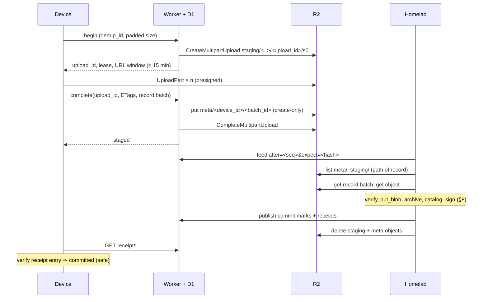

# Reliquary ingest protocol

- **Status:** Draft (Wave 1). Not normative until ADR-0009 is Accepted. Sections marked **Provisional** may change in Wave 2; sections marked **Not model-checked** must be added to the A3-S1 model before Gate A.
- **Owner:** A3 (ADR-0009). Other workstreams supply requirements; they do not edit this file.
- **Date:** 2026-10-07
- **Evidence:** `docs/research/a3-ingest-protocol.md` (claims K1–K14, findings F1–F9); `spikes/A3-S1/README.md` (TLA+/TLC and Rust model check); `docs/security/threat-model.md` (SR-01…SR-31).
- **Depends on:** `docs/spec/identifiers.md` (A1: `dedup_id`), `docs/spec/object-format.md` (A2: content object, signed-note records, record batches, `record_sha256`, padding, E_* codes), ADR-0010 and `docs/design/api-v1.md` (C1: endpoints, R2 key layout, D1 schema), `docs/spec/bundle-format.md` (A4, not yet written).
- **Key words:** MUST, MUST NOT, SHOULD and MAY as in RFC 2119 (RFC not re-read in this run; datatracker was blocked).
- **Owner decisions still open that change this spec:** OD-04 (DR-A3-1), DR-A3-2 (receipt format), DR-A3-3 (valve), DR-F3-2 (presence scope, F3), DR-C1-3 (hint channel, C1), DR-C1-6 (append-only reading, C1).

## 1. Scope

This spec defines:
- the invariants the protocol must keep (§3);
- the state machines of the cloud upload, the homelab record and the client item (§4);
- the flows: check, upload, record, ingest, rejection, reconciliation, receipts (§5);
- the typed answers and outcome codes (§6);
- the receipt, content-statement and heartbeat formats (§7, Provisional);
- the durable-commit contract the storage engine must implement (§8);
- the safety valve and retry budget (§9);
- the protocol-state → user-visible-state map that E3 uses (§10);
- the conformance tests (§11).

It does not define record or object bytes (A2), dedup-ID derivation (A1), the R2 key layout, D1 schema or HTTP shapes (C1), or bundle framing (A4).

## 2. Terms and identifiers

| Term | Meaning |
|---|---|
| `device_id` | The admitted device (ADR-0014). |
| `record_id` | Random 128-bit ID chosen by the device, one per signed record (A2 §7.2). Same across transports. |
| `record_sha256` | SHA-256 of one record's exact signed-note bytes (A2 §7.1). |
| `dedup_id` | A1's keyed-MAC content ID, with epoch. |
| `h0_sha256` | SHA-256 of the content object's header; binds a record to an object (A2 §7.2). |
| `upload_id` | Random ID the Worker generates for one upload attempt. Never reused. |
| Staging object | A completed object under `staging/` (ADR-0010 §3). |
| Record batch | One `meta/` object holding N signed records (A2 §7.1). |
| Receipt entry | Homelab-signed statement that one record is durably committed (§7.1). |
| Content statement | Homelab-signed, device-neutral statement that content for a `dedup_id` is committed (§7.2). |
| Heartbeat | Homelab-signed freshness note (§7.3). |
| Lease | Advisory hold on a `dedup_id` by one upload, with a TTL in Worker time. |
| Fenced | An upload for which the Worker will issue no more URLs or completions, and whose last URL has expired. |
| Idempotency key | (device_id, record_id) for records and receipts; SHA-256 for blobs. |

**Clocks.** Leases and URL expiry use Worker time. `committed_at`, health and nudge decisions use homelab time (SR-19). Device times are recorded as context and MUST NOT drive any protocol decision. BUD-TTS is measured on the device with a monotonic clock (§10.2).

## 3. Invariants and liveness

These are the properties A3-S1 checked. Implementations and G2's test suite MUST preserve them.

| ID | Property |
|---|---|
| I1 | A staging or record object is deleted only after its content and record are durably committed at the homelab, or after a durable homelab rejection of that record. |
| I2 | A device shows an item as safe only if it holds a receipt entry for its own record that verifies under the pinned key; that implies the homelab holds the blob and the archived record. |
| I3 | A committed blob for `dedup_id` *d* has plaintext whose MAC is *d* (no false merge). |
| I4 | At most one distinct receipt entry exists per (device_id, record_id). |
| I5 | I1–I4 hold whatever happens to leases, hints and D1 (loss, duplication, rollback, wipe). |
| I6 | The receipt relay holds only receipts the homelab has archived (relay ⊆ archive). |
| I7 | The homelab never deletes a staging object whose record arrives later (no dangling record). |
| L1 | Every device that stays online and keeps its source eventually holds a receipt, if the homelab is eventually up. |
| L2 | Every claimed item ends committed or re-claimable. |
| L3 | After reconciliation, `staging/`, `meta/` and open multipart uploads drain. |
| L4 | The Worker's cache converges to the homelab's state after a rollback. |

Model status: v1 (this spec, §5.2 multipart path) passes I1–I4, I6, I7 and L1–L4 within the bounds in `spikes/A3-S1/README.md` (exhaustive at 2 devices × 1 item; 3 × 3 bounded or simulated only; valve modelled as an oracle; no wall-clock time).

## 4. State machines

### 4.1 Cloud, per upload (Worker + D1)

| State | Entered by | Leaves to |
|---|---|---|
| `claimed` | Begin on an answer that permits upload | `staged`, `fenced` |
| `staged` | Complete, after the record is in `meta/` (§5.2) | `committed`, `duplicate`, `rejected` |
| `fenced` | Lease expired without progress, NoSuchUpload, or device revoked; and the last issued URL has expired | — |
| `committed`, `duplicate` | Homelab publish | — |
| `rejected(code)` | Homelab publish | — |

Rules:
- A `claimed` lease MUST have a TTL, renewed by progress (each URL window), shorter than the R2 multipart abort window and longer than the URL lifetime (SR-10(a)).
- A `staged` upload MUST NOT expire on a timer (SR-10(b)). It becomes re-claimable only when its object no longer exists (by listing) or the homelab rejects it.
- Once `fenced`, the Worker MUST refuse further URLs, re-signs and completions for that `upload_id` with `upload_fenced`. **Not model-checked.**
- The per-`dedup_id` view (`absent / in-flight / committed`) is a cache. It MUST be rebuildable from homelab publishes.

### 4.2 Homelab, per record (system of record)

| State | Meaning |
|---|---|
| `received` | Record parsed and signature verified (A2 §8 steps 1–4) |
| `awaiting-content` | Record references an object that is not yet listed and whose upload is not fenced |
| `verifying` | Object fetched; A2 §8 steps 5–10 running |
| `committed` | Blob durable, record archived, receipt entry signed |
| `awaiting-blob` | Dedup-hit record; the blob is not yet committed (A2 "record waits") |
| `held` | Accepted for admin review (anomaly policy, revocation cut-over). Policy owned by D3/D4/E3. **Provisional; not model-checked.** |
| `rejected(code)` | Terminal; includes `content-missing` |

Per blob: `absent → committed → pruned` (admin only, SR-20).

### 4.3 Client, per item

| State | Exits |
|---|---|
| `discovered` | `hashed`, `excluded` |
| `hashed` (pass 1 done; object header fixed; record can be sealed) | `dedup-checked` |
| `dedup-checked` | `uploading` (MISSING), `awaiting-receipt` (IN_FLIGHT or COMMITTED: dedup-hit record sent) |
| `uploading` | `staged`; on `upload_fenced` or NoSuchUpload → new upload |
| `staged` (record accepted and object complete) | `awaiting-receipt` |
| `awaiting-receipt` | `committed`; valve → `uploading`; `content-missing` or re-upload request → `uploading`; budget spent → `budget-spent` |
| `committed` (own receipt entry verified) | `re-verified` (v2) |

Side states: `on-usb`, `cloud-only`, `excluded`, `failed(source-changed | source-unreadable | permission-lost | rejected-by-home | too-large-for-link)`, `budget-spent`, `gone-before-safe`.

A client MUST enter `gone-before-safe` when it holds no receipt for an item and neither the source nor the encrypted object remains (SR-28). It MUST alert the person and the admin.

## 5. Flows

### 5.1 Check

1. The device sends up to 1,000 `dedup_id`s with padded sizes (`POST /v1/check`).
2. The Worker answers each with a typed answer (§6.1) within the scope fixed by DR-F3-2. Until DR-F3-2 is decided, the Worker MUST answer only from the requesting device's own receipts (F3's option E default).
3. The Worker MUST NOT answer `IN_FLIGHT` to the device that holds the live lease (self-lease rule, A3-S1 F-B1).
4. No answer is ever "safe". On `COMMITTED` the device verifies the content statement (§7.2), sends its own record with `object = null`, and waits for its own receipt. On `IN_FLIGHT` it does the same and re-checks with backoff (§9).

### 5.2 Multipart upload with record-first Complete (model-checked)

- The Worker MUST write the record batch to `meta/` (create-only; equal-hash retry is success, a different hash is `conflict`) **before** it runs CompleteMultipartUpload.
- A repeated `complete` MUST be idempotent and return `staged`.
- The Worker MUST NOT send a condition on CompleteMultipartUpload (a failed condition aborts the upload; research note C32).

### 5.3 Single PUT and segment checkpoints (Not model-checked)

- **Single PUT:** the Worker MUST have accepted the record (in `meta/`) before it issues the presigned PUT URL ("record-first at begin"). `complete` then verifies the object by HEAD and padded size (SR-24) and marks `staged`.
- **Segment checkpoint** (only if the R2 abort window cannot be extended, A3-S3): the record MUST be in `meta/` before the first segment Complete. Segments are `s0, s1, …` under the same `upload_id`; the homelab concatenates them in order.
- Implementations MAY instead send small files as one-part multipart uploads and use §5.2 unchanged.
- In every path, a completed staging object without a record in `meta/` MUST NOT exist. There is no orphan GC.

### 5.4 Homelab ingest loop

1. **Reconcile** on start, after any hint gap or `resync`, and periodically (§9 parameter `T_reconcile`): list `meta/` and `staging/` with pagination and a `start-after` checkpoint. Listing is the path of record (SR-12).
2. **Hints** (Provisional, pending DR-C1-3): poll the Worker feed `after=<seq>&expect=<hash>`. Each feed event carries the hash of the previous event. If the event at `<seq>` is missing or its hash differs (D1 rollback or wipe), the Worker MUST answer `resync` and the homelab MUST reconcile fully and restart its cursor. If Queues are used instead, the homelab MUST ack a message only after writing the hint to its own durable inbox, and MUST deduplicate by record key, not by message id. **Cursor rule not model-checked.**
3. For each record batch, for each record: run the durable-commit contract (§8).
4. Nothing trust-relevant is taken from hints or the feed. Revocations are homelab-authoritative (SR-17).

### 5.5 Missing content and the fence rule (Not model-checked)

When a record references content that is not listed:
- If the upload is not `fenced`, the record stays `awaiting-content`. The homelab retries.
- The homelab MAY answer `content-missing` only when the Worker reports the upload `fenced` **and** the object is absent on repeated reads over `T_fence_grace`, checking the multipart upload first and then the object.
- Otherwise, on NoSuchKey for a listed object, the homelab MUST retry and alert the admin, and MUST NOT reject.
- The homelab MUST remember `upload_id`s it answered `content-missing`. If an object later appears under such a key, it verifies the object against the archived record; if valid it MAY commit the blob (no receipt for the rejected record); in every case it then deletes the object and logs the event.

### 5.6 Rejection (SR-11)

On failed verification (any A2 E_* code) the homelab:
- (a) stores nothing;
- (b) publishes `rejected(code)` for that upload only; the Worker resets only that upload's claim and MUST NOT downgrade a committed `dedup_id`;
- (c) attributes the failure to a device only if that device's own valid signed record matches the rejected object (`h0_sha256` and header MAC); otherwise logs "tamper in transit" and alerts the admin without blame;
- (d) SHOULD send a homelab-signed re-upload request for that `dedup_id` to devices whose records are `awaiting-blob` for it. Devices act on it only if it verifies under the pinned key. Re-check and the valve remain the guarantee.

### 5.7 Mixed transports

- A record has one `record_id` on every transport (A2). The homelab commits it once and returns the stored receipt entry on every later arrival (I4).
- The same `record_id` with different bytes is `E_REPLAY_RECORD_ID` and alerts the admin.
- `on-usb` is never safe. The device falls back to R2 after `T_usb_fallback` without a receipt (A4 sets it).
- Receipt batches and heartbeats MAY travel back on USB sticks (A4).

## 6. Typed answers and outcome codes

### 6.1 Check answers

| Answer | Meaning | Device action |
|---|---|---|
| `MISSING` | No live upload or commit in scope | Begin an upload |
| `IN_FLIGHT` | Another device in scope holds a live lease or a `staged` upload | Send dedup-hit record; re-check with backoff |
| `COMMITTED` + content statement | Content committed (statement verifies) | Send dedup-hit record; wait for own receipt |
| `UNKNOWN` | Anything else, or a statement that fails to verify | Treat as MISSING-later |

### 6.2 Worker errors (C1 owns the HTTP shapes)

| Code | Meaning |
|---|---|
| `record_required` | Complete or single-PUT begin without an accepted record |
| `conflict` | Record batch already exists with a different hash |
| `upload_fenced` | Upload is fenced; start a new one |
| `staging_paused`, `staging_full` | ADR-0010 guard rails (stale heartbeat, cap) |
| `revoked` | Device revoked |
| `resync` | Homelab feed cursor does not match (§5.4) |

### 6.3 Homelab outcomes (in receipts and rejections)

| Outcome | Meaning |
|---|---|
| `committed` | Content verified and committed by this record |
| `duplicate` | Content was already committed; this record is committed too |
| `content-missing` | Fence rule met (§5.5); device starts a new attempt |
| `rejected(E_*)` | A2 §8 verification code |
| `held` | Admin review (Provisional) |

`E_REPLAY_SEQ` MUST surface as an admin health issue "possible cloned or restored device".

## 7. Formats (Provisional; one-way door #5, DR-A3-2)

All three are C2SP signed notes signed by homelab keys from the pinned trust bundle (SR-02). The exact text layout is fixed with A2 in Wave 2.

### 7.1 Receipt batch

- Origin line identifying `reliquary/receipts/v1`, then `device_id`, a per-device `batch_seq`, `issued_at` (homelab time).
- One I-JSON entry per record: `device_id`, `record_id`, `record_sha256`, `dedup_id`, padded size, `committed_at` (homelab time), outcome (§6.3).
- Every size MUST be the padded size (A2 §9). `record_sha256` binds the true size through the record.
- The homelab MUST store each entry before publishing it and MUST return the stored bytes on redelivery (I4).
- A device MUST verify the signature, that `device_id` is its own, and that `record_sha256` equals its record's hash before it marks the item `committed`.
- Fields `v` and the origin are reserved so a v2 Merkle-log checkpoint can be added for re-verification.

### 7.2 Content statement (for COMMITTED answers)

- Fields: `dedup_id`, padded size, statement epoch, `issued_at`.
- It MUST NOT contain any `device_id`, `record_id`, record digest or per-device commit time (F3 M-27).
- It lets a device skip the content upload. It never makes an item safe.
- Statements are retired by epoch after an admin prune.

### 7.3 Heartbeat (SR-18)

- Fields: homelab time, per-device last `batch_seq`, ingest backlog counts.
- Published at least every `T_heartbeat`, relayed by `GET /v1/status`.
- A device shows "home not confirming" when the newest verified heartbeat is older than `T_fresh`.

### 7.4 Audit log (SR-30)

The homelab MUST keep an append-only log of per-entry signed notes for accepted records, rejected records and issued receipts. C2SP tlog checkpoints are a Wave 2 option.

## 8. Durable-commit contract (interface for A6)

Each step is idempotent on (device_id, record_id), with the blob keyed by SHA-256. A step already done is a no-op.

1. Parse the record batch strictly (SR-22). Verify signature, admitted key and replay rules (A2 §8 steps 1–4).
2. If the record references content: fetch the object (or segments). On NoSuchKey apply §5.5. Decrypt to temp and verify (A2 §8 steps 5–10).
3. `put_blob(sha256, bytes)`: durable before return (exclusive-create temp, fsync, rename, directory fsync). An existing blob with equal content MUST be success.
4. `archive_record(device_id, record_id, bytes)`: durable. Same key with different bytes → `E_REPLAY_RECORD_ID`.
5. Catalog transaction and audit-log entry.
6. Sign the receipt entry, or return the stored one. This step SHOULD sit behind an interface so a separate signer can re-verify from the store first (AR-08; A6/D2).
7. Publish commit marks and receipt entries to the Worker; wait for success.
8. Only then delete the staging object(s) and the `meta/` object, with homelab credentials. Devices MUST NOT have delete rights (R-18).

## 9. Policy parameters (proposals; no measurements)

| Parameter | Proposal | Constraint | Decided by |
|---|---|---|---|
| Lease TTL | 1 h, renewed by progress | < multipart abort window; > URL lifetime (≤ 15 min, BUD-REVOKE) | A3 + C1 |
| Re-check backoff | exponential from 15 min | BUD-BAT-D | A3-S2, B6 |
| `T_valve` | 12 h awaiting receipt | Re-upload should still fit BUD-TTS for typical photos | DR-A3-3 |
| `T_valve_metered` | 72 h, or ask the person | CLAUDE.md metered-network awareness | DR-A3-3 |
| Retry budget | owner to set | Ends in a person + admin nudge (SR-06) | DR-A3-3, E3 |
| `T_fresh` / `T_heartbeat` | 6 h / 15 min | ADR-0010 presign pause uses the same heartbeat | E3, C7 |
| `T_fence_grace` | three reads over 24 h | Retry rather than reject on transient R2 faults | A3 |
| `T_reconcile` | 1 h | Listing cost during outages (C4) | A3, C4 |
| `T_usb_fallback` | 14 days | — | A4 |

**Valve rule.** After `T_valve` (or `T_valve_metered` on metered-only devices) in `awaiting-receipt`, the device uploads its own copy under a new `upload_id`, except while the newest heartbeat is older than `T_fresh`, or while the competing upload is `staged` and the heartbeat is fresh. Time spent deferred counts against the retry budget. When the budget is spent the item enters `budget-spent` and raises a nudge. A device MUST NOT treat any cloud answer as a reason to stop retrying without a nudge.

**BUD-TTS exception.** When a claimant dies, the item misses BUD-TTS by at least `T_valve` plus upload time. This is a documented exception, not a pass.

## 10. Protocol state → user-visible state (E3 owns the words)

### 10.1 Map

| Protocol state(s) | Placeholder word | Safe? | Nudge / alert |
|---|---|---|---|
| discovered, hashed, dedup-checked | found, waiting | No | Staleness (E3) |
| uploading; paused (metered, battery, lease) | sending / waiting (reason) | No | — |
| staged; awaiting-receipt | sent | **Never** | Receipt later than BUD-TTS → "home server hasn't picked up" |
| heartbeat older than `T_fresh` | home not confirming | No change | Device banner; admin alert |
| on-usb | on a USB stick | **Never** | R2 fallback after `T_usb_fallback` |
| committed | stored at home | **Yes (only this)** | — |
| re-verified (v2) | stored at home (checked date) | Yes | — |
| failed: source-changed | waiting | No | Auto-retry |
| failed: rejected-by-home | problem, will resend | No | Admin alert; blame only per §5.6(c) |
| held | waiting for the admin | No | Admin alert |
| failed: source-unreadable, permission-lost | can't read | No | Person nudge |
| failed: too-large-for-link | needs a USB stick | No | Admin nudge |
| budget-spent | stuck, admin told | No | Person + admin nudge |
| cloud-only / excluded | not on this device / — | n/a | E4 policy |
| **gone-before-safe** | was deleted before it reached home | **Loss risk** | **Person + admin alert, always** |

### 10.2 BUD-TTS measurement

Measured on the device from `first_seen` to receipt verification (monotonic clock). Reported with the split: claim, staged, record accepted, committed (homelab), relayed, fetched. "Sent" = `first_seen` to record accepted and staged.

## 11. Conformance

- **Model:** `spikes/A3-S1/tla/Ingest.tla` and `spikes/A3-S1/rust/`. Any change to §4, §5 or §8 MUST be re-checked. Before Gate A the model MUST add: single PUT and segment paths (§5.3), the fence rule and hide-then-reappear (§5.5), the feed-cursor rule under rollback (§5.4), and a metered-only device with a timer valve (§9).
- **Mutants that MUST fail** (all caught in A3-S1): `no_verify`, `delete_on_pull`, `delete_before_archive`, `staging_expiry`, `resign_receipt`, `safe_on_committed_answer`, `safe_on_staged`, `no_valve`, `no_reconcile`, `no_republish`, `self_lease`.
- **Harness:** A3-S2 on the A0 harness (Wave 2): two devices, same 2 GB synthetic file, one killed; homelab offline for 15 simulated days; 5 % of hints dropped. Pass: one blob, two verified receipts, empty `staging/` and `meta/`, no open multipart uploads; BUD-TTS split recorded.
- **Real R2:** A3-S3 kit (`docs/research/kits/A3-S3/README.md`) and C1-S1.
- **Security tests:** D4 owns dedup poisoning, receipt tamper, compromised Worker, presigned overwrite and SR-11(c) blame tests.
- **Lifecycle check:** `staging/` and `meta/` MUST carry no Expiration rule (ADR-0010 CI check).

## 12. Open items

- Receipt and heartbeat text layout; Rust signed-note implementation (A2, A3).
- `device_seq` allocated at sealing (A2 to agree).
- `held` policy, ingest quotas, revocation cut-over (D3, C2, D4, E3).
- Whether R2 accepts an abort rule above 7 days (A3-S3 H3); segment checkpoints only after that and after modelling.
- Hint channel (DR-C1-3) and presence scope (DR-F3-2).
- Metadata-only records (tombstones, renames) and record batches are specified by A2/B5 and not yet modelled.
